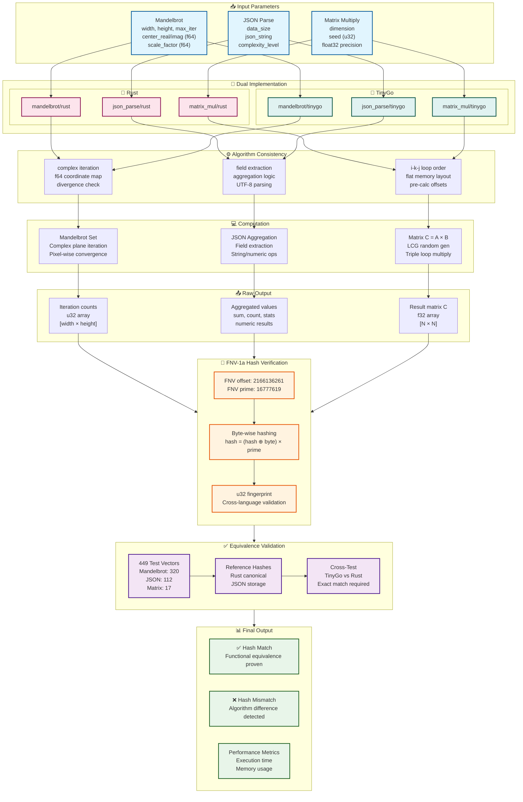
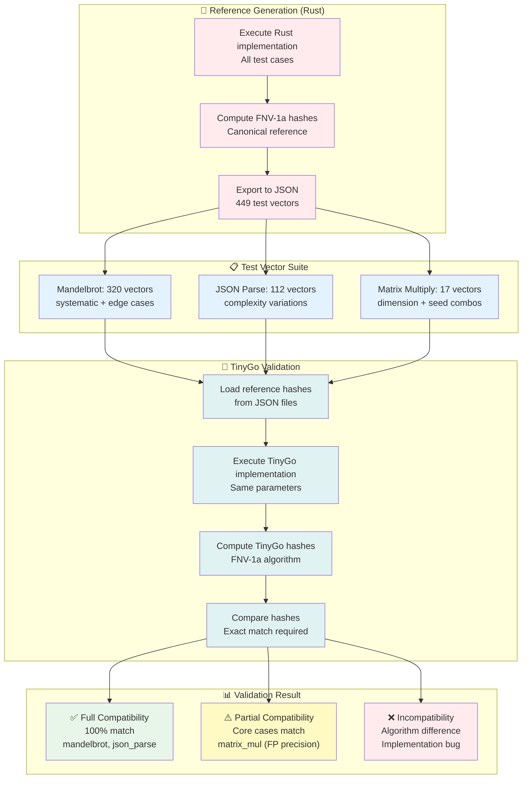
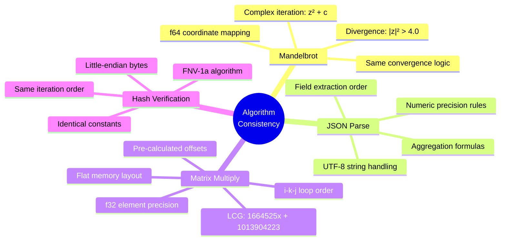

# Benchmark Task Architecture

## System Architecture Overview

```mermaid
flowchart TB
    subgraph Input["📥 Input Parameters"]
        P1["Mandelbrot<br/>width, height, max_iter<br/>center_real/imag (f64)<br/>scale_factor (f64)"]
        P2["JSON Parse<br/>data_size<br/>json_string<br/>complexity_level"]
        P3["Matrix Multiply<br/>dimension<br/>seed (u32)<br/>float32 precision"]
    end

    subgraph Impl["🔄 Dual Implementation"]
        direction LR
        subgraph Rust["🦀 Rust"]
            R1["mandelbrot/rust"]
            R2["json_parse/rust"]
            R3["matrix_mul/rust"]
        end

        subgraph TinyGo["🐹 TinyGo"]
            T1["mandelbrot/tinygo"]
            T2["json_parse/tinygo"]
            T3["matrix_mul/tinygo"]
        end
    end

    subgraph Algo["⚙️ Algorithm Consistency"]
        A1["i-k-j loop order<br/>flat memory layout<br/>pre-calc offsets"]
        A2["field extraction<br/>aggregation logic<br/>UTF-8 parsing"]
        A3["complex iteration<br/>f64 coordinate map<br/>divergence check"]
    end

    subgraph Compute["💻 Computation"]
        C1["Mandelbrot Set<br/>Complex plane iteration<br/>Pixel-wise convergence"]
        C2["JSON Aggregation<br/>Field extraction<br/>String/numeric ops"]
        C3["Matrix C = A × B<br/>LCG random gen<br/>Triple loop multiply"]
    end

    subgraph Output["📤 Raw Output"]
        O1["Iteration counts<br/>u32 array<br/>[width × height]"]
        O2["Aggregated values<br/>sum, count, stats<br/>numeric results"]
        O3["Result matrix C<br/>f32 array<br/>[N × N]"]
    end

    subgraph Hash["🔐 FNV-1a Hash Verification"]
        direction TB
        H1["FNV offset: 2166136261<br/>FNV prime: 16777619"]
        H2["Byte-wise hashing<br/>hash = (hash ⊕ byte) × prime"]
        H3["u32 fingerprint<br/>Cross-language validation"]

        H1 --> H2 --> H3
    end

    subgraph Validate["✅ Equivalence Validation"]
        V1["449 Test Vectors<br/>Mandelbrot: 320<br/>JSON: 112<br/>Matrix: 17"]
        V2["Reference Hashes<br/>Rust canonical<br/>JSON storage"]
        V3["Cross-Test<br/>TinyGo vs Rust<br/>Exact match required"]

        V1 --> V2 --> V3
    end

    subgraph Result["📊 Final Output"]
        F1["✅ Hash Match<br/>Functional equivalence proven"]
        F2["❌ Hash Mismatch<br/>Algorithm difference detected"]
        F3["Performance Metrics<br/>Execution time<br/>Memory usage"]
    end

    %% Data flow connections
    P1 --> R1 & T1
    P2 --> R2 & T2
    P3 --> R3 & T3

    R1 & T1 --> A3 --> C1 --> O1
    R2 & T2 --> A2 --> C2 --> O2
    R3 & T3 --> A1 --> C3 --> O3

    O1 & O2 & O3 --> Hash
    Hash --> Validate
    Validate --> Result

    %% Styling
    classDef inputStyle fill:#e1f5fe,stroke:#01579b,stroke-width:2px
    classDef rustStyle fill:#fce4ec,stroke:#880e4f,stroke-width:2px
    classDef goStyle fill:#e0f2f1,stroke:#004d40,stroke-width:2px
    classDef hashStyle fill:#fff3e0,stroke:#e65100,stroke-width:2px
    classDef validateStyle fill:#f3e5f5,stroke:#4a148c,stroke-width:2px
    classDef resultStyle fill:#e8f5e9,stroke:#1b5e20,stroke-width:2px

    class P1,P2,P3 inputStyle
    class R1,R2,R3 rustStyle
    class T1,T2,T3 goStyle
    class H1,H2,H3 hashStyle
    class V1,V2,V3 validateStyle
    class F1,F2,F3 resultStyle
```

## Cross-Language Equivalence Validation

```mermaid
flowchart TB
    subgraph Generate["🦀 Reference Generation (Rust)"]
        G1["Execute Rust implementation<br/>All test cases"]
        G2["Compute FNV-1a hashes<br/>Canonical reference"]
        G3["Export to JSON<br/>449 test vectors"]
    end

    subgraph TestVectors["📋 Test Vector Suite"]
        T1["Mandelbrot: 320 vectors<br/>systematic + edge cases"]
        T2["JSON Parse: 112 vectors<br/>complexity variations"]
        T3["Matrix Multiply: 17 vectors<br/>dimension + seed combos"]
    end

    subgraph Validate["🐹 TinyGo Validation"]
        V1["Load reference hashes<br/>from JSON files"]
        V2["Execute TinyGo implementation<br/>Same parameters"]
        V3["Compute TinyGo hashes<br/>FNV-1a algorithm"]
        V4["Compare hashes<br/>Exact match required"]
    end

    subgraph Result["📊 Validation Result"]
        R1["✅ Full Compatibility<br/>100% match<br/>mandelbrot, json_parse"]
        R2["⚠️ Partial Compatibility<br/>Core cases match<br/>matrix_mul (FP precision)"]
        R3["❌ Incompatibility<br/>Algorithm difference<br/>Implementation bug"]
    end

    G1 --> G2 --> G3
    G3 --> T1 & T2 & T3
    T1 & T2 & T3 --> V1
    V1 --> V2 --> V3 --> V4
    V4 --> R1 & R2 & R3

    style G1 fill:#ffebee
    style G2 fill:#ffebee
    style G3 fill:#ffebee
    style T1 fill:#e3f2fd
    style T2 fill:#e3f2fd
    style T3 fill:#e3f2fd
    style V1 fill:#e0f2f1
    style V2 fill:#e0f2f1
    style V3 fill:#e0f2f1
    style V4 fill:#e0f2f1
    style R1 fill:#e8f5e9
    style R2 fill:#fff9c4
    style R3 fill:#ffebee
```

## Algorithm Consistency Guarantees

```mermaid
mindmap
  root((Algorithm<br/>Consistency))
    Mandelbrot
      Complex iteration: z² + c
      Divergence: |z|² > 4.0
      f64 coordinate mapping
      Same convergence logic
    JSON Parse
      Field extraction order
      Aggregation formulas
      UTF-8 string handling
      Numeric precision rules
    Matrix Multiply
      i-k-j loop order
      Flat memory layout
      Pre-calculated offsets
      LCG: 1664525x + 1013904223
      f32 element precision
    Hash Verification
      FNV-1a algorithm
      Little-endian bytes
      Same iteration order
      Identical constants
```

## Performance Measurement Integration

```mermaid
sequenceDiagram
    autonumber
    actor User
    participant CLI as run_bench.js<br/>(Node.js CLI)
    participant Orchestrator as BenchmarkOrchestrator
    participant Browser as BrowserService<br/>(Puppeteer)
    participant WebPage as bench.html<br/>(Web Harness)
    participant Runner as BenchmarkRunner<br/>(JavaScript)
    participant WASM as WASM Module<br/>(Rust/TinyGo)
    participant Results as ResultsService
    
    User->>CLI: npm run bench<br/>[--quick|--headed|--parallel]
    
    rect rgb(240, 248, 255)
    Note over CLI,Orchestrator: ⚙️ Initialization Phase
    CLI->>CLI: Parse CLI options<br/>(headless, timeout, parallel, etc)
    CLI->>Orchestrator: Create services with<br/>dependency injection
    CLI->>Orchestrator: initialize(configPath, options)
    Orchestrator->>Orchestrator: Load config<br/>(bench.json or bench-quick.json)
    Orchestrator->>Browser: initialize(browserConfig)
    Browser->>Browser: Launch Puppeteer<br/>(headed or headless)
    Orchestrator->>Results: initialize(metadata)
    end
    
    rect rgb(255, 250, 240)
    Note over Orchestrator,WebPage: 🌐 Browser Setup Phase
    alt Headed Mode
        Browser->>WebPage: Navigate to bench.html
        Browser->>Browser: Wait for #status element
        Orchestrator->>WebPage: initializeBenchmarkSuite(taskList)
    else Headless Mode
        Note over Browser: Defer page navigation<br/>until task execution
    end
    end
    
    rect rgb(240, 255, 240)
    Note over Orchestrator,WASM: 🚀 Execution Phase
    
    alt Parallel Mode (Headless Only)
        loop For each benchmark (max N concurrent)
            Orchestrator->>Browser: createNewPage()
            Browser-->>Orchestrator: new page instance
            Orchestrator->>Orchestrator: executeSingleBenchmark()
            
            Orchestrator->>WebPage: goto(benchmarkUrl)
            Orchestrator->>WebPage: evaluate(runTaskBenchmark)
            
            WebPage->>Runner: runTaskBenchmark(taskConfig)
            Runner->>Runner: Generate input data<br/>(scale-specific params)
            Runner->>WASM: Load .wasm file
            WASM-->>Runner: Module ready
            Runner->>WASM: Call init(seed)
            WASM-->>Runner: Initialize internal state
            
            loop Warmup runs (e.g., 3 times)
                Runner->>WASM: Allocate params memory
                WASM-->>Runner: Memory pointer
                Runner->>WASM: Write parameters
                Runner->>WASM: run_task(params_ptr)
                WASM-->>Runner: Result hash (discard)
            end
            
            rect rgb(230, 240, 255)
            Note over Runner,WASM: ⏱️ Performance Measurement
            Runner->>Runner: Start timer<br/>(performance.now())
            loop Measure runs (e.g., 10 times)
                Runner->>WASM: run_task(params_ptr)
                WASM->>WASM: Execute computation<br/>(Mandelbrot/JSON/Matrix)
                WASM->>WASM: Compute FNV-1a hash
                WASM-->>Runner: Return u32 hash
                Runner->>Runner: Record time & memory
            end
            Runner->>Runner: Stop timer
            end
            
            Runner-->>WebPage: Task results<br/>(times, hash, memory)
            WebPage-->>Orchestrator: Benchmark result
            Orchestrator->>Results: addResult(benchmarkResult)
            Orchestrator->>Browser: Close dedicated page
        end
        
    else Sequential Mode (Headed or Headless)
        loop For each benchmark
            Note over Orchestrator: Same execution flow as parallel,<br/>but reuses main browser page
            Orchestrator->>Orchestrator: executeSingleBenchmark()
            Note over WebPage,WASM: [Same WASM execution steps as above]
            Orchestrator->>Results: addResult(benchmarkResult)
        end
    end
    end
    
    rect rgb(255, 240, 240)
    Note over Orchestrator,Results: 💾 Results Phase
    Orchestrator->>Results: finalize(metadata)
    Orchestrator->>Results: saveToFile(outputPath)
    Results->>Results: Write JSON file<br/>(results/TIMESTAMP.json)
    Results-->>User: Results saved
    end
    
    alt Headed Mode
        Orchestrator-->>User: Browser kept open<br/>(Press Ctrl+C to exit)
        Note over Browser: Browser remains open<br/>for inspection
    else Headless Mode
        Orchestrator->>Browser: cleanup()
        Browser->>Browser: Close browser
        CLI-->>User: Exit process
    end
    
    rect rgb(255, 255, 230)
    Note over User: 🔬 Manual Validation (Separate Step)
    User->>User: Run: make validate<br/>or: make test validate
    Note over User: This runs validate-tasks.sh<br/>to compare hashes with<br/>reference data
    end
```
