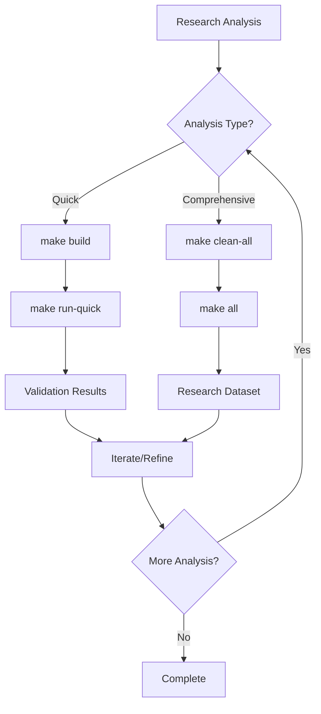
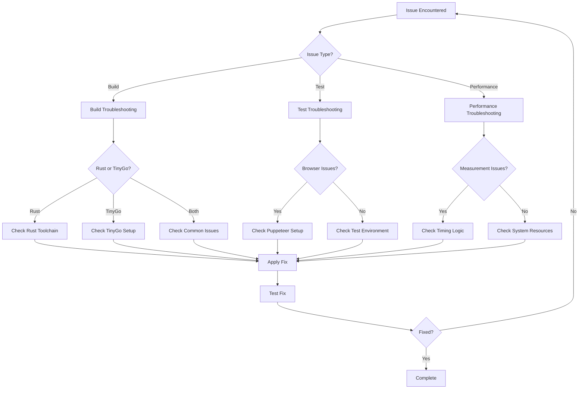

# WebAssembly Benchmark Project - Command Reference Guide

## Overview

This document provides a comprehensive guide for developers taking over the WebAssembly Benchmark project. It covers all available commands, their purposes, execution sequences, and common troubleshooting scenarios for both development and research workflows.

## Table of Contents

1. [Project Overview](#project-overview)
2. [Command Categories](#command-categories)
3. [Development Workflows](#development-workflows)
4. [Research Workflows](#research-workflows)
5. [Command Reference](#command-reference)
6. [Troubleshooting Guide](#troubleshooting-guide)
7. [Flow Charts](#flow-charts)

---

## Project Overview

This project benchmarks WebAssembly performance by comparing Rust and TinyGo implementations across multiple computational tasks. The project supports both development and research scenarios with automated pipelines for building, testing, and analyzing performance data.

**Key Technologies:**
- WebAssembly (WASM) compilation targets
- Rust and TinyGo implementations
- Node.js test harness with Puppeteer
- Python statistical analysis pipeline
- Make-based automation system

**Project Structure:**
- `tasks/` - Benchmark implementations (Rust/TinyGo)
- `scripts/` - Build and automation scripts
- `tests/` - Test suites (unit, integration, e2e)
- `analysis/` - Statistical analysis tools
- `results/` - Benchmark output data
- `docs/` - Project documentation

---

## Command Categories

### Environment Setup
Commands for initializing development environment and dependencies.

### Build System
Commands for compiling WebAssembly modules and managing builds.

### Test Suite
Commands for running different levels of testing and validation.

### Benchmark Execution
Commands for running performance benchmarks with various configurations.

### Analysis Pipeline
Commands for processing results and generating reports.

### Maintenance
Commands for cleaning, linting, and project maintenance.

---

## Development Workflows

### 🔧 New Developer Setup

**Purpose**: Set up development environment from scratch

**Flow**:
```
make check-deps → make init → make build → npm run test:smoke → make status
```

**Timeline**: 10-20 minutes (depending on compilation time and system performance)

**Expected Outcome**: Fully configured development environment with verified functionality

### 🔄 Daily Development Cycle

**Purpose**: Standard development and testing workflow

**Flow**:
```
git pull → make build → npm run test:unit → [code changes] → npm run test:smoke → git commit
```

**Timeline**: 2-5 minutes per cycle

**Expected Outcome**: Verified code changes with passing tests

### 🚀 Pre-Release Validation

**Purpose**: Comprehensive validation before deployment

**Flow**:
```
make clean-all → make build → npm run test:full → make all-quick
```

**Timeline**: 20-40 minutes

**Expected Outcome**: Full validation with verified builds and test coverage (no performance analysis)

---

## Research Workflows

### 📊 Quick Performance Analysis

**Purpose**: Fast performance comparison for development

**Flow**:
```
make build → make run-quick
```

**Timeline**: 2-3 minutes

**Expected Outcome**: Verified build integrity and module correctness (no performance data generated)

### 🔬 Comprehensive Research Experiment

**Purpose**: Full research-grade performance analysis

**Flow**:
```
make clean-all → make all
```

**Timeline**: 30-60 minutes

**Expected Outcome**: Complete research dataset with statistical significance

### 🎯 Focused Task Analysis

**Purpose**: Analyze specific benchmark task performance

**Flow**:
```
make build → npm run bench → make analyze
```

**Timeline**: 10-20 minutes

**Expected Outcome**: Detailed analysis of single benchmark task

---

## Command Reference

### Makefile Commands

#### **make check-deps**
**Purpose**: Verify all required tools and dependencies are installed
**When to Use**: Before any other operations, especially in new environments
**Prerequisites**: None
**Common Issues**: Missing Rust/TinyGo toolchain, Node.js version incompatibility

#### **make init**
**Purpose**: Initialize development environment and install dependencies
**When to Use**: First-time setup or after clean-all
**Prerequisites**: check-deps passed
**Common Issues**: Network connectivity, permission issues with pip/npm

#### **make build**
**Purpose**: Build all WebAssembly modules for both Rust and TinyGo
**When to Use**: After code changes, before testing or benchmarking
**Prerequisites**: init completed
**Common Issues**: Compilation errors, missing source files

#### **make build-rust**
**Purpose**: Build only Rust WebAssembly modules
**When to Use**: Working specifically on Rust implementations
**Prerequisites**: Rust toolchain available
**Common Issues**: Rust compilation errors, wasm-pack issues

#### **make build-tinygo**
**Purpose**: Build only TinyGo WebAssembly modules
**When to Use**: Working specifically on TinyGo implementations
**Prerequisites**: TinyGo toolchain available
**Common Issues**: TinyGo compilation errors, WASM target issues

#### **make run**
**Purpose**: Execute benchmark suite with default configuration
**When to Use**: Performance testing and data collection
**Prerequisites**: build completed
**Common Issues**: Browser automation failures, timeout issues

#### **make run-headed**
**Purpose**: Run benchmarks with visible browser (debugging mode)
**When to Use**: Debugging benchmark issues, visual verification
**Prerequisites**: build completed, display available
**Common Issues**: Display/X11 forwarding issues in headless environments

#### **make run-quick**
**Purpose**: Quick development validation workflow (build + validate, no benchmarking)
**When to Use**: Development validation, verifying builds work correctly without full benchmarking
**Prerequisites**: build completed
**Common Issues**: Build failures, validation script errors

#### **make analyze**
**Purpose**: Run statistical analysis on latest benchmark results
**When to Use**: After benchmark execution
**Prerequisites**: benchmark results available
**Common Issues**: Missing Python dependencies, no results data

#### **make all**
**Purpose**: Execute complete experiment pipeline (build → run → analyze)
**When to Use**: Full research experiments
**Prerequisites**: init completed
**Common Issues**: Long execution time, any step failure stops pipeline

#### **make all-quick**
**Purpose**: Complete pipeline with quick settings for development
**When to Use**: Development verification, quick experimentation
**Prerequisites**: init completed
**Common Issues**: No benchmark data generated, analysis step should be omitted

#### **make clean**
**Purpose**: Remove build artifacts and temporary files
**When to Use**: Build issues, disk space cleanup
**Prerequisites**: None
**Common Issues**: Permission issues on protected files

#### **make clean-all**
**Purpose**: Complete cleanup including dependencies
**When to Use**: Fresh start, resolving dependency conflicts
**Prerequisites**: None
**Common Issues**: Requires re-running init afterward

#### **make status**
**Purpose**: Display current project state and environment info
**When to Use**: Debugging, status verification
**Prerequisites**: None
**Common Issues**: None (informational only)

### NPM Script Commands

#### **npm run dev**
**Purpose**: Start development server with auto-opening browser
**When to Use**: Interactive development and testing
**Prerequisites**: Dependencies installed
**Common Issues**: Port conflicts, browser opening failures

#### **npm run serve**
**Purpose**: Start development server without browser
**When to Use**: Server-only or headless environments
**Prerequisites**: Dependencies installed
**Common Issues**: Port already in use

#### **npm run build**
**Purpose**: Build configuration and WebAssembly modules
**When to Use**: Alternative to make build
**Prerequisites**: Dependencies installed
**Common Issues**: Build script execution failures

#### **npm run test:smoke**
**Purpose**: Quick validation tests for core functionality
**When to Use**: Fast development feedback
**Prerequisites**: Build completed
**Common Issues**: Browser automation setup issues

#### **npm run test:unit**
**Purpose**: Run isolated unit tests
**When to Use**: Testing specific components
**Prerequisites**: Dependencies installed
**Common Issues**: Test environment configuration

#### **npm run test:integration**
**Purpose**: Run cross-language consistency tests
**When to Use**: Validating language implementation consistency
**Prerequisites**: Build completed, server running
**Common Issues**: Browser compatibility, timing issues

#### **npm run test:full**
**Purpose**: Complete test suite including e2e tests
**When to Use**: Comprehensive validation
**Prerequisites**: Full environment setup
**Common Issues**: Long execution time, environment dependencies

#### **npm run bench**
**Purpose**: Run benchmarks with custom configuration
**When to Use**: Specific benchmark scenarios
**Prerequisites**: Build completed
**Common Issues**: Configuration parameter errors

#### **npm run validate**
**Purpose**: Validate all task implementations
**When to Use**: Verifying implementation correctness
**Prerequisites**: Build completed
**Common Issues**: WASM module loading failures

---

## Troubleshooting Guide

### Build Issues

**Rust Compilation Failures**
- **Symptoms**: Cargo build errors, missing dependencies
- **Solutions**:
  - Verify Rust toolchain: `rustup show`
  - Update Rust: `rustup update`
  - Check wasm-pack: `wasm-pack --version`
  - Clean Rust cache: `cargo clean`

**TinyGo Compilation Failures**
- **Symptoms**: TinyGo build errors, WASM target issues
- **Solutions**:
  - Verify TinyGo installation: `tinygo version`
  - Check WASM target support: `tinygo targets`
  - Update TinyGo to latest version
  - Verify Go version compatibility

**Cross-Platform Issues**
- **Symptoms**: `numfmt: command not found` on macOS
- **Solutions**: This has been fixed with portable formatting functions
- **Prevention**: Use provided build scripts, avoid direct GNU tools

### Test Failures

**Browser Automation Issues**
- **Symptoms**: Puppeteer timeouts, browser launch failures
- **Solutions**:
  - Check Chrome/Chromium installation
  - Verify display configuration (headless vs headed)
  - Increase timeout values for slow systems
  - Check port availability (default: 2025)

**Cross-Language Consistency Failures**
- **Symptoms**: Hash mismatches, precision differences
- **Solutions**:
  - Verify both implementations built successfully
  - Check floating-point standardization
  - Run validation script: `npm run validate`
  - Review recent changes to algorithm implementations

**Performance Measurement Issues**
- **Symptoms**: Invalid timing data, coefficient of variation warnings
- **Solutions**: These have been fixed in recent updates
- **Verification**: Ensure property path consistency in test code

### Environment Issues

**Dependency Conflicts**
- **Symptoms**: Version mismatches, installation failures
- **Solutions**:
  - Run `make clean-all` followed by `make init`
  - Check Node.js version: `node --version` (>=18.0.0 required)
  - Verify Python version: `python3 --version`
  - Clear npm cache: `npm cache clean --force`

**Permission Issues**
- **Symptoms**: Access denied, file permission errors
- **Solutions**:
  - Check file permissions in build directories
  - Avoid running as root unless necessary
  - Verify write access to results/ and builds/
  - Use `--user` flag for pip installations

**Memory/Resource Issues**
- **Symptoms**: Out of memory, slow performance
- **Solutions**:
  - Monitor system resources during builds/tests
  - Use `make all-quick` for resource-constrained environments
  - Adjust timeout values in test configurations
  - Close unnecessary applications

### Analysis Issues

**Missing Results Data**
- **Symptoms**: No data to analyze, analysis script failures
- **Solutions**:
  - Verify benchmark execution completed successfully
  - Check results/ directory for recent data
  - Ensure proper file permissions
  - Re-run benchmarks if data is corrupted

**Statistical Analysis Errors**
- **Symptoms**: Python script failures, plotting errors
- **Solutions**:
  - Verify Python dependencies: `pip3 list`
  - Check data file formats and integrity
  - Ensure matplotlib/numpy compatibility
  - Review analysis script for recent changes

---

## Flow Charts

### Development Workflow


### Research Workflow



### Troubleshooting Decision Tree



---

## Best Practices

### Development Practices
- Always run `make check-deps` in new environments
- Use `make status` to verify project state
- Run smoke tests after significant changes
- Keep builds clean with regular `make clean`

### Research Practices
- Use `make run-quick` for quick validation, `make all` for full exploration
- Run full experiments with `make all` for publication
- Document experimental parameters and results
- Validate cross-language consistency regularly

### Maintenance Practices
- Update dependencies regularly
- Monitor disk space in results/ directory
- Keep documentation synchronized with code changes
- Use version control effectively for experiment tracking

---

## Additional Resources

- **Project Repository**: https://github.com/alleninnz/wasm-benchmark
- **Testing Strategy**: `docs/testing-strategy-guide.md`
- **Development Plan**: `docs/development-plan.md`
- **Experiment Plans**: `docs/experiment-plan_en.md`