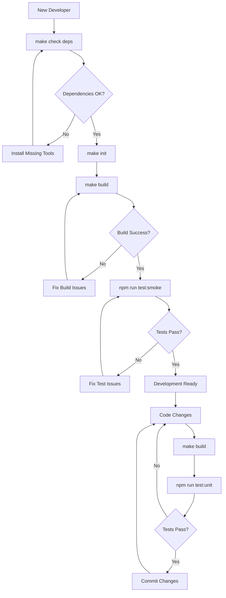
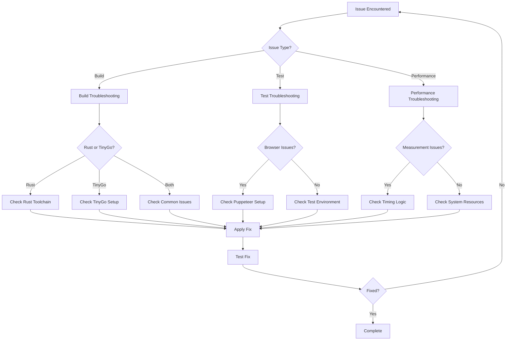

# WebAssembly Benchmark Project - Command Reference Guide

## Overview

This document provides a comprehensive guide for developers taking over the WebAssembly Benchmark project. It covers all available commands, their purposes, execution sequences, and common troubleshooting scenarios for both development and research workflows.

## Table of Contents

1. [Project Overview](#project-overview)
2. [Command Categories](#command-categories)
3. [Development Workflows](#development-workflows)
4. [Research Workflows](#research-workflows)
5. [Command Reference](#command-reference)
6. [Troubleshooting Guide](#troubleshooting-guide)
7. [Flow Charts](#flow-charts)

---

## Project Overview

This project benchmarks WebAssembly performance by comparing Rust and TinyGo implementations across multiple computational tasks. The project supports both development and research scenarios with automated pipelines for building, testing, and analyzing performance data.

### Key Technologies

- WebAssembly (WASM) compilation targets
- Rust and TinyGo implementations with unified C-ABI interface
- Node.js test harness with Puppeteer browser automation (v24.22.0)
- Python statistical analysis pipeline with NumPy 2.3+, SciPy 1.10+, Matplotlib 3.6+
- Make-based automation system with service-oriented architecture (5 core services)
- Poetry for Python dependency management
- Vitest for JavaScript testing framework (ConfigurationService, BrowserService, ResultsService)

### Project Structure

- `tasks/` - Benchmark implementations (Rust/TinyGo)
- `scripts/` - Build and automation scripts
- `tests/` - Test suites (unit, integration, e2e)
- `analysis/` - Statistical analysis tools
- `results/` - Benchmark output data
- `docs/` - Project documentation

---

## Command Categories

### Environment Setup

Commands for initializing development environment and dependencies.

### Build System

Commands for compiling WebAssembly modules and managing builds.

### Test Suite

Commands for running different levels of testing and validation.

### Benchmark Execution

Commands for running performance benchmarks with various configurations.

### Analysis Pipeline

Commands for processing results and generating reports.

### Maintenance

Commands for cleaning, linting, and project maintenance.

---

## Development Workflows

### New Developer Setup

#### Setup Purpose

Set up development environment from scratch

#### Setup Flow

```bash
make check deps → make init → make build → npm run test:smoke → make status
```

#### Setup Timeline

10-20 minutes (depending on compilation time and system performance)

#### Setup Expected Outcome

Fully configured development environment with verified functionality

### Daily Development Cycle

#### Development Purpose

Standard development and testing workflow

#### Development Flow

```bash
git pull → make build → npm run test:unit → [code changes] → npm run test:smoke → git commit
```

#### Development Timeline

2-5 minutes per cycle

#### Development Expected Outcome

Verified code changes with passing tests

### Pre-Release Validation

#### Validation Purpose

Comprehensive validation before deployment

#### Validation Flow

```bash
make clean all → make build → npm run test → make all quick
```

#### Validation Timeline

20-40 minutes

#### Validation Expected Outcome

Full validation with verified builds and test coverage (no performance analysis)

---

## Research Workflows

### Quick Performance Analysis

#### Quick Analysis Purpose

Fast performance comparison for development

#### Quick Analysis Flow

```bash
make build → make run quick
```

#### Quick Analysis Timeline

2-3 minutes

#### Quick Analysis Expected Outcome

Verified build integrity and module correctness (no performance data generated)

### Comprehensive Research Experiment

#### Research Purpose

Full research-grade performance analysis

#### Research Flow

```bash
make clean all → make all
```

#### Research Timeline

30-60 minutes

#### Research Expected Outcome

Complete research dataset with statistical significance

### Focused Task Analysis

#### Focused Purpose

Analyze specific benchmark task performance

#### Focused Flow

```bash
make build → npm run bench → make analyze
```

#### Focused Timeline

10-20 minutes

#### Focused Expected Outcome

Detailed analysis of single benchmark task

---

## Command Reference

### Makefile Commands

#### **make check deps**

**Purpose**: Verify all required tools and dependencies are available
**When to Use**: Before any other operations, especially in new environments
**Prerequisites**: None
**Common Issues**: Missing Rust/TinyGo toolchain, Node.js version incompatibility

#### **make init**

**Purpose**: Initialize development environment, install Node.js and Python dependencies, generate environment fingerprint
**When to Use**: First-time setup or after clean-all
**Prerequisites**: check-deps passed

**Dependencies Installed**:

- Node.js packages via npm ci (chalk, puppeteer, yaml, eslint, express, vitest)
- Python packages via Poetry (numpy, matplotlib, scipy, pyyaml, black, ruff)
- Environment fingerprint (versions.lock, meta.json)

**Common Issues**: Network connectivity, Poetry not installed, permission issues

#### **make build**

**Purpose**: Build WebAssembly modules or config (use: make build [rust/tinygo/all/config])
**When to Use**: After code changes, before testing or benchmarking
**Prerequisites**: init completed

**Options**:

- `make build` - Build both Rust and TinyGo modules
- `make build rust` - Build only Rust modules
- `make build tinygo` - Build only TinyGo modules  
- `make build all` - Build all with full pipeline and optimization analysis
- `make build config` - Build configuration files from YAML
- `make build config quick` - Build quick configuration for development

**Common Issues**: Compilation errors, missing source files, Rust/TinyGo toolchain issues

**Note**: Individual build targets have been replaced with flag-based commands:
- `make build rust` - Build only Rust modules
- `make build tinygo` - Build only TinyGo modules
- `make build all` - Build all with full pipeline and optimization analysis
- `make build config` - Build configuration files from YAML
- `make build config quick` - Build quick configuration for development

#### **make run**

**Purpose**: Run browser benchmark suite (use quick headed for options)
**When to Use**: Performance testing and data collection
**Prerequisites**: build completed

**Options**:

- `make run` - Run with default configuration
- `make run quick` - Run quick benchmarks for development
- `make run headed` - Run with visible browser for debugging
- `make run quick headed` - Quick benchmarks with visible browser

**Common Issues**: Browser automation failures, timeout issues, missing configuration

#### **make qc**

**Purpose**: Run quality control on benchmark data (use quick for quick mode)
**When to Use**: After benchmark execution to validate data quality
**Prerequisites**: benchmark results available

**Options**:

- `make qc` - Full quality control analysis
- `make qc quick` - Quick quality control for development

**Common Issues**: Missing Python dependencies, no results data, Poetry environment issues

#### **make analyze**

**Purpose**: Run validation, quality control, statistical analysis, and plotting (use quick for quick mode)
**When to Use**: After benchmark execution for complete analysis
**Prerequisites**: benchmark results available
**Pipeline**: validate → qc → stats → plots

**Options**:

- `make analyze` - Full analysis pipeline
- `make analyze quick` - Quick analysis for development

**Common Issues**: Missing Python dependencies, Poetry not initialized, matplotlib display issues

#### **make all**

**Purpose**: Execute complete experiment pipeline (build → run → analyze)
**When to Use**: Full research experiments
**Prerequisites**: init completed
**Common Issues**: Long execution time, any step failure stops pipeline

#### **make all quick**

**Purpose**: Complete pipeline with quick settings for development/testing
**When to Use**: Development verification, quick experimentation
**Prerequisites**: init completed
**Common Issues**: No benchmark data generated, analysis step should be omitted

#### **make clean**

**Purpose**: Clean build artifacts and temporary files (use: make clean all for complete cleanup)
**When to Use**: Build issues, disk space cleanup

**Options**:

- `make clean` - Clean generated artifacts (builds, configs, reports, results)
- `make clean all` - Complete cleanup including dependencies, caches, logs (with confirmation)

**Cleaned Items**:

- Build artifacts (*.wasm, checksums.txt, sizes.csv)
- Configuration files (bench.json, bench-quick.json)
- Reports and results directories
- Cache files (.cache.*)
- Temporary files (\*.tmp, \_\_pycache\_\_, \*.pyc)

**Common Issues**: Permission issues on protected files, accidental data loss

#### **make lint**

**Purpose**: Run code quality checks (use: make lint [python/rust/go/js])
**When to Use**: Code quality assurance, pre-commit checks
**Prerequisites**: Dependencies installed

**Options**:

- `make lint` - Run all language linters
- `make lint python` - Python linting with ruff
- `make lint rust` - Rust linting with cargo clippy
- `make lint go` - Go linting with go vet and gofmt
- `make lint js` - JavaScript linting with ESLint

**Common Issues**: Missing linters, code formatting issues, linting rule violations

#### **make format**

**Purpose**: Format code (use: make format [python/rust/go])
**When to Use**: Code formatting, consistent style
**Prerequisites**: Dependencies installed

**Options**:

- `make format` - Format all supported languages
- `make format python` - Python formatting with black
- `make format rust` - Rust formatting with cargo fmt
- `make format go` - Go formatting with gofmt

**Common Issues**: Missing formatters, conflicting formatting rules

#### **make test**

**Purpose**: Run tests (use: make test [validate] or run all tests)
**When to Use**: Test execution, validation
**Prerequisites**: Dependencies installed

**Options**:

- `make test` - Run all available tests (JavaScript + Python)
- `make test validate` - Run WASM task validation suite

**Common Issues**: Missing test runners, environment setup issues

#### **make status**

**Purpose**: Show current project status
**When to Use**: Debugging, status verification
**Displays**: Environment status, build artifacts, results count, latest experiment
**Common Issues**: None (informational only)

#### **make info**

**Purpose**: Show system information
**When to Use**: Debugging environment issues
**Displays**: OS, architecture, CPU cores, memory, tool versions
**Common Issues**: None (informational only)

**Note**: This is the updated syntax for dependency checking (was `make check-deps`)

### NPM Script Commands

#### **npm run dev**

**Purpose**: Start development server with auto-opening browser
**When to Use**: Interactive development and testing
**Prerequisites**: Dependencies installed
**Server**: Runs on port 2025, logs to dev-server.log
**Common Issues**: Port conflicts, browser opening failures

#### **npm run serve:port**

**Purpose**: Start development server on specified port (uses PORT environment variable)
**When to Use**: Server-only mode with custom port configuration
**Prerequisites**: Dependencies installed
**Example**: `PORT=3000 npm run serve:port`
**Common Issues**: Port already in use, environment variable issues

#### **npm run test**

**Purpose**: Run full test suite (JavaScript and Python) with verbose output
**When to Use**: Comprehensive testing and validation
**Prerequisites**: Dependencies installed, build completed
**Test Framework**: Vitest with 300s timeout
**Common Issues**: Long execution time, environment dependencies

#### **npm run test:smoke**

**Purpose**: Quick validation tests for core functionality
**When to Use**: Fast development feedback
**Prerequisites**: Build completed
**Test Framework**: Vitest with 10s timeout
**Common Issues**: Browser automation setup issues

#### **npm run test:unit**

**Purpose**: Run isolated unit tests
**When to Use**: Testing specific components
**Prerequisites**: Dependencies installed
**Test Framework**: Vitest with 5s timeout
**Common Issues**: Test environment configuration

#### **npm run test:integration**

**Purpose**: Run cross-language consistency tests
**When to Use**: Validating language implementation consistency
**Prerequisites**: Build completed, server running
**Test Framework**: Vitest with 60s timeout
**Common Issues**: Browser compatibility, timing issues

### Python Script Commands

#### **wasm-benchmark-qc**

**Purpose**: Quality control analysis of benchmark results
**When to Use**: Validating data integrity and statistical assumptions
**Prerequisites**: Results data available
**Analysis**: Outlier detection, normality tests, variance analysis
**Common Issues**: Missing data files, statistical assumption violations

#### **wasm-benchmark-stats**

**Purpose**: Statistical analysis of benchmark results
**When to Use**: Computing significance tests and effect sizes
**Prerequisites**: Results data available
**Analysis**: Welch's t-test, Cohen's d effect size, confidence intervals
**Common Issues**: Insufficient sample sizes, non-normal distributions

#### **wasm-benchmark-plots**

**Purpose**: Generate visualization plots for benchmark results
**When to Use**: Creating publication-ready charts and graphs
**Prerequisites**: Results data available
**Output**: PNG files in reports/plots/ directory
**Common Issues**: Matplotlib backend issues, missing data

#### **wasm-benchmark-validate**

**Purpose**: Cross-language validation of task implementations
**When to Use**: Verifying WASM module correctness
**Prerequisites**: Build completed
**Validation**: FNV-1a hash comparison across languages
**Common Issues**: Hash mismatches, WASM loading failures

## Command Usage Patterns

### Typical Development Workflow

```bash
# Initial setup
make init

# Development cycle
make build config quick
npm run dev &
make run quick
make qc quick
make analyze quick

# Full validation
make test
npm run test
```

### Production Benchmarking Workflow

```bash
# Complete benchmark run
make init
make build all
make run
make qc
make analyze
make plots
```

### Troubleshooting Workflow

```bash
# Check system status
make status
make info

# Clean and rebuild
make clean all
make init
make build all

# Validate components
make validate
npm run test:smoke
```

## Best Practices Summary

- **Always run `make init`** before starting work
- **Use quick modes** during development for faster feedback
- **Run full validation** before publishing results
- **Check logs** in dev-server.log for server issues
- **Use `make status`** to verify system readiness
- **Clean builds** with `make clean all` when switching toolchains

### Run Bench Script Options

#### **node scripts/run_bench.js**

**Purpose**: Execute benchmark suite with various configuration options
**When to Use**: Performance testing and data collection with custom settings
**Prerequisites**: build completed, configuration files exist

**Available Options:**

- `--headed`: Run in headed mode (show browser)
- `--devtools`: Open browser DevTools
- `--verbose`: Enable verbose logging
- `--parallel`: Enable parallel benchmark execution
- `--quick`: Use quick configuration for fast development testing
- `--timeout=<ms>`: Set timeout in milliseconds (default: 300000, quick: 30000)
- `--max-concurrent=<n>`: Max concurrent benchmarks in parallel mode (default: 4, max: 20)
- `--failure-threshold=<rate>`: Failure threshold rate 0-1 (default: 0.3)
- `--help, -h`: Show help message

**Common Usage Examples:**

```bash
# Basic headless run
node scripts/run_bench.js

# Development with visible browser
node scripts/run_bench.js --headed

# Quick development testing
node scripts/run_bench.js --quick

# Verbose output for debugging
node scripts/run_bench.js --verbose

# Parallel execution
node scripts/run_bench.js --parallel --max-concurrent=5

# Custom timeout for slow systems
node scripts/run_bench.js --timeout=600000

# Conservative failure handling
node scripts/run_bench.js --failure-threshold=0.1
```

**Common Issues**: Browser automation failures, timeout issues, configuration file missing

## Troubleshooting Guide

### Build Issues

#### Rust Compilation Failures

- **Symptoms**: Cargo build errors, missing dependencies
- **Solutions**:
  - Verify Rust toolchain: `rustup show`
  - Update Rust: `rustup update`
  - Check wasm-pack: `wasm-pack --version`
  - Clean Rust cache: `cargo clean`

#### TinyGo Compilation Failures

- **Symptoms**: TinyGo build errors, WASM target issues
- **Solutions**:
  - Verify TinyGo installation: `tinygo version`
  - Check WASM target support: `tinygo targets`
  - Update TinyGo to latest version
  - Verify Go version compatibility

#### Cross-Platform Issues

- **Symptoms**: `numfmt: command not found` on macOS
- **Solutions**: This has been fixed with portable formatting functions
- **Prevention**: Use provided build scripts, avoid direct GNU tools

### Test Failures

#### Browser Automation Issues

- **Symptoms**: Puppeteer timeouts, browser launch failures
- **Solutions**:
  - Check Chrome/Chromium installation
  - Verify display configuration (headless vs headed)
  - Increase timeout values for slow systems
  - Check port availability (default: 2025)

#### Cross-Language Consistency Failures

- **Symptoms**: Hash mismatches, precision differences
- **Solutions**:
  - Verify both implementations built successfully
  - Check floating-point standardization
  - Run validation script: `npm run validate`
  - Review recent changes to algorithm implementations

#### Performance Measurement Issues

- **Symptoms**: Invalid timing data, coefficient of variation warnings
- **Solutions**: These have been fixed in recent updates
- **Verification**: Ensure property path consistency in test code

### Environment Issues

#### Dependency Conflicts

- **Symptoms**: Version mismatches, installation failures
- **Solutions**:
  - Run `make clean all` followed by `make init`
  - Check Node.js version: `node --version` (>=18.0.0 required)
  - Verify Python version: `python3 --version`
  - Clear npm cache: `npm cache clean --force`

#### Permission Issues

- **Symptoms**: Access denied, file permission errors
- **Solutions**:
  - Check file permissions in build directories
  - Avoid running as root unless necessary
  - Verify write access to results/ and builds/
  - Use `--user` flag for pip installations

#### Memory/Resource Issues

- **Symptoms**: Out of memory, slow performance
- **Solutions**:
  - Monitor system resources during builds/tests
  - Use `make all quick` for resource-constrained environments
  - Adjust timeout values in test configurations
  - Close unnecessary applications

### Analysis Issues

#### Missing Results Data

- **Symptoms**: No data to analyze, analysis script failures
- **Solutions**:
  - Verify benchmark execution completed successfully
  - Check results/ directory for recent data
  - Ensure proper file permissions
  - Re-run benchmarks if data is corrupted

#### Statistical Analysis Errors

- **Symptoms**: Python script failures, plotting errors
- **Solutions**:
  - Verify Python dependencies: `pip3 list`
  - Check data file formats and integrity
  - Ensure matplotlib/numpy compatibility
  - Review analysis script for recent changes

---

## Flow Charts

### Development Workflow



### Research Workflow


### Troubleshooting Decision Tree



---

## Operational Best Practices

### Development Practices

- Always run `make check deps` in new environments
- Use `make status` to verify project state
- Run smoke tests after significant changes: `npm run test:smoke`
- Keep builds clean with regular `make clean`

### Research Practices

- Use `make run quick` for quick validation, `make all` for full exploration
- Run full experiments with `make all` for publication
- Document experimental parameters and results
- Validate cross-language consistency regularly

### Maintenance Practices

- Update dependencies regularly
- Monitor disk space in results/ directory
- Keep documentation synchronized with code changes
- Use version control effectively for experiment tracking

---

## Timeout Configuration Strategy

The project implements a comprehensive timeout strategy designed to handle intensive WebAssembly tasks while preventing resource waste and providing fast feedback during development.

### 🎯 **Timeout Strategy Overview**

| 模式 | 基础超时 | 浏览器协议 | 任务执行 | WASM密集任务 |
|------|---------|-----------|---------|-------------|
| **正常模式** | 600s | 1200s (20min) | 1500s (25min) | 1800s (30min) |
| **快速模式** | 60s | 120s (2min) | 150s (2.5min) | 180s (3min) |

### **Configuration Hierarchy**

1. **Base Timeout**: Configured in `configs/bench.yaml` and `configs/bench-quick.yaml`

   ```yaml
   environment:
     timeout: 600  # Normal mode: 10 minutes
     timeout: 20   # Quick mode: 20 seconds
   ```

2. **Timeout Multipliers** (defined in `ConfigurationService.js`):
   - **Browser Protocol**: 2x base (for Puppeteer automation)
   - **Navigation**: 1x base (for page loading)
   - **Task Execution**: 2.5x base (for individual benchmark tasks)
   - **Element Wait**: 0.25x base (for DOM element waiting)
   - **WASM Intensive**: 3x base (for CPU-intensive WASM tasks)
   - **Quick Mode Factor**: 0.1x (reduction for development mode)

### **Implementation Details**

- **Protocol Timeout**: Set in `BrowserService.js` via `protocolTimeout` parameter
- **Page Timeout**: Set via `page.setDefaultTimeout()` for browser operations
- **Task Timeout**: Applied at benchmark execution level
- **Quick Mode**: Automatically reduces all timeouts by 90% for fast feedback

### **Troubleshooting Timeout Issues**

Common timeout errors and solutions:

1. **`Runtime.callFunctionOn timed out`**:
   - Increase base timeout in config files
   - Check if task complexity requires more time
   - Verify browser protocol timeout is sufficient

2. **Navigation timeout**:
   - Check network connectivity
   - Increase navigation timeout multiplier
   - Verify development server is running

3. **Element wait timeout**:
   - Check DOM element selectors
   - Increase element wait timeout
   - Verify page loading completion

For detailed timeout configuration, see `docs/timeout-configuration.md`.

---
