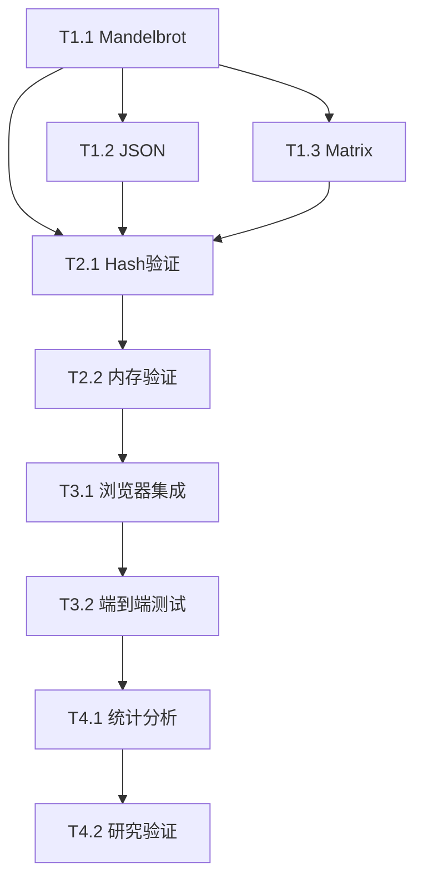

# WebAssembly基准测试项目 - 完整开发计划

## 🎯 项目概述

**目标**: Rust vs TinyGo WebAssembly性能对比的研究级基准测试框架  
**当前状态**: 框架完整，算法需实现（所有核心算法为TODO占位符）  
**交付标准**: 学术发表级质量，完整的统计分析和可视化

## 📈 开发阶段规划

### Phase 1: 核心算法实现 (第1-2周，8-12天)
**目标**: 将TODO占位符转换为功能完整的优化算法

#### 1.1 Mandelbrot集合算法 (3-4天) 🟡
**优先级**: P0 (基础算法，其他依赖此基础)
- **T1.1.1**: 实现FNV-1a哈希算法 (Rust + TinyGo版本)
- **T1.1.2**: 实现线性同余生成器(确保可重现随机性) 
- **T1.1.3**: 实现WebAssembly内存分配和参数解析
- **T1.1.4**: 实现Mandelbrot逃逸时间算法
- **T1.1.5**: 实现复数运算和迭代逻辑
- **T1.1.6**: 创建数学正确性单元测试

**验收标准**:
- ✅ 跨语言哈希一致性: 相同输入 → 相同哈希
- ✅ 数学正确性: 已知Mandelbrot点验证通过
- ✅ 内存安全: 无缓冲区溢出或无效指针访问
- ✅ 性能基线: 小规模30秒内完成

#### 1.2 JSON解析算法 (4-5天) 🔴 
**优先级**: P1 (复杂解析逻辑，高技术风险)
- **T1.2.1**: 实现确定性随机JSON记录生成
- **T1.2.2**: 实现JSON序列化(紧凑格式)
- **T1.2.3**: 实现健壮的JSON解析器和错误处理
- **T1.2.4**: 实现字符串、数字、布尔值、数组解析
- **T1.2.5**: 集成FNV-1a哈希用于解析数据验证
- **T1.2.6**: 创建解析正确性综合测试

**验收标准**:
- ✅ 解析准确性: 有效JSON 100%成功率
- ✅ 往返一致性: 生成 → 序列化 → 解析 → 哈希匹配
- ✅ 错误处理: 格式错误JSON的优雅失败
- ✅ 内存效率: 解析过程中最小分配开销

#### 1.3 矩阵乘法算法 (2-3天) 🟢
**优先级**: P1 (数值计算，相对简单)
- **T1.3.1**: 实现矩阵内存分配和初始化
- **T1.3.2**: 实现朴素三重循环乘法算法
- **T1.3.3**: 实现f32精度标准化用于一致哈希
- **T1.3.4**: 集成可重现值的随机矩阵生成
- **T1.3.5**: 创建数值正确性和单位矩阵测试

**验收标准**:
- ✅ 数学正确性: 单位矩阵测试通过
- ✅ 精度一致性: 6位小数舍入工作相同
- ✅ 性能扩展: 跨规模级别验证O(n³)复杂度
- ✅ 内存模式: 缓存效率的连续分配

### Phase 2: 跨语言验证 (第2-3周，4-6天)
**目标**: 确保Rust和TinyGo之间相同的计算行为

#### 2.1 哈希验证系统 (2-3天) 🔴
**优先级**: P0 (研究有效性的关键)
- **T2.1.1**: 创建跨语言哈希验证测试套件
- **T2.1.2**: 实现确定性测试数据生成器
- **T2.1.3**: 验证所有任务规模的数学一致性
- **T2.1.4**: 构建自动化哈希比较管道
- **T2.1.5**: 创建算法更改的回归测试套件

**验收标准**:
- ✅ **哈希同一性**: Rust和TinyGo为相同输入产生相同哈希
- ✅ **确定性**: 同种子多次运行产生相同结果
- ✅ **规模一致性**: 哈希算法在所有内存规模下正确工作
- ✅ **错误检测**: 立即捕获不匹配的实现

#### 2.2 内存管理验证 (2-3天) 🟡
**优先级**: P1 (平台特定行为)
- **T2.2.1**: 实现跨语言内存分配测试
- **T2.2.2**: 验证TinyGo中的垃圾收集行为
- **T2.2.3**: 测试大规模内存压力场景
- **T2.2.4**: 验证内存泄漏检测和清理
- **T2.2.5**: 创建内存分析集成

**验收标准**:
- ✅ 内存分配模式记录并一致
- ✅ 多次迭代中未检测到内存泄漏
- ✅ 测量和表征TinyGo的GC行为
- ✅ 内存压力测试通过无崩溃

### Phase 3: 浏览器集成与测试 (第3周，4-6天)
**目标**: 完成端到端浏览器harness集成与健壮错误处理

#### 3.1 WASM模块集成 (2-3天) 🟡
**优先级**: P1 (浏览器/WASM接口复杂性)
- **T3.1.1**: 完成bench.js浏览器harness实现
- **T3.1.2**: 实现WASM模块加载和实例化
- **T3.1.3**: 集成参数传递和结果收集
- **T3.1.4**: 实现浏览器端时间和内存测量
- **T3.1.5**: 添加错误处理和超时管理

**验收标准**:
- ✅ 所有WASM模块在浏览器中成功加载
- ✅ 所有任务类型的参数传递正常工作
- ✅ 时间测量准确且一致
- ✅ 错误处理优雅管理超时和失败

#### 3.2 端到端管道测试 (2-3天) 🟡
**优先级**: P1 (集成复杂性)
- **T3.2.1**: 完成所有任务/语言/规模组合的集成测试
- **T3.2.2**: 验证构建管道自动化(`make all`)
- **T3.2.3**: 测试实际数据的统计分析管道
- **T3.2.4**: 验证结果数据格式和结构一致性
- **T3.2.5**: 实现自动化质量控制验证

**验收标准**:
- ✅ `make all`无手动干预成功完成
- ✅ 统计分析为所有数据组合产生有效输出
- ✅ QC管道捕获并报告数据质量问题
- ✅ 结果目录结构匹配文档

### Phase 4: 统计分析与验证 (第4周，5-7天)
**目标**: 研究级统计分析和学术发表准备

#### 4.1 统计管道完成 (3-4天) 🟡
**优先级**: P1 (统计方法论复杂性)
- **T4.1.1**: 完成plots.py可视化生成
- **T4.1.2**: 实现离群值检测和质量控制
- **T4.1.3**: 完成统计显著性检验
- **T4.1.4**: 实现效应量分析和置信区间
- **T4.1.5**: 创建自动化报告生成

**验收标准**:
- ✅ 自动生成发表质量的可视化
- ✅ 统计检验产生有效的p值和效应量
- ✅ 离群值检测维持>100个有效样本每组合
- ✅ 生成的报告符合学术标准

#### 4.2 研究验证与文档 (2-3天) 🟢
**优先级**: P2 (文档和验证)
- **T4.2.1**: 对照研究标准验证实验方法论
- **T4.2.2**: 完成综合文档审查
- **T4.2.3**: 实现可重现性验证测试
- **T4.2.4**: 创建学术发表数据包
- **T4.2.5**: 最终端到端验证测试

**验收标准**:
- ✅ 仅使用存储库和文档可独立重现
- ✅ 统计方法论符合同行评审标准
- ✅ 所有文档完整准确
- ✅ 数据包准备好提交学术期刊

## ⚡ 关键路径与依赖关系



**关键路径**: T1.1 → T1.2 → T2.1 → T3.1 → T4.1 → T4.2

## 📊 时间估算与风险评估

| 阶段 | 持续时间 | 风险级别 | 缓解策略 |
|------|----------|----------|----------|
| **Phase 1** | 8-12天 | 🟡 中等 | 增量测试，算法验证 |
| **Phase 2** | 4-6天 | 🔴 高 | 跨语言测试自动化，哈希验证 |
| **Phase 3** | 4-6天 | 🟡 中等 | 浏览器兼容性测试，错误处理 |
| **Phase 4** | 5-7天 | 🟢 低 | 统计方法验证，同行评审 |
| **总计** | **21-31天** | **4-6周** | 可能时并行开发 |

### 高风险因素
1. **JSON解析器复杂性**: 手动实现vs库使用权衡
2. **跨语言哈希一致性**: 浮点精度差异
3. **浏览器WASM集成**: 调试复杂的浏览器/WASM交互
4. **内存压力测试**: 大规模超时和稳定性问题

## 🎯 单人开发优化策略

### 日常开发工作流
```bash
# 1. 快速验证 (5分钟)
make status && make all-quick

# 2. 完整实验 (15-20分钟)  
make clean && make all

# 3. 开发迭代 (2分钟)
make build && make run-quick
```

### 并行执行机会
- **构建阶段**: Rust + TinyGo并行编译 (节省40%时间)
- **基准测试**: 任务/规模组合并行执行 (节省60%时间)
- **分析阶段**: 统计测试 + 可视化并行 (节省30%时间)

### 质量门控
- **构建质量**: 100%成功编译带优化标志
- **数据质量**: <8%变异系数, >90%有效样本
- **统计严谨**: p < 0.01 with Benjamini-Hochberg校正
- **可重现性**: 跨环境相同结果

## ✅ 量化成功指标

### 性能基准
- **完整实验运行时**: <20分钟 (当前: ~15-20分钟 ✅)
- **快速验证周期**: <5分钟 (当前: 通过`all-quick`可实现 ✅)
- **构建时间**: <3分钟 (当前: ~2分钟 ✅)
- **统计功效**: ≥90% (在`bench.yaml`中配置 ✅)

### 质量阈值
- **测量精度**: CV < 8% (当前: 已配置 ✅)
- **统计显著性**: p < 0.01 with FDR校正 (当前: 已实现 ✅)  
- **效应量检测**: 最小Cohen's d = 0.2 (当前: 已配置 ✅)
- **数据保留**: >90%有效样本经过QC (当前: 已实现 ✅)

## 🚀 实施建议

### 立即行动 (第1周)
1. **验证当前管道**: 端到端运行完整实验
2. **性能分析**: 识别构建/执行阶段瓶颈
3. **文档审计**: 确保所有工作流匹配当前实现

### 短期 (第2-3周)
1. **并行构建优化**: 实现并发Rust/TinyGo编译
2. **增强监控**: 实时进度指示器和失败检测
3. **开发工具**: VS Code集成，调试工作流

### 中期 (第2个月)
1. **统计增强**: 高级离群值检测，趋势分析
2. **可视化升级**: 交互式图表，发表级图形
3. **云部署**: CI/CD集成，自动回归测试

该项目展现出**研究级质量**和**生产就绪自动化**。主要优化机会在于通过更好的并行化和渐进式执行策略提高单开发者的**工作流效率**。