# 📋 `make run quick` 执行链路详细分析

> **文档版本**: v2.0
> **最后更新**: 2025-09-26
> **项目状态**: 99% 完成 - 生产就绪的快速测试框架

---

## 🎯 **概述**

`make run quick` 是 WebAssembly Benchmark 项目中用于快速开发测试的关键命令，提供 1-2 分钟的快速反馈，相比完整测试套件的 30+分钟大幅提升开发效率。本文档详细分析其完整的执行链路、涉及文件、核心方法和架构设计。

### 📊 **执行性能对比**

| 模式             | 执行时间                   | 任务规模 | 适用场景               |
| ---------------- | -------------------------- | -------- | ---------------------- |
| `make run`       | 并行 5+ 分钟 串行 20+ 分钟 | 完整规模 | 正式基准测试、研究发布 |
| `make run quick` | 1-2 分钟                   | 微型规模 | 开发验证、CI 冒烟测试  |

---

## 🏗️ **整体架构**

```mermaid
graph TD
    A[make run quick] --> B[检查依赖 NODE_MODULES]
    B --> C{配置文件存在?}
    C -->|否| D[scripts/build_config.js --quick]
    C -->|是| E[scripts/run_bench.js --quick]
    D --> E
    E --> F[服务初始化]
    F --> G[BenchmarkOrchestrator]
    G --> H[浏览器基准测试]
    H --> I[结果保存]
```



---

## 🔧 **1. Makefile 入口点**

### **1.1 目标定义**

**文件位置**: `/Makefile` (第 162-175 行)

```makefile
run: $(NODE_MODULES) ## Run browser benchmark suite (use quick headed for options)
 @$(MAKE) build config $(if $(filter true,$(QUICK_MODE)),quick,)
 $(call start_dev_server)
 $(call check_script_exists,scripts/run_bench.js)
ifeq ($(QUICK_MODE),true)
 $(call log_step,Running quick benchmark suite for development feedback...)
 node scripts/run_bench.js --quick
 $(call log_success,⚡ Quick benchmarks completed - results saved with timestamp)
else
 ...
endif
```

### **1.2 依赖关系**

- **前置依赖**: `$(NODE_MODULES)` - 确保 Node.js 依赖已安装
- **条件依赖**: `configs/bench-quick.json` - 不存在时自动生成
- **脚本验证**: `scripts/run_bench.js` - 验证存在性并设置执行权限

### **1.3 执行步骤**

1. **日志输出**: 显示开始执行快速基准测试套件
2. **配置检查**: 检查 `configs/bench-quick.json` 是否存在
3. **配置生成**: 如不存在，调用 `build_config.js --quick` 生成
4. **脚本验证**: 验证 `run_bench.js` 存在并可执行
5. **主程序执行**: 运行 `node scripts/run_bench.js --quick`
6. **完成日志**: 显示执行完成信息

---

## ⚙️ **2. 配置生成阶段**

### **2.1 build_config.js 配置生成器**

**文件位置**: `/scripts/build_config.js`

#### **核心职责**

- **格式转换**: YAML → JSON 转换，消除运行时 YAML 解析开销
- **配置优化**: 为浏览器环境优化配置结构
- **验证保证**: 确保配置完整性和正确性
- **缓存支持**: 生成带版本信息的配置缓存

#### **关键方法详解**

```javascript
// 主要方法及其作用
loadYamlConfig()              // 加载并解析 YAML 配置文件
├── 读取 configs/bench-quick.yaml
├── 使用 yaml.parse() 解析内容
└── 错误处理和日志记录

createOptimizedEnvironment()  // 创建优化的环境配置
├── 处理 warmup_runs、measure_runs 等核心参数
├── 设置超时配置 (timeout)
├── 配置监控选项 (memory_monitoring、gc_monitoring)
└── 过滤和转换配置格式

optimizeConfig()             // 为浏览器使用优化配置
├── 提取基本实验信息
├── 优化环境设置
├── 处理任务和语言配置
├── 生成便利数组 (taskNames、enabledLanguages)
└── 添加元数据信息

validateConfig()             // 验证生成的配置
├── 检查必需字段 (experiment、environment、tasks、languages)
├── 验证实验名称和环境参数
├── 验证任务和语言配置
└── 生成详细的错误报告

writeJsonConfig()           // 写入最终 JSON 配置
├── 添加 "DO NOT EDIT" 头部注释
├── 格式化 JSON 输出
├── 写入 configs/bench-quick.json
└── 报告文件大小统计
```

### **2.2 Quick 配置特性**

**配置文件**: `/configs/bench-quick.yaml`

#### **性能优化设置**

```yaml
environment:
  warmup_runs: 5 # 减少预热次数
  measure_runs: 20 # 减少测量次数
  repetitions: 2 # 减少重复次数
  timeout: 60 # 60秒快速超时
```

#### **微型任务规模**

```yaml
tasks:
  mandelbrot:
    scales:
      micro:
        width: 64 # 64x64 网格
        height: 64

  json_parse:
    scales:
      micro:
        record_count: 500 # 500 记录

  matrix_mul:
    scales:
      micro:
        dimension: 64 # 64x64 矩阵

```

```bash
 $(call check_script_exists,scripts/run_bench.js)
 node scripts/run_bench.js --quick
 $(call log_success,Quick benchmarks completed - results saved with timestamp)

```

#### **工程化质量控制**

```yaml
qc:
  max_coefficient_variation: 0.15 # 变异系数阈值 - 控制测量一致性
  outlier_iqr_multiplier: 1.5 # 异常值检测倍数 - IQR方法
  min_valid_samples: 15 # 最少有效样本数 - 保证统计意义
  timeout_handling:
    treat_timeout_as: "failure" # 超时处理策略
    max_timeout_rate: 0.3 # 最大超时率 - 质量控制
```

---

## 🚀 **3. 主执行阶段**

### **3.1 run_bench.js 主入口**

**文件位置**: `/scripts/run_bench.js`

#### **架构模式**

采用**纯服务导向架构 (Pure Service-Oriented Architecture)**，通过依赖注入实现松耦合设计。

#### **核心流程**

```javascript
async function main() {
    // 1. CLI 参数解析
    const args = process.argv.slice(2);
    const options = parseOptions(args);

    // 2. 服务初始化 (依赖注入)
    const logger = new LoggingService({...});
    const configService = new ConfigurationService();
    const browserService = new BrowserService();
    const resultsService = new ResultsService();
    const orchestrator = new BenchmarkOrchestrator(
        configService, browserService, resultsService
    );

    // 3. 系统初始化
    await orchestrator.initialize(configPath);

    // 4. 执行基准测试
    const results = await orchestrator.executeBenchmarks(options);

    // 5. 保存结果
    await orchestrator.saveResults(outputPath, 'json');
}
```

#### **CLI 参数解析**

```javascript
parseOptions(args) {
    return {
        headless: !args.includes('--headed'),    // 无头模式
        devtools: args.includes('--devtools'),   // 开发者工具
        verbose: args.includes('--verbose'),     // 详细日志
        parallel: args.includes('--parallel'),   // 并行执行
        quick: args.includes('--quick'),         // 快速模式
        timeout: parseArgumentValue(...),        // 超时设置
        maxParallel: parseArgumentValue(...),    // 最大并发数
        failureThreshold: parseArgumentValue(...) // 失败阈值
    };
}
```

### **3.2 服务层架构**

#### **ConfigurationService 配置服务**

**文件位置**: `/scripts/services/ConfigurationService.js`

```javascript
class ConfigurationService extends IConfigurationService {
    // 核心方法
    async loadConfig(configPath)     // 加载和验证配置
    validateConfig(config)           // 配置结构验证
    addDefaults(config)             // 添加默认值

    // 配置获取方法
    getConfig()                     // 获取完整配置
    getBenchmarks()                 // 获取基准测试配置
    getBrowserConfig()              // 获取浏览器配置
    getTimeout()                    // 获取超时配置
    getParallelConfig()             // 获取并行配置
    getBenchmarkUrl()               // 构建基准测试 URL
}
```

**配置验证逻辑**:

```javascript
validateConfig(config) {
    const required = ['benchmarks', 'output'];
    const missing = required.filter(field => !config[field]);

    if (missing.length > 0) {
        throw new Error(`Missing required config fields: ${missing.join(', ')}`);
    }

    // 验证基准测试配置
    config.benchmarks.forEach((bench, index) => {
        this.validateBenchmarkConfig(bench, index);
    });
}
```

#### **BenchmarkOrchestrator 协调中心**

**文件位置**: `/scripts/services/BenchmarkOrchestrator.js`

这是整个系统的核心协调器，负责编排所有基准测试的执行。

```javascript
class BenchmarkOrchestrator extends IBenchmarkOrchestrator {
  constructor(configService, browserService, resultsService, loggingService) {
    // 依赖注入的服务实例
    this.configService = configService;
    this.browserService = browserService;
    this.resultsService = resultsService;
    this.logger = loggingService;

    // 执行状态管理
    this.isRunning = false;
    this.abortController = null;
  }
}
```

**核心执行方法**:

```javascript
// 主执行入口
async executeBenchmarks(options = {}) {
    this.isRunning = true;
    this.abortController = new AbortController();

    try {
        const benchmarks = this.configService.getBenchmarks();
        const parallelConfig = this.configService.getParallelConfig();

        let results;
        if (parallelConfig.enabled && benchmarks.length > 1) {
            results = await this.executeInParallel(benchmarks, options);
        } else {
            results = await this.executeSequentially(benchmarks, options);
        }

        return {
            summary: this.resultsService.getSummary(),
            results: this.resultsService.getResults(),
            statistics: this.resultsService.getStatistics()  // 注意：statistics 仅在内存中，不保存到文件
        };
    } finally {
        this.isRunning = false;
        this.abortController = null;
    }
}

// 并行执行策略
async executeInParallel(benchmarks, options = {}) {
    const parallelConfig = this.configService.getParallelConfig();
    const maxParallel = Math.min(parallelConfig.maxParallel, benchmarks.length);

    const results = [];
    const executing = new Set();
    let benchmarkIndex = 0;

    // 控制并发的执行逻辑
    while (benchmarkIndex < benchmarks.length || executing.size > 0) {
        // 启动新的基准测试直到达到最大并发数
        while (executing.size < maxParallel && benchmarkIndex < benchmarks.length) {
            const benchmark = benchmarks[benchmarkIndex];
            const promise = this.executeSingleBenchmark(benchmark, benchmarkIndex);
            executing.add(promise);
            benchmarkIndex++;

            promise.finally(() => executing.delete(promise));
        }

        // 等待至少一个完成
        if (executing.size > 0) {
            await Promise.race(executing);
        }
    }

    return results;
}

// 单个基准测试执行
async executeSingleBenchmark(benchmark, options = {}) {
    const startTime = Date.now();
    const timeout = this.configService.getTimeout();

    try {
        // 创建超时保护
        const timeoutPromise = new Promise((_, reject) => {
            setTimeout(() => reject(new Error(`Benchmark timeout (${timeout}ms)`)), timeout);
        });

        // 执行基准测试任务
        const benchmarkPromise = this.runBenchmarkTask(benchmark, options);
        const result = await Promise.race([benchmarkPromise, timeoutPromise]);

        const duration = Date.now() - startTime;
        const benchmarkResult = {
            ...result,
            benchmark: benchmark.name,
            duration,
            success: true,
            timestamp: new Date().toISOString()
        };

        this.resultsService.addResult(benchmarkResult);
        return benchmarkResult;

    } catch (error) {
        const duration = Date.now() - startTime;
        const errorResult = {
            benchmark: benchmark.name,
            success: false,
            error: error.message,
            duration,
            timestamp: new Date().toISOString()
        };

        this.resultsService.addResult(errorResult);
        throw error;
    }
}
```

**浏览器任务执行**:

```javascript
async runBenchmarkTask(benchmark, options = {}) {
    // 1. 导航到基准测试页面
    const benchmarkUrl = this.configService.getBenchmarkUrl();
    await this.browserService.navigateTo(benchmarkUrl);

    // 2. 等待页面就绪
    await this.browserService.waitForElement('#status', { timeout: 10000 });

    // 3. 解析任务信息
    const taskName = benchmark.name.replace(/_micro$/, '');
    const scale = benchmark.name.includes('_micro') ? 'micro' : 'small';

    // 4. 执行各语言实现
    const results = [];
    for (const implementation of benchmark.implementations) {
        const language = implementation.name.split('-')[0];

        const taskConfig = {
            task: taskName,
            language: language,
            scale: scale,
            taskConfig: this.configService.getConfig().tasks[taskName],
            warmup_runs: this.configService.getConfig().warmupIterations || 3,
            measure_runs: this.configService.getConfig().iterations || 10,
            timeout: 30000
        };

        try {
            // 在浏览器中执行基准测试
            const result = await this.browserService.executeScript(async (config) => {
                if (window.benchmarkRunner && typeof window.benchmarkRunner.runTaskBenchmark === 'function') {
                    return await window.benchmarkRunner.runTaskBenchmark(config);
                } else {
                    throw new Error('benchmarkRunner.runTaskBenchmark function not found in page');
                }
            }, taskConfig);

            results.push({
                ...result,
                task: taskName,
                language: language,
                implementation: implementation.name
            });
        } catch (error) {
            results.push({
                success: false,
                error: error.message,
                task: taskName,
                language: language,
                implementation: implementation.name
            });
        }
    }

    return {
        benchmark: benchmark.name,
        success: results.some(r => r.success),
        results: results,
        timestamp: new Date().toISOString()
    };
}
```

---

## 🌐 **4. 浏览器端执行**

### **4.1 Web Harness 架构**

**主页面**: `/harness/web/bench.html`

#### **核心组件**

```javascript
// 全局状态管理
window.benchmarkState = {
  status: "initializing", // 执行状态
  progress: 0, // 进度百分比
  currentTask: null, // 当前任务
  currentLang: null, // 当前语言
  currentRun: 0, // 当前运行次数
  totalRuns: 0, // 总运行次数
  successfulRuns: 0, // 成功次数
  failedRuns: 0, // 失败次数
  results: [], // 结果数组
  memoryUsage: 0, // 内存使用量
  startTime: performance.now(), // 开始时间
  lastError: null, // 最后错误
  errorCount: 0, // 错误计数
  detailedMetrics: false, // 详细指标开关
  taskTimeout: 30000, // 任务超时
};
```

#### **关键全局函数**

```javascript
// 主要的任务执行接口
window.runTask = async function (taskName, language, taskData) {
  // 输入验证
  if (typeof taskName !== "string" || !taskName.trim()) {
    throw new Error("runTask: taskName must be a non-empty string");
  }
  if (typeof language !== "string" || !language.trim()) {
    throw new Error("runTask: language must be a non-empty string");
  }
  if (!taskData || typeof taskData !== "object") {
    throw new Error("runTask: taskData must be a valid object");
  }

  if (!window.benchmarkRunner) {
    throw new Error(
      "Benchmark runner not initialized. Wait for initialization to complete."
    );
  }

  // 创建任务配置
  const config = {
    task: taskName,
    language: language,
    scale: "small",
    taskConfig: {
      scales: {
        small: taskData,
      },
    },
    warmup_runs: 0,
    measure_runs: 1,
    timeout: window.benchmarkState.taskTimeout || 30000,
  };

  try {
    const results = await window.benchmarkRunner.runTaskBenchmark(config);
    return results && results.length > 0
      ? results[0]
      : {
          success: false,
          error: "No results returned from benchmark",
          task: taskName,
          language: language,
          executionTime: 0,
          memoryUsed: 0,
          resultHash: 0,
        };
  } catch (error) {
    window.logResult(`runTask failed: ${error.message}`, "error");
    return {
      success: false,
      error: error.message,
      errorType: "execution_error",
      task: taskName,
      language: language,
      executionTime: 0,
      memoryUsed: 0,
      resultHash: 0,
    };
  }
};

// 日志记录系统
window.logResult = function (message, type = "log") {
  try {
    const resultsDiv = document.getElementById("results");
    if (!resultsDiv) {
      console.warn("Results div not found, falling back to console:", message);
      console.log(`[${type.toUpperCase()}]`, message);
      return;
    }

    const logDiv = document.createElement("div");
    logDiv.className = `log ${type}`;
    logDiv.textContent = `[${new Date()
      .toISOString()
      .slice(11, 23)}] ${message}`;
    resultsDiv.appendChild(logDiv);
    resultsDiv.scrollTop = resultsDiv.scrollHeight;

    // 错误跟踪
    if (type === "error") {
      window.benchmarkState.lastError = message;
      window.benchmarkState.errorCount++;
    }

    // 限制日志条目数量防止内存问题
    const logEntries = resultsDiv.getElementsByClassName("log");
    if (logEntries.length > 1000) {
      for (let i = 0; i < 100; i++) {
        if (logEntries[0]) {
          resultsDiv.removeChild(logEntries[0]);
        }
      }
    }
  } catch (error) {
    console.error("Failed to log result:", error, "Original message:", message);
  }
};

// UI 更新函数
function updateUI() {
  const state = window.benchmarkState;
  document.getElementById("status").textContent = state.status;
  document.getElementById("current-task").textContent =
    state.currentTask || "None";
  document.getElementById("current-lang").textContent =
    state.currentLang || "None";
  document.getElementById(
    "current-run"
  ).textContent = `${state.currentRun}/${state.totalRuns}`;
  document.getElementById("total-runs").textContent = state.totalRuns;
  document.getElementById("successful-runs").textContent = state.successfulRuns;
  document.getElementById("failed-runs").textContent = state.failedRuns;
  document.getElementById("progress").style.width = `${state.progress}%`;
  document.getElementById("elapsed-time").textContent = `${(
    (performance.now() - state.startTime) /
    1000
  ).toFixed(1)}s`;

  // 内存监控
  if (performance.memory) {
    const memMB = (performance.memory.usedJSHeapSize / 1024 / 1024).toFixed(1);
    document.getElementById("memory-usage").textContent = `${memMB} MB`;
    state.memoryUsage = parseFloat(memMB);
  }
}
```

### **4.2 WebAssembly 模块系统**

**位置**: `/harness/web/wasm_loader.js`

#### **支持的基准测试任务**

| 任务           | 类型       | 描述              | 主要测试点           |
| -------------- | ---------- | ----------------- | -------------------- |
| **mandelbrot** | CPU 密集型 | Mandelbrot 集计算 | 浮点运算、循环优化   |
| **json_parse** | 数据处理   | JSON 解析和序列化 | 字符串处理、内存分配 |
| **matrix_mul** | 数学计算   | 矩阵乘法运算      | 数组访问、算法优化   |

#### **支持的编程语言**

| 语言       | 目标平台               | 优化级别     | 文件位置                |
| ---------- | ---------------------- | ------------ | ----------------------- |
| **Rust**   | wasm32-unknown-unknown | -O3, LTO=fat | `/builds/rust/*.wasm`   |
| **TinyGo** | wasm                   | -opt=3       | `/builds/tinygo/*.wasm` |

#### **任务执行流程**

```javascript
// 1. 模块加载
async function loadWasmModule(language, taskName) {
  const modulePath = `/builds/${language}/${taskName}-${language}-o3.wasm`;
  const wasmModule = await WebAssembly.instantiateStreaming(fetch(modulePath));
  return wasmModule.instance;
}

// 2. 任务配置
function configureTask(taskName, scale, taskConfig) {
  const scaleConfig = taskConfig.scales[scale];
  return {
    // mandelbrot 示例
    width: scaleConfig.width,
    height: scaleConfig.height,
    maxIter: scaleConfig.max_iter,
    // json_parse 示例
    recordCount: scaleConfig.record_count,
    // matrix_mul 示例
    dimension: scaleConfig.dimension,
  };
}

// 3. 基准测试执行
async function runBenchmark(wasmInstance, config, warmup_runs, measure_runs) {
  // 预热运行
  for (let i = 0; i < warmup_runs; i++) {
    await executeTask(wasmInstance, config);
  }

  // 测量运行
  const results = [];
  for (let i = 0; i < measure_runs; i++) {
    const startTime = performance.now();
    const result = await executeTask(wasmInstance, config);
    const endTime = performance.now();

    results.push({
      executionTime: endTime - startTime,
      result: result,
      memoryUsed: getMemoryUsage(),
    });
  }

  return results;
}

// 4. 结果验证
function verifyResult(result, taskName, expectedHash) {
  const computedHash = computeHash(result);
  return computedHash === expectedHash;
}
```

---

## 📊 **5. 结果处理和保存**

### **5.1 ResultsService 结果服务**

**文件位置**: `/scripts/services/ResultsService.js`

#### **核心功能**

```javascript
class ResultsService extends IResultsService {
  constructor() {
    super();
    this.results = [];
    this.metadata = {};
    this.statistics = {};
    this.summary = {
      totalTasks: 0,
      successfulTasks: 0,
      failedTasks: 0,
      successRate: 0,
    };
  }

  // 结果收集
  addResult(result) {
    this.results.push({
      ...result,
      timestamp: new Date().toISOString(),
      id: this.generateResultId(),
    });
    this.updateSummary();
  }

  // 基础统计信息（实际实现）
  getStatistics() {
    if (this.results.length === 0) {
      return { count: 0 };
    }

    const durations = this.results
      .filter((r) => r.duration)
      .map((r) => r.duration);

    const stats = {
      count: this.results.length,
      successCount: this.getSuccessfulResults().length,
      failureCount: this.getFailedResults().length,
      successRate: this.summary?.successRate || 0,
    };

    if (durations.length > 0) {
      stats.duration = {
        min: Math.min(...durations),
        max: Math.max(...durations),
        average: durations.reduce((a, b) => a + b, 0) / durations.length,
        median: this.calculateMedian(durations),
      };
    }

    return stats;
  }

  // 文件保存（实际实现）
  async saveToFile(filepath, format = "json", options = {}) {
    // 注意：实际只保存 summary 和 results，不包含 statistics 或其他复杂元数据
    const outputData = {
      summary: this.summary,
      results: this.results,
    };

    switch (format) {
      case "json":
        await this.saveAsJson(filepath, outputData, options);
        break;
      case "csv":
        await this.saveAsCsv(filepath, outputData, options);
        break;
      default:
        throw new Error(`Unsupported format: ${format}`);
    }
  }
}
```

### **5.2 输出文件格式**

**输出位置**: `/results/{timestamp}.json`

#### **实际结果文件结构**

```json
{
  "summary": {
    "configPath": "/Users/Ethan/Desktop/ARP/wasm-benchmark/configs/bench-quick.json",
    "browserConfig": {
      "headless": true,
      "args": ["--no-sandbox", "--disable-setuid-sandbox", "..."]
    },
    "timestamp": "2025-09-13T05:38:23.458Z",
    "startTime": "2025-09-13T05:38:23.459Z",
    "totalTasks": 3,
    "successfulTasks": 3,
    "failedTasks": 0,
    "totalDuration": 2564,
    "successRate": 1,
    "endTime": "2025-09-13T05:38:26.024Z",
    "totalExecutionTime": 2565,
    "averageTaskDuration": 854.6666666666666,
    "executionMode": "sequential",
    "totalBenchmarks": 3,
    "options": { "headless": true, "quick": true }
  },
  "results": [
    {
      "benchmark": "mandelbrot_micro",
      "success": true,
      "results": [
        {
          "task": "mandelbrot",
          "language": "rust",
          "scale": "micro",
          "run": 1,
          "moduleId": "mandelbrot-rust-micro",
          "inputDataHash": 3796140904,
          "executionTime": 0.5,
          "memoryUsageMb": 0.0009765625,
          "memoryUsed": 1024,
          "wasmMemoryBytes": 1179648,
          "resultHash": 2807463114,
          "timestamp": 1757741904136,
          "jsHeapBefore": 1334916,
          "jsHeapAfter": 1334916,
          "success": true
        }
        // ... 更多测量结果
      ],
      "timestamp": "2025-09-13T05:38:24.481Z",
      "duration": 1022
    }
    // ... 更多基准测试结果
  ]
}
```

**重要说明**：

- ❌ **没有 statistics 字段**：复杂的统计分析和性能比较数据不存在于保存的文件中
- ❌ **没有 experiment 或 metadata 字段**：文件结构比文档声称的简单得多
- ✅ **只有 summary 和 results**：实际保存的数据结构仅包含基础摘要和原始结果数据

### **5.3 元数据收集**

```javascript
// 系统信息收集
function collectSystemMetadata() {
  return {
    timestamp: new Date().toISOString(),
    nodeVersion: process.version,
    platform: process.platform,
    arch: process.arch,
    cpus: os.cpus().length,
    totalMemory: os.totalmem(),
    freeMemory: os.freemem(),
    userAgent: navigator.userAgent, // 浏览器端
    browserInfo: {
      vendor: navigator.vendor,
      language: navigator.language,
      hardwareConcurrency: navigator.hardwareConcurrency,
    },
  };
}

// 执行环境信息
function collectExecutionMetadata(options) {
  return {
    configFile: options.configPath,
    executionMode: options.parallel ? "parallel" : "sequential",
    timeout: options.timeout,
    maxParallel: options.maxParallel,
    failureThreshold: options.failureThreshold,
    quickMode: options.quick,
  };
}
```

---

## 🔍 **6. 关键技术特性**

### **6.1 错误处理机制**

#### **多层超时保护**

```javascript
// 1. 全局超时 (Makefile 级别)
// 整个 make run quick 命令的总时间限制

// 2. 进程超时 (run_bench.js 级别)
const DEFAULT_TIMEOUT_MS = 300000;  // 5分钟
const QUICK_TIMEOUT_MS = 30000;     // 30秒快速模式

// 3. 任务超时 (BenchmarkOrchestrator 级别)
async executeSingleBenchmark(benchmark, options = {}) {
    const timeout = this.configService.getTimeout();
    const timeoutPromise = new Promise((_, reject) => {
        setTimeout(() => reject(new Error(`Benchmark timeout (${timeout}ms)`)), timeout);
    });

    const result = await Promise.race([benchmarkPromise, timeoutPromise]);
}

// 4. 浏览器操作超时 (BrowserService 级别)
await this.browserService.waitForElement('#status', { timeout: 10000 });

// 5. WebAssembly 任务超时 (浏览器端)
taskTimeout: 30000  // 单个 WASM 任务的最大执行时间
```

#### **重试机制**

```javascript
class BenchmarkOrchestrator {
  async executeWithRetry(task, maxRetries = 3) {
    let lastError;

    for (let attempt = 1; attempt <= maxRetries; attempt++) {
      try {
        return await this.executeSingleBenchmark(task);
      } catch (error) {
        lastError = error;
        this.logger.warn(
          `Attempt ${attempt}/${maxRetries} failed: ${error.message}`
        );

        if (attempt < maxRetries) {
          const delay = Math.min(1000 * Math.pow(2, attempt - 1), 5000);
          await new Promise((resolve) => setTimeout(resolve, delay));
        }
      }
    }

    throw lastError;
  }
}
```

#### **失败阈值控制**

```javascript
validateFailureThreshold() {
    const failureRate = this.failedTasks / this.totalTasks;
    const threshold = this.configService.getFailureThreshold();

    if (failureRate > threshold) {
        throw new Error(`Failure rate ${(failureRate * 100).toFixed(1)}% exceeds threshold ${(threshold * 100).toFixed(1)}%`);
    }
}
```

#### **紧急清理机制**

```javascript
async emergencyCleanup() {
    this.logger.warn('[BenchmarkOrchestrator] Performing emergency cleanup...');
    const emergencyOperations = [];

    try {
        // 1. 强制状态重置
        emergencyOperations.push('force-state-reset');
        this.isRunning = false;
        this.abortController = null;

        // 2. 紧急浏览器清理
        if (this.browserService) {
            emergencyOperations.push('emergency-browser-cleanup');
            await this.browserService.emergencyCleanup();
        }

        // 3. 清理结果服务
        if (this.resultsService) {
            emergencyOperations.push('results-clear');
            this.resultsService.clear();
        }

        return { success: true, emergencyOperations };
    } catch (error) {
        // 紧急清理中不抛出异常 - 记录并继续
        const errorMsg = `[BenchmarkOrchestrator] Emergency cleanup failed: ${error.message}`;
        this.logger.error(errorMsg);
        return { success: false, error: errorMsg, completedOperations: emergencyOperations };
    }
}
```

### **6.2 性能优化策略**

#### **并行执行控制**

```javascript
async executeInParallel(benchmarks, options = {}) {
    const parallelConfig = this.configService.getParallelConfig();
    const maxParallel = Math.min(parallelConfig.maxParallel, benchmarks.length);

    const results = [];
    const executing = new Set();
    let benchmarkIndex = 0;

    // 控制并发数的滑动窗口算法
    while (benchmarkIndex < benchmarks.length || executing.size > 0) {
        // 填充执行队列到最大并发数
        while (executing.size < maxParallel && benchmarkIndex < benchmarks.length) {
            const benchmark = benchmarks[benchmarkIndex];
            const promise = this.executeSingleBenchmark(benchmark, benchmarkIndex);
            executing.add(promise);
            benchmarkIndex++;

            // 完成时自动从执行队列移除
            promise.finally(() => executing.delete(promise));
        }

        // 等待至少一个任务完成
        if (executing.size > 0) {
            await Promise.race(executing);
        }
    }

    return results;
}
```

#### **资源管理优化**

```javascript
// 浏览器实例池
class BrowserService {
  constructor() {
    this.browserPool = new Map();
    this.maxPoolSize = 3;
  }

  async getBrowserInstance(config) {
    const key = this.generateBrowserKey(config);

    if (this.browserPool.has(key)) {
      return this.browserPool.get(key);
    }

    if (this.browserPool.size >= this.maxPoolSize) {
      // 回收最久未使用的实例
      const [oldestKey] = this.browserPool.keys();
      const oldestBrowser = this.browserPool.get(oldestKey);
      await oldestBrowser.close();
      this.browserPool.delete(oldestKey);
    }

    const browser = await puppeteer.launch(config);
    this.browserPool.set(key, browser);
    return browser;
  }
}
```

#### **内存监控**

```javascript
// 内存使用跟踪
function trackMemoryUsage() {
  if (performance.memory) {
    const memInfo = {
      used: performance.memory.usedJSHeapSize,
      total: performance.memory.totalJSHeapSize,
      limit: performance.memory.jsHeapSizeLimit,
      timestamp: Date.now(),
    };

    // 内存压力检测
    const usageRatio = memInfo.used / memInfo.limit;
    if (usageRatio > 0.8) {
      console.warn(
        `High memory usage detected: ${(usageRatio * 100).toFixed(1)}%`
      );
      // 触发垃圾回收 (如果可用)
      if (window.gc) {
        window.gc();
      }
    }

    return memInfo;
  }
  return null;
}
```

### **6.3 可观测性和监控**

#### **分层日志系统**

```javascript
class LoggingService {
  constructor(config = {}) {
    this.logLevel = config.logLevel || "info";
    this.enableColors = config.enableColors !== false;
    this.enableTimestamp = config.enableTimestamp !== false;
    this.prefix = config.prefix || "";
  }

  // 不同级别的日志方法
  debug(message, ...args) {
    this.log("debug", message, ...args);
  }
  info(message, ...args) {
    this.log("info", message, ...args);
  }
  warn(message, ...args) {
    this.log("warn", message, ...args);
  }
  error(message, ...args) {
    this.log("error", message, ...args);
  }
  success(message, ...args) {
    this.log("success", message, ...args);
  }

  // 结构化日志输出
  log(level, message, ...args) {
    if (!this.shouldLog(level)) return;

    const timestamp = this.enableTimestamp ? new Date().toISOString() : "";
    const prefix = this.prefix ? `[${this.prefix}]` : "";
    const coloredLevel = this.enableColors
      ? this.colorize(level)
      : level.toUpperCase();

    const logMessage = `${timestamp} ${coloredLevel} ${prefix} ${message}`;
    console.log(logMessage, ...args);
  }

  // 特殊格式的日志方法
  section(title) {
    this.log("info", "");
    this.log("info", "=".repeat(50));
    this.log("info", title);
    this.log("info", "=".repeat(50));
  }

  progress(message, current, total) {
    const percentage = ((current / total) * 100).toFixed(1);
    const progressBar = this.createProgressBar(current, total);
    this.log(
      "info",
      `${message}: ${progressBar} ${current}/${total} (${percentage}%)`
    );
  }
}
```

#### **实时进度跟踪**

```javascript
// 进度更新机制
function updateProgress(current, total, taskName, language) {
  const progress = (current / total) * 100;

  // 更新全局状态
  window.benchmarkState.progress = progress;
  window.benchmarkState.currentTask = taskName;
  window.benchmarkState.currentLang = language;
  window.benchmarkState.currentRun = current;
  window.benchmarkState.totalRuns = total;

  // 更新 UI
  document.getElementById("progress").style.width = `${progress}%`;
  document.getElementById("current-task").textContent = taskName || "None";
  document.getElementById("current-lang").textContent = language || "None";
  document.getElementById("current-run").textContent = `${current}/${total}`;

  // 日志记录
  window.logResult(
    `Progress: ${taskName}/${language} - ${current}/${total} (${progress.toFixed(
      1
    )}%)`
  );
}
```

#### **性能指标收集**

```javascript
// 详细的性能指标
class PerformanceCollector {
  constructor() {
    this.metrics = {
      executionTimes: [],
      memoryUsage: [],
      cpuUsage: [],
      networkLatency: [],
      renderingMetrics: [],
    };
  }

  collectTaskMetrics(taskResult) {
    return {
      // 执行时间指标
      executionTime: taskResult.executionTime,
      setupTime: taskResult.setupTime,
      teardownTime: taskResult.teardownTime,

      // 内存指标
      memoryBefore: taskResult.memoryBefore,
      memoryAfter: taskResult.memoryAfter,
      memoryPeak: taskResult.memoryPeak,
      memoryDelta: taskResult.memoryAfter - taskResult.memoryBefore,

      // WebAssembly 特定指标
      wasmCompileTime: taskResult.wasmCompileTime,
      wasmInstantiateTime: taskResult.wasmInstantiateTime,
      wasmExecutionTime: taskResult.wasmExecutionTime,

      // 验证指标
      resultHash: taskResult.resultHash,
      verificationTime: taskResult.verificationTime,
      verificationSuccess: taskResult.verificationSuccess,
    };
  }

  generateReport() {
    return {
      summary: this.calculateSummaryStats(),
      details: this.metrics,
      trends: this.analyzeTrends(),
      recommendations: this.generateRecommendations(),
    };
  }
}
```

### **6.4 超时配置策略**

#### **🎯 新超时策略总览**

针对密集型 WebAssembly 任务优化的超时配置，解决了 `Runtime.callFunctionOn timed out` 等协议超时问题。

| 模式 | 基础超时 | 浏览器协议 | 任务执行 | WASM密集任务 | 元素等待 |
|------|---------|-----------|---------|-------------|---------|
| **正常模式** | 600s (10min) | 1200s (20min) | 1500s (25min) | 1800s (30min) | 150s (2.5min) |
| **快速模式** | 60s (1min) | 120s (2min) | 150s (2.5min) | 180s (3min) | 15s (15s) |

#### **超时层级架构**

```javascript
// 配置层级：configs/bench.yaml & configs/bench-quick.yaml
environment:
  timeout: 600  // 基础超时（秒）- 正常模式
  timeout: 20   // 基础超时（秒）- 快速模式

// 倍数配置：scripts/services/ConfigurationService.js
class ConfigurationService {
  getTimeoutWithMultiplier(multiplier) {
    const baseTimeout = this.getTimeout(); // 基础超时转换为毫秒
    
    // 快速模式减少 90%
    if (this.isQuickMode) {
      return Math.floor(baseTimeout * multiplier * 0.1);
    }
    
    return Math.floor(baseTimeout * multiplier);
  }
  
  // 具体超时方法
  getBrowserTimeout()    // 2x 基础 - Puppeteer 协议超时
  getNavigationTimeout() // 1x 基础 - 页面导航超时  
  getTaskTimeout()       // 2.5x 基础 - 基准任务超时
  getElementTimeout()    // 0.25x 基础 - DOM 元素等待
  getWasmTimeout()       // 3x 基础 - WASM 密集任务
}
```

#### **协议超时配置**

```javascript
// scripts/services/BrowserService.js
async initialize(browserConfig = {}, configService = null) {
  // 获取协议超时配置
  const browserTimeout = this.configService ? 
    this.configService.getBrowserTimeout() : 600000;
  
  const config = {
    headless: true,
    args: [...],
    protocolTimeout: browserTimeout, // 关键：设置协议超时
    ...browserConfig
  };
  
  this.browser = await this.puppeteer.launch(config);
  this.page = await this.browser.newPage();
  
  // 页面级超时
  this.page.setDefaultTimeout(browserTimeout);
}
```

#### **超时问题诊断和解决**

```javascript
// 常见超时错误类型及解决方案
const timeoutTroubleshooting = {
  // 1. Puppeteer 协议超时
  'Runtime.callFunctionOn timed out': {
    cause: '浏览器协议层超时',
    solution: '增加 protocolTimeout 配置',
    config: 'getBrowserTimeout() - 2x base',
    fixed_in: 'BrowserService.js launch config'
  },
  
  // 2. 页面导航超时
  'Navigation timeout': {
    cause: '页面加载或导航超时',
    solution: '增加 navigation timeout',
    config: 'getNavigationTimeout() - 1x base',
    fixed_in: 'BrowserService.navigateTo()'
  },
  
  // 3. 元素等待超时
  'Element not found': {
    cause: 'DOM 元素等待超时',
    solution: '增加 element wait timeout',
    config: 'getElementTimeout() - 0.25x base',
    fixed_in: 'BrowserService.waitForElement()'
  },
  
  // 4. 任务执行超时
  'Benchmark timeout': {
    cause: 'WASM 任务执行时间过长',
    solution: '增加任务超时或使用快速模式',
    config: 'getTaskTimeout() - 2.5x base',
    recommendation: '使用 --quick 模式开发测试'
  }
};
```

#### **超时配置最佳实践**

```yaml
# 配置建议
development:
  mode: quick
  timeout: 20  # 20秒基础，快速反馈
  适用场景: [开发调试, CI冒烟测试, 快速验证]

production:
  mode: normal  
  timeout: 600  # 10分钟基础，充分测试
  适用场景: [正式基准, 性能研究, 发布验证]

troubleshooting:
  # 如果仍然超时，可以临时增加
  timeout: 900  # 15分钟基础
  建议: 检查任务复杂度和系统性能
```

#### **监控和日志**

```javascript
// 超时相关日志输出
[Browser] [INFO] Browser timeout set to 1200000ms (20min)
[Browser] [INFO] Protocol timeout set to 1200000ms for intensive WASM tasks
[Orchestrator] [SUCCESS] Completed: mandelbrot_medium_rust (181193ms)
[Orchestrator] [WARNING] Task result 0 invalid - marking benchmark as failure
```

---

## ⚡ **7. Quick 模式的设计哲学**

### **7.1 快速反馈原则**

#### **时间优化策略**

```yaml
# 执行时间对比分析
Normal Mode:
  warmup_runs: 25 # 25次预热
  measure_runs: 120 # 120次测量
  repetitions: 2 # 2次重复
  scales: [small, medium, large] # 3个规模
  total_time: ~5 minutes # 总计约5分钟

Quick Mode:
  warmup_runs: 3 # 3次预热 (70% 减少)
  measure_runs: 15 # 15次测量 (85% 减少)
  repetitions: 1 # 1次重复 (80% 减少)
  scales: [micro] # 仅微型规模 (67% 减少)
  total_time: ~1 minutes # 总计约1分钟 (80% 减少)
```

### **7.2 开发工作流集成**

#### **适用场景矩阵**

```markdown
| 场景         | Normal Mode | Quick Mode  | 推荐   |
| ------------ | ----------- | ----------- | ------ |
| 代码变更验证 | ❌ 太慢     | ✅ 快速反馈 | Quick  |
| 性能回归检测 | ❌ 太慢     | ✅ 趋势检测 | Quick  |
| 开发调试     | ❌ 打断流程 | ✅ 快速迭代 | Quick  |
| 正式基准测试 | ✅ 高精度   | ❌ 精度不足 | Normal |
| 研究发布     | ✅ 可重复   | ❌ 不够严谨 | Normal |
| 环境验证     | ❌ 过度     | ✅ 足够     | Quick  |
| 冒烟测试     | ❌ 过度     | ✅ 完美     | Quick  |
```

---

## 🔧 **8. 扩展和维护指南**

### **8.1 添加新的基准测试任务**

#### **步骤 1: 配置文件更新**

```yaml
# configs/bench-quick.yaml
tasks:
  new_task:
    description: "New benchmark task description"
    scales:
      micro:
        param1: value1
        param2: value2
        memory_est_mb: 0.05
    fixed_params:
      shared_param: value
```

#### **步骤 2: WebAssembly 实现**

```rust
// tasks/new_task/rust/src/lib.rs
#[no_mangle]
pub extern "C" fn run_new_task(param1: u32, param2: f64) -> u64 {
    // 实现新任务逻辑
    // 返回结果hash用于验证
}
```

#### **步骤 3: 浏览器集成**

```javascript
// harness/web/wasm_loader.js
const taskRunners = {
  new_task: {
    rust: async (wasmInstance, config) => {
      const result = wasmInstance.exports.run_new_task(
        config.param1,
        config.param2
      );
      return { result, hash: result };
    },
    tinygo: async (wasmInstance, config) => {
      // TinyGo 实现
    },
  },
};
```

### **8.2 性能调优建议**

#### **并行化策略**

```javascript
// 动态并发控制
class AdaptiveParallelism {
  constructor() {
    this.systemLoad = this.detectSystemLoad();
    this.optimalConcurrency = this.calculateOptimalConcurrency();
  }

  calculateOptimalConcurrency() {
    const cpuCores = navigator.hardwareConcurrency || 4;
    const memoryGb = this.estimateAvailableMemory();

    // 基于系统资源计算最优并发数
    const cpuBased = Math.max(1, Math.floor(cpuCores * 0.8));
    const memoryBased = Math.max(1, Math.floor(memoryGb / 0.5)); // 每个任务约0.5GB

    return Math.min(cpuBased, memoryBased, 6); // 最大6个并发
  }
}
```

## 🎯 **总结**

**🏆 这个执行链路分析展示了现代软件工程中性能基准测试系统的最佳实践，为类似项目提供了宝贵的架构参考和实现指南。**

---
