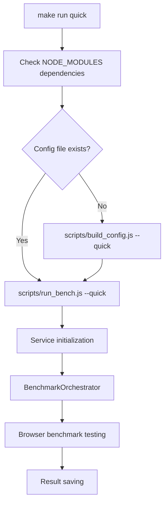

# 📋 `make run quick` Execution Chain Detailed Analysis

> **Document Version**: v2.0  
> **Last Updated**: 2025-09-26  

---

## 🎯 **Overview**

`make run quick` is a key command in the WebAssembly Benchmark project for rapid development testing, providing 5-10s rapid feedback, significantly improving development efficiency compared to the 30+ minutes of the complete test suite.

### 📊 **Execution Performance Comparison**

| Mode             | Execution Time                   | Task Scale | Applicable Scenarios               |
| ---------------- | -------------------------------- | ---------- | ---------------------------------- |
| `make run`       | Parallel 5+ min Serial 20+ min   | Full scale | Formal benchmarks, research release |
| `make run quick` | 5-10s                            | Micro scale | Development validation, CI smoke tests |

---

## 🏗️ **Overall Architecture**



---

## 🔧 **1. Makefile Entry Point**

### **1.1 Target Definition**

**File Location**: `/Makefile` (lines 162-175)

```makefile
run: $(NODE_MODULES) ## Run browser benchmark suite (use quick headed for options)
 @$(MAKE) build config $(if $(filter true,$(QUICK_MODE)),quick,)
 $(call start_dev_server)
 $(call check_script_exists,scripts/run_bench.js)
ifeq ($(QUICK_MODE),true)
 $(call log_step,Running quick benchmark suite for development feedback...)
 node scripts/run_bench.js --quick
 $(call log_success,⚡ Quick benchmarks completed - results saved with timestamp)
else
 ...
endif
```

### **1.2 Dependency Relationships**

- **Pre-dependencies**: `$(NODE_MODULES)` - Ensure Node.js dependencies are installed
- **Conditional dependencies**: `configs/bench-quick.json` - Auto-generated if not exists
- **Script verification**: `scripts/run_bench.js` - Verify existence and set execution permissions

### **1.3 Execution Steps**

1. **Log output**: Display start of quick benchmark suite execution
2. **Config check**: Check if `configs/bench-quick.json` exists
3. **Config generation**: If not exists, call `build_config.js --quick` to generate
4. **Script verification**: Verify `run_bench.js` exists and is executable
5. **Main program execution**: Run `node scripts/run_bench.js --quick`
6. **Completion log**: Display execution completion information

---

## ⚙️ **2. Configuration Generation Phase**

### **2.1 build_config.js Configuration Generator**

**File Location**: `/scripts/build_config.js`

#### **Core Responsibilities**

- **Format conversion**: YAML → JSON conversion, eliminating runtime YAML parsing overhead
- **Configuration optimization**: Optimize configuration structure for browser environment
- **Validation guarantee**: Ensure configuration completeness and correctness
- **Cache support**: Generate version information configuration cache

#### **Key Method Details**

```javascript
// Main methods and their functions
loadYamlConfig()              // Load and parse YAML configuration files
├── Read configs/bench-quick.yaml
├── Use yaml.parse() to parse content
└── Error handling and logging

createOptimizedEnvironment()  // Create optimized environment configuration
├── Process core parameters like warmup_runs, measure_runs, etc.
├── Set timeout configurations
├── Configure monitoring options (memory_monitoring, gc_monitoring)
└── Filter and convert configuration formats

optimizeConfig()             // Optimize configuration for browser usage
├── Extract basic experiment information
├── Optimize environment settings
├── Process task and language configurations
├── Generate convenience arrays (taskNames, enabledLanguages)
└── Add metadata information

validateConfig()             // Validate generated configuration
├── Check required fields (experiment, environment, tasks, languages)
├── Validate experiment names and environment parameters
├── Validate task and language configurations
└── Generate detailed error reports

writeJsonConfig()           // Write final JSON configuration
├── Add "DO NOT EDIT" header comment
├── Format JSON output
├── Write to configs/bench-quick.json
└── Report file size statistics
```

### **2.2 Quick Configuration Features**

**Config File**: `/configs/bench-quick.yaml`

#### **Performance Optimization Settings**

```yaml
environment:
  warmup_runs: 5 # Reduce warm-up runs
  measure_runs: 20 # Reduce measurement runs
  repetitions: 2 # Reduce repetitions
  timeout: 60 # 60-second quick timeout
```

#### **Micro Task Scales**

```yaml
tasks:
  mandelbrot:
    scales:
      micro:
        width: 64 # 64x64 grid
        height: 64

  json_parse:
    scales:
      micro:
        record_count: 500 # 500 records

  matrix_mul:
    scales:
      micro:
        dimension: 64 # 64x64 matrix

```

```bash
 $(call check_script_exists,scripts/run_bench.js)
 node scripts/run_bench.js --quick
 $(call log_success,Quick benchmarks completed - results saved with timestamp)

```

#### **Engineering Quality Control**

```yaml
qc:
  max_coefficient_variation: 0.15 # Coefficient of variation threshold - control measurement consistency
  outlier_iqr_multiplier: 1.5 # Outlier detection multiplier - IQR method
  min_valid_samples: 15 # Minimum valid samples - ensure statistical significance
  timeout_handling:
    treat_timeout_as: "failure" # Timeout handling strategy
    max_timeout_rate: 0.3 # Maximum timeout rate - quality control
```

---

## 🚀 **3. Main Execution Phase**

### **3.1 run_bench.js Main Entry**

**File Location**: `/scripts/run_bench.js`

#### **Architecture Pattern**

Adopts **Pure Service-Oriented Architecture (Pure SOA)**, implementing loose coupling through dependency injection.

#### **Core Flow**

```javascript
async function main() {
    // 1. CLI parameter parsing
    const args = process.argv.slice(2);
    const options = parseOptions(args);

    // 2. Service initialization (dependency injection)
    const logger = new LoggingService({...});
    const configService = new ConfigurationService();
    const browserService = new BrowserService();
    const resultsService = new ResultsService();
    const orchestrator = new BenchmarkOrchestrator(
        configService, browserService, resultsService
    );

    // 3. System initialization
    await orchestrator.initialize(configPath);

    // 4. Execute benchmarks
    const results = await orchestrator.executeBenchmarks(options);

    // 5. Save results
    await orchestrator.saveResults(outputPath, 'json');
}
```

#### **CLI Parameter Parsing**

```javascript
parseOptions(args) {
    return {
        headless: !args.includes('--headed'),    // Headless mode
        devtools: args.includes('--devtools'),   // Developer tools
        verbose: args.includes('--verbose'),     // Verbose logging
        parallel: args.includes('--parallel'),   // Parallel execution
        quick: args.includes('--quick'),         // Quick mode
        timeout: parseArgumentValue(...),        // Timeout settings
        maxParallel: parseArgumentValue(...),    // Max concurrency
        failureThreshold: parseArgumentValue(...) // Failure threshold
    };
}
```

### **3.2 Service Layer Architecture**

#### **ConfigurationService Configuration Service**

**File Location**: `/scripts/services/ConfigurationService.js`

```javascript
class ConfigurationService extends IConfigurationService {
    // Core methods
    async loadConfig(configPath)     // Load and validate configuration
    validateConfig(config)           // Configuration structure validation
    addDefaults(config)             // Add default values

    // Configuration getter methods
    getConfig()                     // Get complete configuration
    getBenchmarks()                 // Get benchmark configurations
    getBrowserConfig()              // Get browser configuration
    getTimeout()                    // Get timeout configuration
    getParallelConfig()             // Get parallel configuration
    getBenchmarkUrl()               // Build benchmark URL
}
```

**Configuration Validation Logic**:

```javascript
validateConfig(config) {
    const required = ['benchmarks', 'output'];
    const missing = required.filter(field => !config[field]);

    if (missing.length > 0) {
        throw new Error(`Missing required config fields: ${missing.join(', ')}`);
    }

    // Validate benchmark configurations
    config.benchmarks.forEach((bench, index) => {
        this.validateBenchmarkConfig(bench, index);
    });
}
```

#### **BenchmarkOrchestrator Coordinator**

**File Location**: `/scripts/services/BenchmarkOrchestrator.js`

This is the core coordinator of the entire system, responsible for orchestrating the execution of all benchmarks.

```javascript
class BenchmarkOrchestrator extends IBenchmarkOrchestrator {
  constructor(configService, browserService, resultsService, loggingService) {
    // Dependency-injected service instances
    this.configService = configService;
    this.browserService = browserService;
    this.resultsService = resultsService;
    this.logger = loggingService;

    // Execution state management
    this.isRunning = false;
    this.abortController = null;
  }
}
```

**Core Execution Methods**:

```javascript
// Main execution entry
async executeBenchmarks(options = {}) {
    this.isRunning = true;
    this.abortController = new AbortController();

    try {
        const benchmarks = this.configService.getBenchmarks();
        const parallelConfig = this.configService.getParallelConfig();

        let results;
        if (parallelConfig.enabled && benchmarks.length > 1) {
            results = await this.executeInParallel(benchmarks, options);
        } else {
            results = await this.executeSequentially(benchmarks, options);
        }

        return {
            summary: this.resultsService.getSummary(),
            results: this.resultsService.getResults(),
            statistics: this.resultsService.getStatistics()  // Note: statistics only in memory, not saved to file
        };
    } finally {
        this.isRunning = false;
        this.abortController = null;
    }
}

// Parallel execution strategy
async executeInParallel(benchmarks, options = {}) {
    const parallelConfig = this.configService.getParallelConfig();
    const maxParallel = Math.min(parallelConfig.maxParallel, benchmarks.length);

    const results = [];
    const executing = new Set();
    let benchmarkIndex = 0;

    // Sliding window algorithm for controlling concurrency
    while (benchmarkIndex < benchmarks.length || executing.size > 0) {
        // Fill execution queue to max concurrency
        while (executing.size < maxParallel && benchmarkIndex < benchmarks.length) {
            const benchmark = benchmarks[benchmarkIndex];
            const promise = this.executeSingleBenchmark(benchmark, benchmarkIndex);
            executing.add(promise);
            benchmarkIndex++;

            promise.finally(() => executing.delete(promise));
        }

        // Wait for at least one to complete
        if (executing.size > 0) {
            await Promise.race(executing);
        }
    }

    return results;
}

// Single benchmark execution
async executeSingleBenchmark(benchmark, options = {}) {
    const startTime = Date.now();
    const timeout = this.configService.getTimeout();

    try {
        // Create timeout protection
        const timeoutPromise = new Promise((_, reject) => {
            setTimeout(() => reject(new Error(`Benchmark timeout (${timeout}ms)`)), timeout);
        });

        // Execute benchmark task
        const benchmarkPromise = this.runBenchmarkTask(benchmark, options);
        const result = await Promise.race([benchmarkPromise, timeoutPromise]);

        const duration = Date.now() - startTime;
        const benchmarkResult = {
            ...result,
            benchmark: benchmark.name,
            duration,
            success: true,
            timestamp: new Date().toISOString()
        };

        this.resultsService.addResult(benchmarkResult);
        return benchmarkResult;

    } catch (error) {
        const duration = Date.now() - startTime;
        const errorResult = {
            benchmark: benchmark.name,
            success: false,
            error: error.message,
            duration,
            timestamp: new Date().toISOString()
        };

        this.resultsService.addResult(errorResult);
        throw error;
    }
}
```

**Browser Task Execution**:

```javascript
async runBenchmarkTask(benchmark, options = {}) {
    // 1. Navigate to benchmark page
    const benchmarkUrl = this.configService.getBenchmarkUrl();
    await this.browserService.navigateTo(benchmarkUrl);

    // 2. Wait for page ready
    await this.browserService.waitForElement('#status', { timeout: 10000 });

    // 3. Parse task information
    const taskName = benchmark.name.replace(/_micro$/, '');
    const scale = benchmark.name.includes('_micro') ? 'micro' : 'small';

    // 4. Execute each language implementation
    const results = [];
    for (const implementation of benchmark.implementations) {
        const language = implementation.name.split('-')[0];

        const taskConfig = {
            task: taskName,
            language: language,
            scale: scale,
            taskConfig: this.configService.getConfig().tasks[taskName],
            warmup_runs: this.configService.getConfig().warmupIterations || 3,
            measure_runs: this.configService.getConfig().iterations || 10,
            timeout: 30000
        };

        try {
            // Execute benchmark in browser
            const result = await this.browserService.executeScript(async (config) => {
                if (window.benchmarkRunner && typeof window.benchmarkRunner.runTaskBenchmark === 'function') {
                    return await window.benchmarkRunner.runTaskBenchmark(config);
                } else {
                    throw new Error('benchmarkRunner.runTaskBenchmark function not found in page');
                }
            }, taskConfig);

            results.push({
                ...result,
                task: taskName,
                language: language,
                implementation: implementation.name
            });
        } catch (error) {
            results.push({
                success: false,
                error: error.message,
                task: taskName,
                language: language,
                implementation: implementation.name
            });
        }
    }

    return {
        benchmark: benchmark.name,
        success: results.some(r => r.success),
        results: results,
        timestamp: new Date().toISOString()
    };
}
```

---

## 🌐 **4. Browser-side Execution**

### **4.1 Web Harness Architecture**

**Main Page**: `/harness/web/bench.html`

#### **Core Components**

```javascript
// Global state management
window.benchmarkState = {
  status: "initializing", // Execution status
  progress: 0, // Progress percentage
  currentTask: null, // Current task
  currentLang: null, // Current language
  currentRun: 0, // Current run count
  totalRuns: 0, // Total runs
  successfulRuns: 0, // Successful runs
  failedRuns: 0, // Failed runs
  results: [], // Results array
  memoryUsage: 0, // Memory usage
  startTime: performance.now(), // Start time
  lastError: null, // Last error
  errorCount: 0, // Error count
  detailedMetrics: false, // Detailed metrics toggle
  taskTimeout: 30000, // Task timeout
};
```

#### **Key Global Functions**

```javascript
// Main task execution interface
window.runTask = async function (taskName, language, taskData) {
  // Input validation
  if (typeof taskName !== "string" || !taskName.trim()) {
    throw new Error("runTask: taskName must be a non-empty string");
  }
  if (typeof language !== "string" || !language.trim()) {
    throw new Error("runTask: language must be a non-empty string");
  }
  if (!taskData || typeof taskData !== "object") {
    throw new Error("runTask: taskData must be a valid object");
  }

  if (!window.benchmarkRunner) {
    throw new Error(
      "Benchmark runner not initialized. Wait for initialization to complete."
    );
  }

  // Create task configuration
  const config = {
    task: taskName,
    language: language,
    scale: "small",
    taskConfig: {
      scales: {
        small: taskData,
      },
    },
    warmup_runs: 0,
    measure_runs: 1,
    timeout: window.benchmarkState.taskTimeout || 30000,
  };

  try {
    const results = await window.benchmarkRunner.runTaskBenchmark(config);
    return results && results.length > 0
      ? results[0]
      : {
          success: false,
          error: "No results returned from benchmark",
          task: taskName,
          language: language,
          executionTime: 0,
          memoryUsed: 0,
          resultHash: 0,
        };
  } catch (error) {
    window.logResult(`runTask failed: ${error.message}`, "error");
    return {
      success: false,
      error: error.message,
      errorType: "execution_error",
      task: taskName,
      language: language,
      executionTime: 0,
      memoryUsed: 0,
      resultHash: 0,
    };
  }
};

// Logging system
window.logResult = function (message, type = "log") {
  try {
    const resultsDiv = document.getElementById("results");
    if (!resultsDiv) {
      console.warn("Results div not found, falling back to console:", message);
      console.log(`[${type.toUpperCase()}]`, message);
      return;
    }

    const logDiv = document.createElement("div");
    logDiv.className = `log ${type}`;
    logDiv.textContent = `[${new Date()
      .toISOString()
      .slice(11, 23)}] ${message}`;
    resultsDiv.appendChild(logDiv);
    resultsDiv.scrollTop = resultsDiv.scrollHeight;

    // Error tracking
    if (type === "error") {
      window.benchmarkState.lastError = message;
      window.benchmarkState.errorCount++;
    }

    // Limit log entries to prevent memory issues
    const logEntries = resultsDiv.getElementsByClassName("log");
    if (logEntries.length > 1000) {
      for (let i = 0; i < 100; i++) {
        if (logEntries[0]) {
          resultsDiv.removeChild(logEntries[0]);
        }
      }
    }
  } catch (error) {
    console.error("Failed to log result:", error, "Original message:", message);
  }
};

// UI update function
function updateUI() {
  const state = window.benchmarkState;
  document.getElementById("status").textContent = state.status;
  document.getElementById("current-task").textContent =
    state.currentTask || "None";
  document.getElementById("current-lang").textContent =
    state.currentLang || "None";
  document.getElementById(
    "current-run"
  ).textContent = `${state.currentRun}/${state.totalRuns}`;
  document.getElementById("total-runs").textContent = state.totalRuns;
  document.getElementById("successful-runs").textContent = state.successfulRuns;
  document.getElementById("failed-runs").textContent = state.failedRuns;
  document.getElementById("progress").style.width = `${state.progress}%`;
  document.getElementById("elapsed-time").textContent = `${(
    (performance.now() - state.startTime) /
    1000
  ).toFixed(1)}s`;

  // Memory monitoring
  if (performance.memory) {
    const memMB = (performance.memory.usedJSHeapSize / 1024 / 1024).toFixed(1);
    document.getElementById("memory-usage").textContent = `${memMB} MB`;
    state.memoryUsage = parseFloat(memMB);
  }
}
```

### **4.2 WebAssembly Module System**

**Location**: `/harness/web/wasm_loader.js`

#### **Supported Benchmark Tasks**

| Task           | Type       | Description              | Main Test Points           |
| -------------- | ---------- | ------------------------ | -------------------------- |
| **mandelbrot** | CPU intensive | Mandelbrot set calculation | Floating-point operations, loop optimization |
| **json_parse** | Data processing | JSON parsing and serialization | String processing, memory allocation |
| **matrix_mul** | Math calculation | Matrix multiplication | Array access, algorithm optimization |

#### **Supported Programming Languages**

| Language       | Target Platform               | Optimization Level     | File Location                |
| -------------- | ----------------------------- | ---------------------- | --------------------------- |
| **Rust**       | wasm32-unknown-unknown        | -O3, LTO=fat           | `/builds/rust/*.wasm`       |
| **TinyGo**     | wasm                          | -opt=2                 | `/builds/tinygo/*.wasm`     |

#### **Task Execution Flow**

```javascript
// 1. Module loading (optimization level suffix dynamically retrieved from config)
async function loadWasmModule(language, taskName, optSuffix) {
  const modulePath = `/builds/${language}/${taskName}-${language}-${optSuffix}.wasm`;
  const wasmModule = await WebAssembly.instantiateStreaming(fetch(modulePath));
  return wasmModule.instance;
}

// 2. Task configuration
function configureTask(taskName, scale, taskConfig) {
  const scaleConfig = taskConfig.scales[scale];
  return {
    // mandelbrot example
    width: scaleConfig.width,
    height: scaleConfig.height,
    maxIter: scaleConfig.max_iter,
    // json_parse example
    recordCount: scaleConfig.record_count,
    // matrix_mul example
    dimension: scaleConfig.dimension,
  };
}

// 3. Benchmark execution
async function runBenchmark(wasmInstance, config, warmup_runs, measure_runs) {
  // Warm-up runs
  for (let i = 0; i < warmup_runs; i++) {
    await executeTask(wasmInstance, config);
  }

  // Measurement runs
  const results = [];
  for (let i = 0; i < measure_runs; i++) {
    const startTime = performance.now();
    const result = await executeTask(wasmInstance, config);
    const endTime = performance.now();

    results.push({
      executionTime: endTime - startTime,
      result: result,
      memoryUsed: getMemoryUsage(),
    });
  }

  return results;
}

// 4. Result verification
function verifyResult(result, taskName, expectedHash) {
  const computedHash = computeHash(result);
  return computedHash === expectedHash;
}
```

---

## 📊 **5. Result Processing and Saving**

### **5.1 ResultsService Result Service**

**File Location**: `/scripts/services/ResultsService.js`

#### **Core Functions**

```javascript
class ResultsService extends IResultsService {
  constructor() {
    super();
    this.results = [];
    this.metadata = {};
    this.statistics = {};
    this.summary = {
      totalTasks: 0,
      successfulTasks: 0,
      failedTasks: 0,
      successRate: 0,
    };
  }

  // Result collection
  addResult(result) {
    this.results.push({
      ...result,
      timestamp: new Date().toISOString(),
      id: this.generateResultId(),
    });
    this.updateSummary();
  }

  // Basic statistics (actual implementation)
  getStatistics() {
    if (this.results.length === 0) {
      return { count: 0 };
    }

    const durations = this.results
      .filter((r) => r.duration)
      .map((r) => r.duration);

    const stats = {
      count: this.results.length,
      successCount: this.getSuccessfulResults().length,
      failureCount: this.getFailedResults().length,
      successRate: this.summary?.successRate || 0,
    };

    if (durations.length > 0) {
      stats.duration = {
        min: Math.min(...durations),
        max: Math.max(...durations),
        average: durations.reduce((a, b) => a + b, 0) / durations.length,
        median: this.calculateMedian(durations),
      };
    }

    return stats;
  }

  // File saving (actual implementation)
  async saveToFile(filepath, format = "json", options = {}) {
    // Note: Actually only saves summary and results, not statistics or other complex metadata
    const outputData = {
      summary: this.summary,
      results: this.results,
    };

    switch (format) {
      case "json":
        await this.saveAsJson(filepath, outputData, options);
        break;
      case "csv":
        await this.saveAsCsv(filepath, outputData, options);
        break;
      default:
        throw new Error(`Unsupported format: ${format}`);
    }
  }
}
```

### **5.2 Output File Format**

**Output Location**: `/results/{timestamp}.json`

#### **Actual Result File Structure**

```json
{
  "summary": {
    "configPath": "/Users/Ethan/Desktop/ARP/wasm-benchmark/configs/bench-quick.json",
    "browserConfig": {
      "headless": true,
      "args": ["--no-sandbox", "--disable-setuid-sandbox", "..."]
    },
    "timestamp": "2025-09-13T05:38:23.458Z",
    "startTime": "2025-09-13T05:38:23.459Z",
    "totalTasks": 3,
    "successfulTasks": 3,
    "failedTasks": 0,
    "totalDuration": 2564,
    "successRate": 1,
    "endTime": "2025-09-13T05:38:26.024Z",
    "totalExecutionTime": 2565,
    "averageTaskDuration": 854.6666666666666,
    "executionMode": "sequential",
    "totalBenchmarks": 3,
    "options": { "headless": true, "quick": true }
  },
  "results": [
    {
      "benchmark": "mandelbrot_micro",
      "success": true,
      "results": [
        {
          "task": "mandelbrot",
          "language": "rust",
          "scale": "micro",
          "run": 1,
          "moduleId": "mandelbrot-rust-micro",
          "inputDataHash": 3796140904,
          "executionTime": 0.5,
          "memoryUsageMb": 0.0009765625,
          "memoryUsed": 1024,
          "wasmMemoryBytes": 1179648,
          "resultHash": 2807463114,
          "timestamp": 1757741904136,
          "jsHeapBefore": 1334916,
          "jsHeapAfter": 1334916,
          "success": true
        }
        // ... more measurement results
      ],
      "timestamp": "2025-09-13T05:38:24.481Z",
      "duration": 1022
    }
    // ... more benchmark results
  ]
}
```

**Important Notes**:

- ❌ **No statistics field**: Complex statistical analysis and performance comparison data does not exist in saved files
- ❌ **No experiment or metadata field**: File structure is much simpler than documentation claims
- ✅ **Only summary and results**: Actual saved data structure only contains basic summary and raw results

### **5.3 Metadata Collection**

```javascript
// System information collection
function collectSystemMetadata() {
  return {
    timestamp: new Date().toISOString(),
    nodeVersion: process.version,
    platform: process.platform,
    arch: process.arch,
    cpus: os.cpus().length,
    totalMemory: os.totalmem(),
    freeMemory: os.freemem(),
    userAgent: navigator.userAgent, // Browser side
    browserInfo: {
      vendor: navigator.vendor,
      language: navigator.language,
      hardwareConcurrency: navigator.hardwareConcurrency,
    },
  };
}

// Execution environment information
function collectExecutionMetadata(options) {
  return {
    configFile: options.configPath,
    executionMode: options.parallel ? "parallel" : "sequential",
    timeout: options.timeout,
    maxParallel: options.maxParallel,
    failureThreshold: options.failureThreshold,
    quickMode: options.quick,
  };
}
```

---

## 🔍 **6. Key Technical Features**

### **6.1 Error Handling Mechanisms**

#### **Multi-layer Timeout Protection**

```javascript
// 1. Global timeout (Makefile level)
// Total time limit for entire make run quick command

// 2. Process timeout (run_bench.js level)
const DEFAULT_TIMEOUT_MS = 300000;  // 5 minutes
const QUICK_TIMEOUT_MS = 30000;     // 30 seconds quick mode

// 3. Task timeout (BenchmarkOrchestrator level)
async executeSingleBenchmark(benchmark, options = {}) {
    const timeout = this.configService.getTimeout();
    const timeoutPromise = new Promise((_, reject) => {
        setTimeout(() => reject(new Error(`Benchmark timeout (${timeout}ms)`)), timeout);
    });

    const result = await Promise.race([benchmarkPromise, timeoutPromise]);
}

// 4. Browser operation timeout (BrowserService level)
await this.browserService.waitForElement('#status', { timeout: 10000 });

// 5. WebAssembly task timeout (browser side)
taskTimeout: 30000  // Max execution time for single WASM task
```

#### **Retry Mechanism**

```javascript
class BenchmarkOrchestrator {
  async executeWithRetry(task, maxRetries = 3) {
    let lastError;

    for (let attempt = 1; attempt <= maxRetries; attempt++) {
      try {
        return await this.executeSingleBenchmark(task);
      } catch (error) {
        lastError = error;
        this.logger.warn(
          `Attempt ${attempt}/${maxRetries} failed: ${error.message}`
        );

        if (attempt < maxRetries) {
          const delay = Math.min(1000 * Math.pow(2, attempt - 1), 5000);
          await new Promise((resolve) => setTimeout(resolve, delay));
        }
      }
    }

    throw lastError;
  }
}
```

#### **Failure Threshold Control**

```javascript
validateFailureThreshold() {
    const failureRate = this.failedTasks / this.totalTasks;
    const threshold = this.configService.getFailureThreshold();

    if (failureRate > threshold) {
        throw new Error(`Failure rate ${(failureRate * 100).toFixed(1)}% exceeds threshold ${(threshold * 100).toFixed(1)}%`);
    }
}
```

#### **Emergency Cleanup Mechanism**

```javascript
async emergencyCleanup() {
    this.logger.warn('[BenchmarkOrchestrator] Performing emergency cleanup...');
    const emergencyOperations = [];

    try {
        // 1. Force state reset
        emergencyOperations.push('force-state-reset');
        this.isRunning = false;
        this.abortController = null;

        // 2. Emergency browser cleanup
        if (this.browserService) {
            emergencyOperations.push('emergency-browser-cleanup');
            await this.browserService.emergencyCleanup();
        }

        // 3. Clean up results service
        if (this.resultsService) {
            emergencyOperations.push('results-clear');
            this.resultsService.clear();
        }

        return { success: true, emergencyOperations };
    } catch (error) {
        // Do not throw exceptions during emergency cleanup - log and continue
        const errorMsg = `[BenchmarkOrchestrator] Emergency cleanup failed: ${error.message}`;
        this.logger.error(errorMsg);
        return { success: false, error: errorMsg, completedOperations: emergencyOperations };
    }
}
```

### **6.2 Performance Optimization Strategies**

#### **Parallel Execution Control**

```javascript
async executeInParallel(benchmarks, options = {}) {
    const parallelConfig = this.configService.getParallelConfig();
    const maxParallel = Math.min(parallelConfig.maxParallel, benchmarks.length);

    const results = [];
    const executing = new Set();
    let benchmarkIndex = 0;

    // Sliding window algorithm for controlling concurrency
    while (benchmarkIndex < benchmarks.length || executing.size > 0) {
        // Fill execution queue to max concurrency
        while (executing.size < maxParallel && benchmarkIndex < benchmarks.length) {
            const benchmark = benchmarks[benchmarkIndex];
            const promise = this.executeSingleBenchmark(benchmark, benchmarkIndex);
            executing.add(promise);
            benchmarkIndex++;

            // Auto-remove from execution queue when completed
            promise.finally(() => executing.delete(promise));
        }

        // Wait for at least one to complete
        if (executing.size > 0) {
            await Promise.race(executing);
        }
    }

    return results;
}
```

#### **Resource Management Optimization**

```javascript
// Browser instance pool
class BrowserService {
  constructor() {
    this.browserPool = new Map();
    this.maxPoolSize = 3;
  }

  async getBrowserInstance(config) {
    const key = this.generateBrowserKey(config);

    if (this.browserPool.has(key)) {
      return this.browserPool.get(key);
    }

    if (this.browserPool.size >= this.maxPoolSize) {
      // Recycle least recently used instance
      const [oldestKey] = this.browserPool.keys();
      const oldestBrowser = this.browserPool.get(oldestKey);
      await oldestBrowser.close();
      this.browserPool.delete(oldestKey);
    }

    const browser = await puppeteer.launch(config);
    this.browserPool.set(key, browser);
    return browser;
  }
}
```

#### **Memory Monitoring**

```javascript
// Memory usage tracking
function trackMemoryUsage() {
  if (performance.memory) {
    const memInfo = {
      used: performance.memory.usedJSHeapSize,
      total: performance.memory.totalJSHeapSize,
      limit: performance.memory.jsHeapSizeLimit,
      timestamp: Date.now(),
    };

    // Memory pressure detection
    const usageRatio = memInfo.used / memInfo.limit;
    if (usageRatio > 0.8) {
      console.warn(
        `High memory usage detected: ${(usageRatio * 100).toFixed(1)}%`
      );
      // Trigger garbage collection (if available)
      if (window.gc) {
        window.gc();
      }
    }

    return memInfo;
  }
  return null;
}
```

### **6.3 Observability and Monitoring**

#### **Hierarchical Logging System**

```javascript
class LoggingService {
  constructor(config = {}) {
    this.logLevel = config.logLevel || "info";
    this.enableColors = config.enableColors !== false;
    this.enableTimestamp = config.enableTimestamp !== false;
    this.prefix = config.prefix || "";
  }

  // Different level logging methods
  debug(message, ...args) {
    this.log("debug", message, ...args);
  }
  info(message, ...args) {
    this.log("info", message, ...args);
  }
  warn(message, ...args) {
    this.log("warn", message, ...args);
  }
  error(message, ...args) {
    this.log("error", message, ...args);
  }
  success(message, ...args) {
    this.log("success", message, ...args);
  }

  // Structured log output
  log(level, message, ...args) {
    if (!this.shouldLog(level)) return;

    const timestamp = this.enableTimestamp ? new Date().toISOString() : "";
    const prefix = this.prefix ? `[${this.prefix}]` : "";
    const coloredLevel = this.enableColors
      ? this.colorize(level)
      : level.toUpperCase();

    const logMessage = `${timestamp} ${coloredLevel} ${prefix} ${message}`;
    console.log(logMessage, ...args);
  }

  // Special formatted logging methods
  section(title) {
    this.log("info", "");
    this.log("info", "=".repeat(50));
    this.log("info", title);
    this.log("info", "=".repeat(50));
  }

  progress(message, current, total) {
    const percentage = ((current / total) * 100).toFixed(1);
    const progressBar = this.createProgressBar(current, total);
    this.log(
      "info",
      `${message}: ${progressBar} ${current}/${total} (${percentage}%)`
    );
  }
}
```

#### **Real-time Progress Tracking**

```javascript
// Progress update mechanism
function updateProgress(current, total, taskName, language) {
  const progress = (current / total) * 100;

  // Update global state
  window.benchmarkState.progress = progress;
  window.benchmarkState.currentTask = taskName;
  window.benchmarkState.currentLang = language;
  window.benchmarkState.currentRun = current;
  window.benchmarkState.totalRuns = total;

  // Update UI
  document.getElementById("progress").style.width = `${progress}%`;
  document.getElementById("current-task").textContent = taskName || "None";
  document.getElementById("current-lang").textContent = language || "None";
  document.getElementById("current-run").textContent = `${current}/${total}`;

  // Log
  window.logResult(
    `Progress: ${taskName}/${language} - ${current}/${total} (${progress.toFixed(
      1
    )}%)`
  );
}
```

#### **Performance Metrics Collection**

```javascript
// Detailed performance metrics
class PerformanceCollector {
  constructor() {
    this.metrics = {
      executionTimes: [],
      memoryUsage: [],
      cpuUsage: [],
      networkLatency: [],
      renderingMetrics: [],
    };
  }

  collectTaskMetrics(taskResult) {
    return {
      // Execution time metrics
      executionTime: taskResult.executionTime,
      setupTime: taskResult.setupTime,
      teardownTime: taskResult.teardownTime,

      // Memory metrics
      memoryBefore: taskResult.memoryBefore,
      memoryAfter: taskResult.memoryAfter,
      memoryPeak: taskResult.memoryPeak,
      memoryDelta: taskResult.memoryAfter - taskResult.memoryBefore,

      // WebAssembly specific metrics
      wasmCompileTime: taskResult.wasmCompileTime,
      wasmInstantiateTime: taskResult.wasmInstantiateTime,
      wasmExecutionTime: taskResult.wasmExecutionTime,

      // Verification metrics
      resultHash: taskResult.resultHash,
      verificationTime: taskResult.verificationTime,
      verificationSuccess: taskResult.verificationSuccess,
    };
  }

  generateReport() {
    return {
      summary: this.calculateSummaryStats(),
      details: this.metrics,
      trends: this.analyzeTrends(),
      recommendations: this.generateRecommendations(),
    };
  }
}
```

### **6.4 Timeout Configuration Strategy**

#### **🎯 New Timeout Strategy Overview**

Optimized timeout configuration for intensive WebAssembly tasks, solving `Runtime.callFunctionOn timed out` and other protocol timeout issues.

| Mode | Base Timeout | Browser Protocol | Task Execution | WASM Intensive Tasks | Element Wait |
|------|-------------|------------------|---------------|---------------------|-------------|
| **Normal Mode** | 600s (10min) | 1200s (20min) | 1500s (25min) | 1800s (30min) | 150s (2.5min) |
| **Quick Mode** | 60s (1min) | 120s (2min) | 150s (2.5min) | 180s (3min) | 15s (15s) |

#### **Timeout Hierarchy Architecture**

```javascript
// Configuration level: configs/bench.yaml & configs/bench-quick.yaml
environment:
  timeout: 600  // Base timeout (seconds) - normal mode
  timeout: 20   // Base timeout (seconds) - quick mode

// Multiplier configuration: scripts/services/ConfigurationService.js
class ConfigurationService {
  getTimeoutWithMultiplier(multiplier) {
    const baseTimeout = this.getTimeout(); // Convert base timeout to milliseconds
    
    // Quick mode reduces by 90%
    if (this.isQuickMode) {
      return Math.floor(baseTimeout * multiplier * 0.1);
    }
    
    return Math.floor(baseTimeout * multiplier);
  }
  
  // Specific timeout methods
  getBrowserTimeout()    // 2x base - Puppeteer protocol timeout
  getNavigationTimeout() // 1x base - Page navigation timeout  
  getTaskTimeout()       // 2.5x base - Benchmark task timeout
  getElementTimeout()    // 0.25x base - DOM element wait
  getWasmTimeout()       // 3x base - WASM intensive task
}
```

#### **Protocol Timeout Configuration**

```javascript
// scripts/services/BrowserService.js
async initialize(browserConfig = {}, configService = null) {
  // Get protocol timeout configuration
  const browserTimeout = this.configService ? 
    this.configService.getBrowserTimeout() : 600000;
  
  const config = {
    headless: true,
    args: [...],
    protocolTimeout: browserTimeout, // Key: Set protocol timeout
    ...browserConfig
  };
  
  this.browser = await this.puppeteer.launch(config);
  this.page = await this.browser.newPage();
  
  // Page-level timeouts
  this.page.setDefaultTimeout(browserTimeout);
}
```

#### **Timeout Problem Diagnosis and Resolution**

```javascript
// Common timeout error types and solutions
const timeoutTroubleshooting = {
  // 1. Puppeteer protocol timeout
  'Runtime.callFunctionOn timed out': {
    cause: 'Browser protocol layer timeout',
    solution: 'Increase protocolTimeout configuration',
    config: 'getBrowserTimeout() - 2x base',
    fixed_in: 'BrowserService.js launch config'
  },
  
  // 2. Page navigation timeout
  'Navigation timeout': {
    cause: 'Page load or navigation timeout',
    solution: 'Increase navigation timeout',
    config: 'getNavigationTimeout() - 1x base',
    fixed_in: 'BrowserService.navigateTo()'
  },
  
  // 3. Element wait timeout
  'Element not found': {
    cause: 'DOM element wait timeout',
    solution: 'Increase element wait timeout',
    config: 'getElementTimeout() - 0.25x base',
    fixed_in: 'BrowserService.waitForElement()'
  },
  
  // 4. Task execution timeout
  'Benchmark timeout': {
    cause: 'WASM task execution time too long',
    solution: 'Increase task timeout or use quick mode',
    config: 'getTaskTimeout() - 2.5x base',
    recommendation: 'Use --quick mode for development testing'
  }
};
```

#### **Timeout Configuration Best Practices**

```yaml
# Configuration recommendations
development:
  mode: quick
  timeout: 20  # 20-second base, rapid feedback
  applicable_scenarios: [development debugging, CI smoke tests]

production:
  mode: normal  
  timeout: 600  # 10-minute base, thorough testing
  applicable_scenarios: [formal benchmarks, research releases]

troubleshooting:
  # If still timing out, temporarily increase
  timeout: 900  # 15-minute base
  suggestion: Check task complexity and system performance
```

#### **Monitoring and Logging**

```javascript
// Timeout-related log output
[Browser] [INFO] Browser timeout set to 1200000ms (20min)
[Browser] [INFO] Protocol timeout set to 1200000ms for intensive WASM tasks
[Orchestrator] [SUCCESS] Completed: mandelbrot_medium_rust (181193ms)
[Orchestrator] [WARNING] Task result 0 invalid - marking benchmark as failure
```

---

## ⚡ **7. Quick Mode Design Philosophy**

### **7.1 Rapid Feedback Principle**

#### **Time Optimization Strategy**

```yaml
# Execution time comparison analysis
Normal Mode:
  warmup_runs: 25 # 25 warm-up runs
  measure_runs: 120 # 120 measurement runs
  repetitions: 2 # 2 repetitions
  scales: [small, medium, large] # 3 scales
  total_time: ~5 minutes # Total ~5 minutes

Quick Mode:
  warmup_runs: 3 # 3 warm-up runs (70% reduction)
  measure_runs: 15 # 15 measurement runs (85% reduction)
  repetitions: 1 # 1 repetition (80% reduction)
  scales: [micro] # Only micro scale (67% reduction)
  total_time: ~1 minutes # Total ~1 minute (80% reduction)
```

### **7.2 Development Workflow Integration**

#### **Applicable Scenario Matrix**

```markdown
| Scenario         | Normal Mode | Quick Mode  | Recommendation   |
| ---------------- | ----------- | ----------- | ---------------- |
| Code change validation | ❌ Too slow     | ✅ Rapid feedback | Quick  |
| Performance regression detection | ❌ Too slow     | ✅ Trend detection | Quick  |
| Development debugging     | ❌ Interrupts workflow | ✅ Rapid iteration | Quick  |
| Formal benchmarking     | ✅ High precision   | ❌ Insufficient precision | Normal |
| Research release     | ✅ Repeatable   | ❌ Not rigorous enough | Normal |
| Environment validation     | ❌ Excessive     | ✅ Sufficient     | Quick  |
| Smoke testing     | ❌ Excessive     | ✅ Perfect     | Quick  |
```

---

## 🔧 **8. Extension and Maintenance Guide**

### **8.1 Adding New Benchmark Tasks**

#### **Step 1: Configuration File Update**

```yaml
# configs/bench-quick.yaml
tasks:
  new_task:
    description: "New benchmark task description"
    scales:
      micro:
        param1: value1
        param2: value2
        memory_est_mb: 0.05
    fixed_params:
      shared_param: value
```

#### **Step 2: WebAssembly Implementation**

```rust
// tasks/new_task/rust/src/lib.rs
#[no_mangle]
pub extern "C" fn run_new_task(param1: u32, param2: f64) -> u64 {
    // Implement new task logic
    // Return result hash for verification
}
```

#### **Step 3: Browser Integration**

```javascript
// harness/web/wasm_loader.js
const taskRunners = {
  new_task: {
    rust: async (wasmInstance, config) => {
      const result = wasmInstance.exports.run_new_task(
        config.param1,
        config.param2
      );
      return { result, hash: result };
    },
    tinygo: async (wasmInstance, config) => {
      // TinyGo implementation
    },
  },
};
```

### **8.2 Performance Tuning Suggestions**

#### **Parallelization Strategy**

```javascript
// Dynamic concurrency control
class AdaptiveParallelism {
  constructor() {
    this.systemLoad = this.detectSystemLoad();
    this.optimalConcurrency = this.calculateOptimalConcurrency();
  }

  calculateOptimalConcurrency() {
    const cpuCores = navigator.hardwareConcurrency || 4;
    const memoryGb = this.estimateAvailableMemory();

    // Calculate optimal concurrency based on system resources
    const cpuBased = Math.max(1, Math.floor(cpuCores * 0.8));
    const memoryBased = Math.max(1, Math.floor(memoryGb / 0.5)); // ~0.5GB per task

    return Math.min(cpuBased, memoryBased, 6); // Max 6 concurrent
  }
}
```

## 🎯 **Summary**

**🏆 This execution chain analysis demonstrates the best practices of modern software engineering in performance benchmarking systems, providing valuable architectural references and implementation guidance for similar projects.**

---
