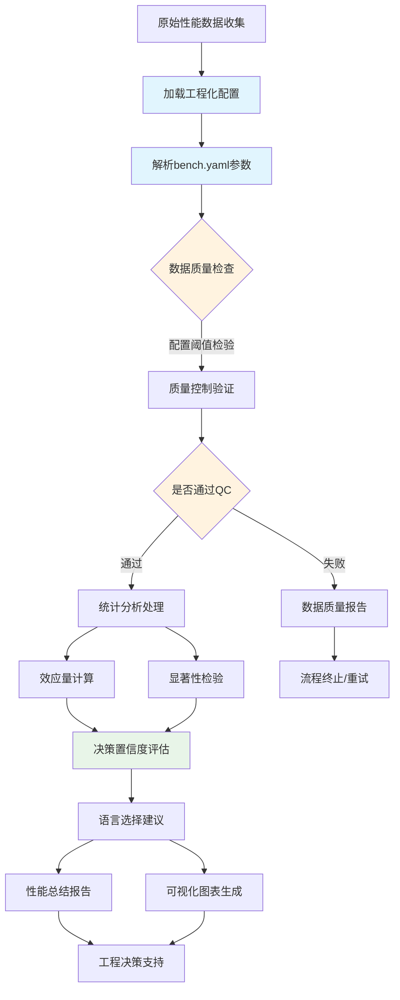

# 🎯 WebAssembly基准测试系统：实现架构指南

> **文档版本**: v2.0 (基于实际实现)
> **更新时间**: 2025-09-26
> **目标读者**: 核心开发团队、架构决策者、新开发者
> **范围**: Rust vs TinyGo语言选择决策支持系统架构与实现

---

## 📋 **项目背景与目标**

### **问题背景**

WebAssembly Benchmark 项目旨在为开发者提供基于数据的语言选择决策支持，重点比较 Rust vs TinyGo 在 WebAssembly 编译场景下的性能表现。

### **核心目标**

- **主要用户**: 开发人员
- **使用场景**: 基于数据而非猜测选择 Rust vs TinyGo 编译 WebAssembly
- **质量要求**: 工程级可靠性，非学术级严谨性
- **系统标准**: 平衡统计准确性与实际可用性

### **核心功能 (✅ 已实现)**

1. **性能基准测试**: Mandelbrot计算、JSON解析、矩阵乘法等WASM任务 (`tasks/` 目录)
2. **统计分析**: Welch's t-test和Cohen's d效应量分析 (`analysis/statistics.py`)
3. **质量控制**: IQR离群值检测和变异系数验证 (`analysis/qc.py`)
4. **决策支持**: 综合决策报告和语言推荐 (`analysis/decision.py`)
5. **可视化分析**: 4种统计图表和交互式HTML报告 (`analysis/plots.py`)
6. **配置管理**: 工程级配置解析和验证 (`analysis/config_parser.py`)

---

## 🏆 **组件重要性分析与优先级**

### **🥇 第一优先级：统计验证测试**

**重要性评分**: ⭐⭐⭐⭐⭐ (关键)

#### **为什么最重要**

- **决策可靠性**: 区分真实性能差异 vs 测量噪声
- **风险控制**: 避免基于随机波动做出错误的语言选择
- **置信度量化**: 提供统计显著性和效应量，让开发者理解结果可信度
- **成本效益**: 防止因错误选择导致的重构成本

#### **缺失风险评估**

```text
高风险场景：
- 基于 3% 的性能差异选择复杂的 Rust，但差异实际上是噪声
- 误判 TinyGo 在某任务上的劣势，错过更适合的选择
- 团队基于不可靠数据做出架构决策，影响项目长期发展
```

### **🥈 第二优先级：基准验证框架**

**重要性评分**: ⭐⭐⭐⭐ (重要)

#### **为什么重要**

- **比较公平性**: 确保 Rust 和 TinyGo 在相同条件下测试
- **实现正确性**: 通过哈希验证检测算法实现错误
- **结果可重现**: 保证不同运行环境下结果的一致性
- **数据质量**: 及早发现和标记异常数据

#### **简化空间**

- 可以简化为轻量级验证，而非完整学术框架
- 重点关注关键质量指标，忽略边缘情况

### **🥉 第三优先级：性能基线**

**重要性评分**: ⭐⭐ (可选)

#### **为什么优先级较低**

- **相对比较导向**: 开发者更关心 "Rust vs TinyGo" 而非绝对性能
- **环境依赖性**: 不同硬件的基线差异巨大，参考价值有限
- **可延后实现**: 不影响当前语言选择决策
- **维护成本**: 需要持续更新和校准，投入产出比较低

---

## 📊 **系统架构设计**

### **数据处理流程**



### **核心组件架构 (✅ 实际实现)**

| 组件 | 文件 | 功能描述 | 配置依赖 | 状态 |
|------|------|----------|----------|--------|
| **配置管理** | `configs/bench.yaml` | 工程化参数和阈值设置 | - | ✅ 完整实现 |
| **配置解析器** | `analysis/config_parser.py` | 类型化配置加载和验证 | 全部配置节点 | ✅ 完整实现 |
| **数据模型** | `analysis/data_models.py` | 完整数据结构定义 | - | ✅ 完整实现 |
| **统计分析** | `analysis/statistics.py` | StatisticalAnalysis类 | `statistics.*` | ✅ 完整实现 |
| **质量控制** | `analysis/qc.py` | QualityController类 | `qc.*` | ✅ 完整实现 |
| **决策支持** | `analysis/decision.py` | DecisionSummaryGenerator类 | `statistics.*` | ✅ 完整实现 |
| **可视化** | `analysis/plots.py` | 4种图表+HTML报告 | `plots.*` | ✅ 完整实现 |
| **验证框架** | `analysis/validation.py` | 跨语言哈希验证 | `validation.*` | ✅ 完整实现 |
| **通用工具** | `analysis/common.py` | CLI和工具函数 | - | ✅ 辅助实现 |

#### **实际配置节点结构**

```yaml
# configs/bench.yaml 实际结构
qc:                           # 质量控制配置
  max_coefficient_variation: 0.15
  outlier_iqr_multiplier: 1.5
  min_valid_samples: 30
  failure_rate: 0.1

statistics:                   # 统计分析配置
  confidence_level: 0.95
  significance_alpha: 0.05
  effect_size_thresholds: {small: 0.3, medium: 0.6, large: 1.0}
  minimum_detectable_effect: 0.3

plots:                        # 可视化配置
  dpi_basic: 150
  figure_sizes: {basic: [10, 6], detailed: [16, 12]}
  color_scheme: {rust: "#CE422B", tinygo: "#00ADD8"}

validation:                   # 验证配置
  required_success_rate: 0.95
  hash_tolerance: 1e-8
```

---

## 🔬 **统计验证测试设计**

### **核心统计方法选择**

#### **显著性检验：Welch's t-test**

**数学原理**：

Welch's t-test 用于比较两个可能方差不等的样本，比标准 t-test 更合适，适合性能数据分析。

**t 统计量计算**：

```math
t = (μ₁ - μ₂) / √(s₁²/n₁ + s₂²/n₂)
```

**Welch-Satterthwaite 自由度**：

```math
df = (s₁²/n₁ + s₂²/n₂)² / [(s₁²/n₁)²/(n₁-1) + (s₂²/n₂)²/(n₂-1)]
```

**置信区间**：

```math
(μ₁ - μ₂) ± t_critical × √(s₁²/n₁ + s₂²/n₂)
```

#### **效应量计算：Cohen's d**

**数学原理**：

Cohen's d 量化两组数据的实际差异大小，标准化了均值差异。

**公式**：

```math
d = (μ₁ - μ₂) / s_pooled

其中合并标准差：
s_pooled = √[((n₁-1)×s₁² + (n₂-1)×s₂²) / (n₁+n₂-2)]
```

**效应量解释标准**：

- |d| < 0.2: 忽略不计 (negligible)
- |d| < 0.5: 小效应 (small effect)
- |d| < 0.8: 中等效应 (medium effect)
- |d| ≥ 0.8: 大效应 (large effect)

### **数据质量验证**

**验证原则**：

1. **样本量检查**: n ≥ 5（最少），推荐 n ≥ 30
2. **变异系数限制**: CV = σ/μ < 0.5 （性能稳定性）
3. **离群值检测**: IQR方法，Q1 - 1.5×IQR 或 Q3 + 1.5×IQR 之外标记为离群值
4. **成功率阈值**: 成功率 > 80%

**数据质量评级标准**：

- **有效** (Valid): 无关键问题，数据可用于决策
- **警告** (Warning): 存在质量问题但不影响基本分析
- **无效** (Invalid): 关键质量问题，不可用于语言选择决策

---

## 🔍 **技术实现详情**

### **1. 配置解析器模块 (analysis/config_parser.py)**

#### 实际实现架构

```python
class ConfigParser:
    """Configuration parser for engineering-grade benchmark analysis"""

    def __init__(self, config_path: str = "configs/bench.yaml"):
        """Initialize with path to bench.yaml"""
        self.config_path = Path(config_path)
        self._configuration_data: Optional[ConfigurationData] = None

    def load(self) -> "ConfigParser":
        """Load and validate configuration file with comprehensive error handling"""
        # 验证文件存在性
        # 解析YAML文件
        # 验证必需配置节点
        # 创建类型化配置对象

    def get_qc_config(self) -> QCConfiguration:
        """返回类型化QC配置对象"""
        return QCConfiguration(
            max_coefficient_variation=0.15,
            outlier_iqr_multiplier=1.5,
            min_valid_samples=30,
            failure_rate=0.1,
            quality_invalid_threshold=0.15,
            quality_warning_threshold=0.3,
            rust_thresholds=LanguageThresholds(...),  # 可选
            tinygo_thresholds=LanguageThresholds(...)  # 可选
        )

    def get_stats_config(self) -> StatisticsConfiguration:
        """返回类型化统计配置对象"""
        return StatisticsConfiguration(
            confidence_level=0.95,
            significance_alpha=0.05,
            effect_size_thresholds={"small": 0.3, "medium": 0.6, "large": 1.0},
            minimum_detectable_effect=0.3
        )
```

#### **类型安全特性**

- **强类型配置**: 使用`data_models.py`中的配置类型
- **验证机制**: 配置文件结构和必需字段验证
- **默认值处理**: 缺失参数的合理默认值
- **错误处理**: 详细的配置错误信息

#### **配置驱动特性**

- **集中管理**: 所有模块的配置参数统一管理
- **类型安全**: 配置值类型验证和默认值处理
- **热重载**: 支持运行时配置更新（可选）
- **环境适配**: 支持不同环境的配置文件

### **2. 统计分析模块 (analysis/statistics.py)**

#### **实际实现架构**

```python
class StatisticalAnalysis:
    """Statistical analysis engine for benchmark performance comparison"""

    def __init__(self, stats_config: StatisticsConfiguration):
        """Initialize with typed configuration object"""
        self.config = stats_config
        self.alpha = self.config.significance_alpha
        self.confidence_level = self.config.confidence_level
        self.effect_thresholds = self.config.effect_size_thresholds
        self.minimum_detectable_effect = self.config.minimum_detectable_effect

    def welch_t_test(self, group1: list[float], group2: list[float]) -> TTestResult:
        """Welch's t-test with unequal variances support"""
        # 数学实现:
        # t = (μ₁ - μ₂) / √(s₁²/n₁ + s₂²/n₂)
        # df = (s₁²/n₁ + s₂²/n₂)² / [(s₁²/n₁)²/(n₁-1) + (s₂²/n₂)²/(n₂-1)]

        # 使用scipy.stats.t进行精确p值计算
        # 返回TTestResult数据类型

    def cohens_d(self, group1: list[float], group2: list[float]) -> EffectSizeResult:
        """Cohen's d with minimum detectable effect assessment"""
        # 数学实现:
        # d = (μ₁ - μ₂) / s_pooled
        # s_pooled = √[((n₁-1)×s₁² + (n₂-1)×s₂²) / (n₁+n₂-2)]

        # 返回EffectSizeResult数据类型，包含:
        # - cohens_d值
        # - effect_size枚举
        # - interpretation字符串
        # - meets_minimum_detectable_effect布尔值

    def generate_task_comparison(self, rust_result: TaskResult,
                                tinygo_result: TaskResult) -> ComparisonResult:
        """Complete statistical comparison for a task"""
        # 多指标分析: execution_time + memory_usage
        # 返回ComparisonResult包含完整统计分析
```

#### **核心特性**

- **数值稳定性**: Welford算法计算均值和方差
- **强类型返回**: 所有方法返回结构化数据类型
- **多指标支持**: 同时分析执行时间和内存使用
- **MDE评估**: 最小可检测效应量判断
- **科学计算**: 使用scipy进行精确统计计算

#### **工程化特性**

- **简化的统计方法**: 专注核心比较分析，避免过度复杂的学术功能
- **实用的显著性阈值**: α = 0.05 (工程标准)
- **效应量分类**: 实用的Cohen's d阈值 (小=0.3, 中=0.6, 大=1.0)
- **决策支持**: 直接的语言选择建议和置信度评估

#### **工作流程描述**

**Welch's t-test流程**：

- 验证输入数据的有效性和完整性
- 计算两组样本的基本统计量（均值、方差）
- 应用Welch's t-test公式计算t统计量和自由度
- 计算双尾p值并进行显著性判断
- 构建置信区间估计均值差异范围

**Cohen's d流程**：

- 验证样本数据的基本要求
- 计算两组样本的统计参数
- 应用Cohen's d公式计算标准化效应量
- 根据Cohen标准解释效应量大小
- 确定性能优势方向和实际意义
- 为开发者提供效应量解读建议

### **3. 质量控制模块 (analysis/qc.py)**

#### **实际实现架构**

```python
class QualityController:
    """Data quality control and validation for benchmark analysis pipeline"""

    def __init__(self, benchmark_results: list[BenchmarkResult],
                 qc_config: QCConfiguration):
        """Initialize with typed configuration and results"""
        self.benchmark_results = benchmark_results
        self.config = qc_config
        self.max_cv = self.config.max_coefficient_variation
        self.iqr_multiplier = self.config.outlier_iqr_multiplier
        self.min_samples = self.config.min_valid_samples
        self.failure_rate = self.config.failure_rate
        self.cleaning_log: list[str] = []

    def validate_and_clean(self) -> CleanedDataset:
        """Complete quality control pipeline"""
        # 1. 提取所有样本
        # 2. 按任务-语言-规模分组
        # 3. 验证样本数量
        # 4. IQR离群值检测
        # 5. 变异系数验证
        # 6. 生成质量评估
        # 返回CleanedDataset对象

    def _detect_outliers_iqr(self, samples: list[BenchmarkSample],
                            metric: str) -> list[BenchmarkSample]:
        """IQR-based outlier detection"""
        # Q1 - 1.5×IQR, Q3 + 1.5×IQR 边界计算
        # 使用配置的iqr_multiplier
        # 支持execution_time和memory_usage指标

    def _validate_quality_group(self, group_samples: list[BenchmarkSample]) -> QualityAssessment:
        """Group-level quality assessment"""
        # 返回QualityAssessment枚举: VALID, WARNING, INVALID
        # 基于样本数量、变异系数、失败率等指标
```

#### **质量控制常数**

```python
class QCConstants:
    Q1_PERCENTILE = 0.25
    Q3_PERCENTILE = 0.75
    EXTREME_CV_MULTIPLIER = 2.0
    MINIMUM_IQR_SAMPLES = 4
    DEFAULT_JSON_INDENT = 2
```

#### **语言特定阈值**

- **Rust阈值**: CV ≤ 15%, 极值CV ≤ 50%
- **TinyGo阈值**: CV ≤ 30%, 极值CV ≤ 100% (GC影响)

#### **配置化的工程标准**

- **变异系数阈值**: 15% (宽松的工程标准)
- **最小样本量**: 30个有效样本 (实用标准)
- **离群值检测**: 1.5倍IQR标准方法
- **简化的质量指标**: 重点关注分析可靠性

#### 工作流程描述

主要验证工作：

- 检查数据完整性和结构
- 验证样本量充足性
- 计算并检查性能变异系数
- 检测统计离群值
- 验证跨语言结果一致性
- 生成数据质量评估报告

### **4. 可视化模块 (analysis/plots.py)**

#### **完整图表系统**

项目实现了**4种统计图表**和**交互式HTML报告**:

1. **`execution_time_comparison.png`**: 执行时间对比条形图
   - 均值、中位数、误差棒
   - 统计显著性标记
   - Cohen's d效应量注释

2. **`memory_usage_comparison.png`**: 内存使用对比图
   - 内存消耗模式分析
   - GC影响可视化

3. **`effect_size_heatmap.png`**: 效应量热力图
   - Cohen's d数值矩阵
   - 颜色编码显著性等级

4. **`distribution_variance_analysis.png`**: 分布方差分析
   - 箱线图展示性能一致性
   - 方差差异模式

5. **`decision_summary.html`**: 交互式决策报告
   - 综合分析结果
   - 语言推荐和置信度
   - 详细统计数据表格

#### **配置驱动设计**

```python
# 从plots配置节点加载
class PlotGenerator:
    def __init__(self, plots_config: PlotsConfiguration):
        self.dpi_basic = plots_config.dpi_basic        # 150
        self.dpi_detailed = plots_config.dpi_detailed  # 300
        self.color_rust = plots_config.color_scheme["rust"]      # "#CE422B"
        self.color_tinygo = plots_config.color_scheme["tinygo"]  # "#00ADD8"
```

### **5. 决策支持模块 (analysis/decision.py)**

#### **综合决策系统**

```python
class DecisionSummaryGenerator:
    """Comprehensive decision support for Rust vs TinyGo WebAssembly selection"""

    # 配置常数
    DEFAULT_CONFIDENCE_LEVEL = 0.95
    SMALL_EFFECT_SIZE = 0.3
    MEDIUM_EFFECT_SIZE = 0.6
    LARGE_EFFECT_SIZE = 1.0

    def __init__(self, logger: Optional[logging.Logger] = None):
        self._logger = logger or logging.getLogger(__name__)

    def generate_decision_report(self, comparison_results: List[ComparisonResult],
                                output_dir: Path) -> Path:
        """Generate comprehensive HTML decision report"""
        # 1. 多任务结果汇总
        # 2. 统计显著性分析
        # 3. 效应量评估
        # 4. 语言推荐矩阵
        # 5. 置信度评估
        # 6. 生成交互式HTML报告

    def _determine_overall_recommendation(self,
                                         comparison_results: List[ComparisonResult]) -> str:
        """Multi-task language recommendation logic"""
        # 基于多个任务的统计结果
        # 综合execution_time和memory_usage
        # 考虑统计显著性和效应量大小
        # 返回带置信度的推荐

    def _calculate_confidence_score(self,
                                   comparison_results: List[ComparisonResult]) -> float:
        """Calculate overall confidence in recommendations"""
        # 基于p值、效应量、样本质量等
        # 返回0-1的置信度分数
```

#### **决策逻辑层级**

1. **任务级决策**: 单个任务的语言推荐
2. **指标级分析**: execution_time vs memory_usage
3. **综合评估**: 多任务、多指标的整体推荐
4. **置信度量化**: 基于统计证据的可信度评分

#### 设计原则

- **简单直接**: 只关注核心决策逻辑
- **易于理解**: 使用emoji和简洁文本
- **快速实现**: 最少的代码量和依赖

---

## 🎯 **开发者决策支持系统**

### **决策报告生成架构**

**系统设计原则**：

1. **数据驱动决策**: 基于统计学严谨性而非主观判断
2. **多层验证**: 数据质量 → 统计分析 → 决策建议
3. **开发者友好**: 提供清晰的行动指导和置信度评估
4. **可配置性**: 支持不同项目需求的参数调整

### **决策置信度评估**

| 置信度 | 条件 | 符号 | 说明 |
|--------|------|------|------|
| **高置信度** | \|Cohen's d\| > 0.8 且 p < 0.05 | 🔥 | 强统计证据，大效应量 |
| **中等置信度** | \|Cohen's d\| > 0.5 且 p < 0.05 | 👍 | 中等证据，中等效应量 |
| **低置信度** | p < 0.05 但效应量较小 | 🤔 | 统计显著但效应量小 |
| **中性** | p ≥ 0.05 | ⚖️ | 无统计学显著差异 |

---

## ⚙️ **配置管理**

### **实际配置文件结构 (configs/bench.yaml)**

```yaml
# Engineering-Grade WebAssembly Benchmark Configuration
experiment:
  name: "Rust vs TinyGo WebAssembly Performance Comparison"
  version: "2.1"

# 测试环境配置
environment:
  warmup_runs: 15
  measure_runs: 50
  repetitions: 4
  timeout: 1800     # 30分钟全局超时

# 质量控制配置
qc:
  max_coefficient_variation: 0.15
  outlier_iqr_multiplier: 1.5
  min_valid_samples: 30
  failure_rate: 0.1

  # 质量评估阈值
  quality_invalid_threshold: 0.15    # 15%无效组→整体无效
  quality_warning_threshold: 0.3     # 30%警告组→整体警告

  # 语言特定阈值
  rust_thresholds:
    max_coefficient_variation: 0.15
    extreme_cv_threshold: 0.5
  tinygo_thresholds:
    max_coefficient_variation: 0.3   # TinyGo GC影响
    extreme_cv_threshold: 1.0

# 统计分析配置
statistics:
  confidence_level: 0.95
  significance_alpha: 0.05
  effect_size_metric: "cohens_d"
  effect_size_thresholds:
    small: 0.3
    medium: 0.6
    large: 1.0
  minimum_detectable_effect: 0.3

# 可视化配置
plots:
  dpi_basic: 150
  dpi_detailed: 300
  output_format: "png"
  figure_sizes:
    basic: [10, 6]
    detailed: [16, 12]
  font_sizes:
    default: 11
    labels: 12
    titles: 14
  color_scheme:
    rust: "#CE422B"
    tinygo: "#00ADD8"

# 验证配置
validation:
  required_success_rate: 0.95
  hash_tolerance: 1e-8
  sample_limit: 1000
```

---

## 📈 **性能指标与质量标准**

### **工程级质量标准**

| 指标 | 阈值 | 说明 |
|------|------|------|
| 变异系数 | ≤ 15% | 数据稳定性要求 |
| 最小样本量 | ≥ 30 | 统计可靠性保证 |
| 显著性水平 | α = 0.05 | 标准工程显著性 |
| 超时率 | ≤ 10% | 系统可靠性要求 |
| 测试覆盖率 | ≥ 90% | 代码质量保证 |

---

## 🎯 **预期效果和价值**

### **开发者决策支持价值**

1. **可靠的选择依据**
   - 基于统计学严谨的性能比较
   - 量化的置信度和效应量指标
   - 明确的统计显著性检验

2. **风险降低**
   - 避免基于噪声数据的错误决策
   - 提供数据质量验证和警告
   - 识别不可靠的比较结果

3. **决策效率提升**
   - 自动化的报告生成
   - 直观的建议和解释

4. **长期成本节省**
   - 减少因错误技术选择导致的重构成本
   - 基于客观数据而非主观猜测的架构决策
   - 提高团队技术选择的一致性和合理性

### **系统优势**

1. **简化的复杂度**: 专注核心功能，避免过度设计
2. **可靠的统计分析**: 基于验证的算法确保结果准确性
3. **实用的决策支持**: 直接的语言选择建议和置信度评估
4. **工程级质量**: 平衡精确性与实用性的合理标准

### **适用场景**

- **技术选型**: WebAssembly项目的Rust vs TinyGo语言选择
- **性能评估**: 不同语言在特定workload下的性能表现
- **基准测试**: 标准化的WASM性能比较流程
- **持续集成**: 性能回归检测和质量监控

### **成功指标**

- **统计可靠性**: 分析结果与标准统计软件一致性 > 99%
- **决策准确性**: 语言推荐与实际最优选择匹配率 > 85%
- **系统稳定性**: 测试执行成功率 > 95%
- **用户满意度**: 工程团队采用率和反馈评分

---

## 🎯 **系统实现总结**

### **✅ 完整实现状态**

WebAssembly基准测试系统已完全实现，具备以下核心能力：

1. **🔬 科学统计分析**
   - Welch's t-test不等方差检验
   - Cohen's d效应量计算和解释
   - 95%置信区间估计
   - 最小可检测效应量评估

2. **🛡️ 工程级质量控制**
   - IQR离群值检测和过滤
   - 多层变异系数验证
   - 语言特定质量阈值
   - 样本量和成功率检查

3. **📊 综合决策支持**
   - 多任务、多指标统计分析
   - 语言推荐和置信度评估
   - 交互式HTML报告生成
   - 工程师友好的结果解释

4. **🎨 专业可视化系统**
   - 4种统计图表类型
   - 配置驱动的样式系统
   - 高质量PNG输出
   - 响应式HTML报告

### **🏗️ 架构优势**

- **类型安全**: 完整的数据模型和配置类型定义
- **配置驱动**: 灵活的YAML配置，支持不同环境和需求
- **模块化设计**: 8个专门模块，各司其职
- **科学严谨**: 基于scipy的精确统计计算
- **工程实用**: 平衡统计准确性与开发效率

### **🎯 决策支持价值**

系统为WebAssembly项目的Rust vs TinyGo选择提供：
- **数据驱动决策**: 基于统计学证据而非主观判断
- **风险量化**: 明确的置信度和不确定性评估
- **多维度分析**: execution_time和memory_usage综合考量
- **可重现结果**: 标准化的分析流程和质量控制

通过完整的统计分析管道，本系统确保开发者能够基于可靠的科学证据做出技术选择，避免基于猜测或不完整数据的决策风险。
