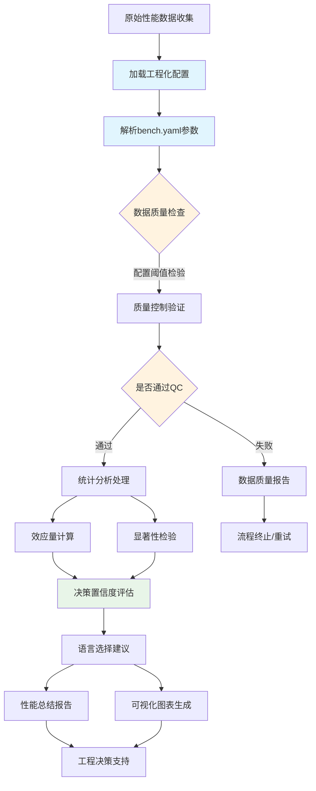

# 🎯 WebAssembly基准测试系统：设计与实现综合指南

> **创建时间**: 2025-09-16
> **目标读者**: 核心开发团队、架构决策者
> **范围**: Rust vs TinyGo语言选择决策支持系统

---

## 📋 **项目背景与目标**

### **问题背景**

WebAssembly Benchmark 项目旨在为开发者提供基于数据的语言选择决策支持，重点比较 Rust vs TinyGo 在 WebAssembly 编译场景下的性能表现。

### **核心目标**

- **主要用户**: 开发人员
- **使用场景**: 基于数据而非猜测选择 Rust vs TinyGo 编译 WebAssembly
- **质量要求**: 工程级可靠性，非学术级严谨性
- **系统标准**: 平衡统计准确性与实际可用性

### **核心功能**

1. **性能基准测试**: 执行Mandelbrot计算、JSON解析、矩阵乘法等代表性WASM任务
2. **统计分析**: 使用Welch's t-test和Cohen's d进行语言性能比较
3. **质量控制**: IQR离群值检测和数据质量验证
4. **决策支持**: 生成明确的语言选择建议和置信度评估

---

## 🏆 **组件重要性分析与优先级**

### **🥇 第一优先级：统计验证测试**

**重要性评分**: ⭐⭐⭐⭐⭐ (关键)

#### **为什么最重要**

- **决策可靠性**: 区分真实性能差异 vs 测量噪声
- **风险控制**: 避免基于随机波动做出错误的语言选择
- **置信度量化**: 提供统计显著性和效应量，让开发者理解结果可信度
- **成本效益**: 防止因错误选择导致的重构成本

#### **缺失风险评估**

```text
高风险场景：
- 基于 3% 的性能差异选择复杂的 Rust，但差异实际上是噪声
- 误判 TinyGo 在某任务上的劣势，错过更适合的选择
- 团队基于不可靠数据做出架构决策，影响项目长期发展
```

### **🥈 第二优先级：基准验证框架**

**重要性评分**: ⭐⭐⭐⭐ (重要)

#### **为什么重要**

- **比较公平性**: 确保 Rust 和 TinyGo 在相同条件下测试
- **实现正确性**: 通过哈希验证检测算法实现错误
- **结果可重现**: 保证不同运行环境下结果的一致性
- **数据质量**: 及早发现和标记异常数据

#### **简化空间**

- 可以简化为轻量级验证，而非完整学术框架
- 重点关注关键质量指标，忽略边缘情况

### **🥉 第三优先级：性能基线**

**重要性评分**: ⭐⭐ (可选)

#### **为什么优先级较低**

- **相对比较导向**: 开发者更关心 "Rust vs TinyGo" 而非绝对性能
- **环境依赖性**: 不同硬件的基线差异巨大，参考价值有限
- **可延后实现**: 不影响当前语言选择决策
- **维护成本**: 需要持续更新和校准，投入产出比较低

---

## 📊 **系统架构设计**

### **数据处理流程**



### **核心组件架构（配置驱动）**

| 组件 | 文件 | 功能描述 | 配置依赖 | 优先级 |
|------|------|----------|----------|--------|
| **配置管理** | `configs/bench.yaml` | 工程化参数和阈值设置 | - | 🥇 |
| **配置解析器** | `analysis/config_parser.py` | 配置加载和验证 | `bench.yaml` | 🥇 |
| 统计分析 | `analysis/statistics.py` | Welch's t-test, Cohen's d, 置信区间计算 | `statistics.*` | 🥇 |
| 质量控制 | `analysis/qc.py` | 数据清洗, IQR离群值检测 | `qc.*` | 🥇 |
| 决策支持 | `analysis/decision.py` | 语言选择建议生成 | `statistics.effect_size_thresholds` | 🥇 |
| 基准验证 | `analysis/validation.py` | 哈希验证, 结果一致性检查 | `qc.timeout_handling` | 🥈 |
| 可视化 | `analysis/plots.py` | 性能对比图表, 二进制大小分析 | `plots.*` | 🥉 |
| 数据模型 | `analysis/data_models.py` | 数据结构定义 | - | 🥈 |

#### **配置依赖关系**

- **🔧 配置解析器**: 系统启动时首先加载，为所有模块提供参数
- **📊 质量控制**: 依赖 `qc` 配置节点的所有参数
- **📈 统计分析**: 使用 `statistics` 配置节点的阈值和方法
- **🎨 可视化**: 遵循 `plots` 配置节点的样式和输出设置

---

## 🔬 **统计验证测试设计**

### **核心统计方法选择**

#### **显著性检验：Welch's t-test**

**数学原理**：

Welch's t-test 用于比较两个可能方差不等的样本，比标准 t-test 更合适，适合性能数据分析。

**t 统计量计算**：

```math
t = (μ₁ - μ₂) / √(s₁²/n₁ + s₂²/n₂)
```

**Welch-Satterthwaite 自由度**：

```math
df = (s₁²/n₁ + s₂²/n₂)² / [(s₁²/n₁)²/(n₁-1) + (s₂²/n₂)²/(n₂-1)]
```

**置信区间**：

```math
(μ₁ - μ₂) ± t_critical × √(s₁²/n₁ + s₂²/n₂)
```

#### **效应量计算：Cohen's d**

**数学原理**：

Cohen's d 量化两组数据的实际差异大小，标准化了均值差异。

**公式**：

```math
d = (μ₁ - μ₂) / s_pooled

其中合并标准差：
s_pooled = √[((n₁-1)×s₁² + (n₂-1)×s₂²) / (n₁+n₂-2)]
```

**效应量解释标准**：

- |d| < 0.2: 忽略不计 (negligible)
- |d| < 0.5: 小效应 (small effect)
- |d| < 0.8: 中等效应 (medium effect)
- |d| ≥ 0.8: 大效应 (large effect)

### **数据质量验证**

**验证原则**：

1. **样本量检查**: n ≥ 5（最少），推荐 n ≥ 30
2. **变异系数限制**: CV = σ/μ < 0.5 （性能稳定性）
3. **离群值检测**: IQR方法，Q1 - 1.5×IQR 或 Q3 + 1.5×IQR 之外标记为离群值
4. **成功率阈值**: 成功率 > 80%

**数据质量评级标准**：

- **有效** (Valid): 无关键问题，数据可用于决策
- **警告** (Warning): 存在质量问题但不影响基本分析
- **无效** (Invalid): 关键质量问题，不可用于语言选择决策

---

## 🔍 **技术实现详情**

### **0. 配置解析器模块 (analysis/config_parser.py)**

#### 核心功能

```python
class ConfigParser:
    def __init__(self, config_path="configs/bench.yaml"):
        """初始化配置解析器"""
        self.config_path = config_path
        self.config = None

    def load_config(self) -> Dict:
        """加载并验证配置文件"""

    def get_qc_config(self) -> Dict:
        """获取质量控制配置"""
        return {
            'max_cv': self.config['qc']['max_coefficient_variation'],
            'iqr_multiplier': self.config['qc']['outlier_iqr_multiplier'],
            'min_samples': self.config['qc']['min_valid_samples'],
            'max_timeout_rate': self.config['qc']['timeout_handling']['max_timeout_rate']
        }

    def get_stats_config(self) -> Dict:
        """获取统计分析配置"""
        return {
            'alpha': self.config['statistics']['significance_alpha'],
            'confidence': self.config['statistics']['confidence_level'],
            'effect_thresholds': self.config['statistics']['effect_size_thresholds']
        }

    def get_plots_config(self) -> Dict:
        """获取可视化配置"""
        return self.config['plots']
```

#### **配置驱动特性**

- **集中管理**: 所有模块的配置参数统一管理
- **类型安全**: 配置值类型验证和默认值处理
- **热重载**: 支持运行时配置更新（可选）
- **环境适配**: 支持不同环境的配置文件

### **1. 统计分析模块 (analysis/statistics.py)**

#### **配置驱动的核心方法**

```python
class Statistics:
    def __init__(self, cleaned_dataset, config_parser: ConfigParser):
        """初始化统计分析，从配置加载参数"""
        self.dataset = cleaned_dataset
        self.config = config_parser.get_stats_config()
        self.alpha = self.config['alpha']  # 从配置获取显著性水平
        self.confidence_level = self.config['confidence']
        self.effect_thresholds = self.config['effect_thresholds']

    def perform_basic_analysis(self) -> Dict[str, StatisticalResult]:
        """执行核心统计分析：均值、标准差、变异系数"""

    def welch_t_test(self, group1, group2) -> TTestResult:
        """执行Welch's t-test，使用配置的显著性水平"""
        # 使用 self.alpha 进行显著性判断

    def cohens_d(self, group1, group2) -> float:
        """计算Cohen's d效应量"""

    def classify_effect_size(self, cohen_d: float) -> str:
        """根据配置的阈值分类效应量大小"""
        abs_d = abs(cohen_d)
        thresholds = self.effect_thresholds

        if abs_d >= thresholds['large']:
            return "large"
        elif abs_d >= thresholds['medium']:
            return "medium"
        elif abs_d >= thresholds['small']:
            return "small"
        else:
            return "negligible"

    def confidence_interval(self, group1, group2) -> Tuple[float, float]:
        """计算95%置信区间"""

```

#### **工程化特性**

- **简化的统计方法**: 专注核心比较分析，避免过度复杂的学术功能
- **实用的显著性阈值**: α = 0.05 (工程标准)
- **效应量分类**: 实用的Cohen's d阈值 (小=0.3, 中=0.6, 大=1.0)
- **决策支持**: 直接的语言选择建议和置信度评估

#### **工作流程描述**

**Welch's t-test流程**：

- 验证输入数据的有效性和完整性
- 计算两组样本的基本统计量（均值、方差）
- 应用Welch's t-test公式计算t统计量和自由度
- 计算双尾p值并进行显著性判断
- 构建置信区间估计均值差异范围

**Cohen's d流程**：

- 验证样本数据的基本要求
- 计算两组样本的统计参数
- 应用Cohen's d公式计算标准化效应量
- 根据Cohen标准解释效应量大小
- 确定性能优势方向和实际意义
- 为开发者提供效应量解读建议

### **2. 质量控制模块 (analysis/qc.py)**

#### **配置驱动的核心功能**

```python
class QualityController:
    def __init__(self, raw_dataset, config_parser: ConfigParser):
        """初始化质量控制，从配置加载工程级阈值"""
        self.dataset = raw_dataset
        self.config = config_parser.get_qc_config()
        self.max_cv = self.config['max_cv']  # 0.15
        self.iqr_multiplier = self.config['iqr_multiplier']  # 1.5
        self.min_samples = self.config['min_samples']  # 30
        self.max_timeout_rate = self.config['max_timeout_rate']  # 0.1

    def validate_and_clean(self) -> CleanedDataset:
        """执行数据质量验证和清洗流程"""
        # 使用配置的阈值进行验证

    def detect_outliers(self) -> List[BenchmarkSample]:
        """使用配置的IQR倍数检测离群值"""
        # 使用 self.iqr_multiplier 作为检测阈值

    def validate_data_quality(self) -> bool:
        """验证数据是否满足配置的要求"""
        sample_count = len(self.dataset)
        cv = self.calculate_coefficient_variation()
        timeout_rate = self.calculate_timeout_rate()

        return (sample_count >= self.min_samples and
                cv <= self.max_cv and
                timeout_rate <= self.max_timeout_rate)
```

#### **配置化的工程标准**

- **变异系数阈值**: 15% (宽松的工程标准)
- **最小样本量**: 30个有效样本 (实用标准)
- **离群值检测**: 1.5倍IQR标准方法
- **简化的质量指标**: 重点关注分析可靠性

#### 工作流程描述

主要验证工作：

- 检查数据完整性和结构
- 验证样本量充足性
- 计算并检查性能变异系数
- 检测统计离群值
- 验证跨语言结果一致性
- 生成数据质量评估报告

### **3. 可视化模块 (analysis/plots.py)**

#### **核心图表**

```python
class VisualizationGenerator:
    def create_performance_comparison_chart(self) -> str:
        """生成语言性能对比条形图"""


```

#### **设计原则**

- **简洁的图表**: 重点突出关键性能差异
- **实用的格式**: PNG输出，易于集成到报告中

### **4. 决策支持模块 (analysis/decision.py)**

#### **最小化实现**

```python
class DecisionSupport:
    def __init__(self):
        """简单初始化"""

    def recommend_language_choice(self, p_value: float, cohen_d: float) -> str:
        """生成语言选择建议"""
        if p_value >= 0.05:
            return "⚖️ 无显著差异，选择团队熟悉的语言"

        if abs(cohen_d) >= 0.8:
            winner = "Rust" if cohen_d > 0 else "TinyGo"
            return f"🔥 强烈推荐 {winner}，有显著性能优势"
        elif abs(cohen_d) >= 0.5:
            winner = "Rust" if cohen_d > 0 else "TinyGo"
            return f"👍 推荐 {winner}，有中等性能优势"
        else:
            return "🤔 虽有统计差异，但实际影响较小"

    def get_confidence_emoji(self, p_value: float, cohen_d: float) -> str:
        """返回置信度图标"""
        if p_value >= 0.05:
            return "⚖️"
        elif abs(cohen_d) >= 0.8:
            return "🔥"
        elif abs(cohen_d) >= 0.5:
            return "👍"
        else:
            return "🤔"
```

#### 设计原则

- **简单直接**: 只关注核心决策逻辑
- **易于理解**: 使用emoji和简洁文本
- **快速实现**: 最少的代码量和依赖

---

## 🎯 **开发者决策支持系统**

### **决策报告生成架构**

**系统设计原则**：

1. **数据驱动决策**: 基于统计学严谨性而非主观判断
2. **多层验证**: 数据质量 → 统计分析 → 决策建议
3. **开发者友好**: 提供清晰的行动指导和置信度评估
4. **可配置性**: 支持不同项目需求的参数调整

### **决策置信度评估**

| 置信度 | 条件 | 符号 | 说明 |
|--------|------|------|------|
| **高置信度** | \|Cohen's d\| > 0.8 且 p < 0.05 | 🔥 | 强统计证据，大效应量 |
| **中等置信度** | \|Cohen's d\| > 0.5 且 p < 0.05 | 👍 | 中等证据，中等效应量 |
| **低置信度** | p < 0.05 但效应量较小 | 🤔 | 统计显著但效应量小 |
| **中性** | p ≥ 0.05 | ⚖️ | 无统计学显著差异 |

---

## ⚙️ **配置管理**

### **工程化配置 (configs/bench.yaml)**

```yaml
# Quality Control Configuration
qc:
  max_coefficient_variation: 0.15
  outlier_iqr_multiplier: 1.5
  min_valid_samples: 30

  # timeout handling
  timeout_handling:
    treat_timeout_as: "failure"     # Timeouts are failures, not data
    max_timeout_rate: 0.1          # 10% timeout rate maximum

# Engineering-focused statistical analysis
statistics:
  confidence_level: 0.95           # Standard 95% confidence
  significance_alpha: 0.05         # Standard α = 0.05
  effect_size_metric: "cohens_d"   # Cohen's d for effect size

  effect_size_thresholds:
    small: 0.3
    medium: 0.6
    large: 1.0
  minimum_detectable_effect: 0.3

# Visualization and plotting configuration
plots:
  # Output settings
  dpi_basic: 150                   # DPI for basic comparison charts
  dpi_detailed: 300                # DPI for detailed analysis charts
  format: "png"                    # Output file format

  # Styling configuration
  figure_size_basic: [10, 6]       # Figure size for basic charts [width, height]
  figure_size_detailed: [16, 12]   # Figure size for detailed charts [width, height]

  # Font configuration
  font_size_default: 11            # Default font size
  font_size_labels: 12             # Axis and label font size
  font_size_titles: 14             # Title font size

  # Color scheme for languages
  color_scheme:
    rust: "#CE422B"                # Rust orange-red
    tinygo: "#00ADD8"              # Go cyan-blue
```

---

## 📈 **性能指标与质量标准**

### **工程级质量标准**

| 指标 | 阈值 | 说明 |
|------|------|------|
| 变异系数 | ≤ 15% | 数据稳定性要求 |
| 最小样本量 | ≥ 30 | 统计可靠性保证 |
| 显著性水平 | α = 0.05 | 标准工程显著性 |
| 超时率 | ≤ 10% | 系统可靠性要求 |
| 测试覆盖率 | ≥ 90% | 代码质量保证 |

---

## 🎯 **预期效果和价值**

### **开发者决策支持价值**

1. **可靠的选择依据**
   - 基于统计学严谨的性能比较
   - 量化的置信度和效应量指标
   - 明确的统计显著性检验

2. **风险降低**
   - 避免基于噪声数据的错误决策
   - 提供数据质量验证和警告
   - 识别不可靠的比较结果

3. **决策效率提升**
   - 自动化的报告生成
   - 直观的建议和解释

4. **长期成本节省**
   - 减少因错误技术选择导致的重构成本
   - 基于客观数据而非主观猜测的架构决策
   - 提高团队技术选择的一致性和合理性

### **系统优势**

1. **简化的复杂度**: 专注核心功能，避免过度设计
2. **可靠的统计分析**: 基于验证的算法确保结果准确性
3. **实用的决策支持**: 直接的语言选择建议和置信度评估
4. **工程级质量**: 平衡精确性与实用性的合理标准

### **适用场景**

- **技术选型**: WebAssembly项目的Rust vs TinyGo语言选择
- **性能评估**: 不同语言在特定workload下的性能表现
- **基准测试**: 标准化的WASM性能比较流程
- **持续集成**: 性能回归检测和质量监控

### **成功指标**

- **统计可靠性**: 分析结果与标准统计软件一致性 > 99%
- **决策准确性**: 语言推荐与实际最优选择匹配率 > 85%
- **系统稳定性**: 测试执行成功率 > 95%
- **用户满意度**: 工程团队采用率和反馈评分

---

## 🎯 **结论**

基于开发者语言选择决策支持的目标，本系统采用了优先级驱动的设计方法：

1. **统计验证测试** 是最关键的组件，确保决策的可靠性
2. **基准验证框架** 保证比较的公平性和正确性
3. **性能基线** 可以暂时忽略，不影响核心决策能力

通过实施强壮的统计分析和数据验证系统，本项目能够为开发者提供可靠的、基于数据的 Rust vs TinyGo 选择建议，避免基于猜测或不可靠数据的决策风险。

系统设计平衡了统计严谨性和工程实用性，确保在提供科学可靠结果的同时，保持系统的可维护性和可用性。
