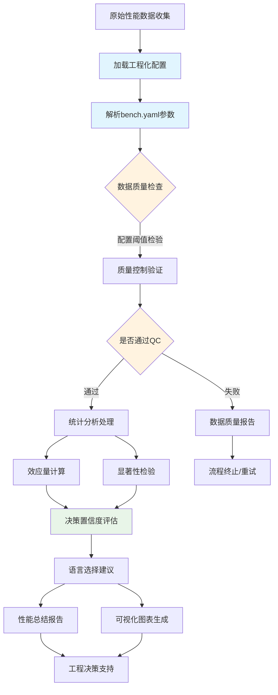

# 🎯 WebAssembly基准测试系统：实现架构指南

> **更新时间**: 2025-09-27  
> **目标读者**: 核心开发团队、架构决策者、新开发者  
> **范围**: Rust vs TinyGo语言选择决策支持系统架构与实现  

---

## 📋 **项目背景与目标**

### **问题背景**

WebAssembly Benchmark 项目旨在为开发者提供基于数据的语言选择决策支持，重点比较 Rust vs TinyGo 在 WebAssembly 编译场景下的性能表现。

### **核心目标**

- **主要用户**: 开发人员
- **使用场景**: 基于数据而非猜测选择 Rust vs TinyGo 编译 WebAssembly
- **质量要求**: 工程级可靠性，非学术级严谨性
- **系统标准**: 平衡统计准确性与实际可用性

### **核心功能 (✅ 已实现)**

1. **性能基准测试**: Mandelbrot计算、JSON解析、矩阵乘法等WASM任务 (`tasks/` 目录)
2. **统计分析**: Welch's t-test和Cohen's d效应量分析 (`analysis/statistics.py`)
3. **质量控制**: IQR离群值检测和变异系数验证 (`analysis/qc.py`)
4. **决策支持**: 综合决策报告和语言推荐 (`analysis/decision.py`)
5. **可视化分析**: 4种统计图表和交互式HTML报告 (`analysis/plots.py`)
6. **配置管理**: 工程级配置解析和验证 (`analysis/config_parser.py`)

---

## 🏆 **组件重要性分析与优先级**

### **🥇 第一优先级：统计验证测试**

**重要性评分**: ⭐⭐⭐⭐⭐ (关键)

#### **为什么最重要**

- **决策可靠性**: 区分真实性能差异 vs 测量噪声
- **风险控制**: 避免基于随机波动做出错误的语言选择
- **置信度量化**: 提供统计显著性和效应量，让开发者理解结果可信度
- **成本效益**: 防止因错误选择导致的重构成本

#### **缺失风险评估**

```text
高风险场景：
- 基于 3% 的性能差异选择复杂的 Rust，但差异实际上是噪声
- 误判 TinyGo 在某任务上的劣势，错过更适合的选择
- 团队基于不可靠数据做出架构决策，影响项目长期发展
```

### **🥈 第二优先级：基准验证框架**

**重要性评分**: ⭐⭐⭐⭐ (重要)

#### **为什么重要**

- **比较公平性**: 确保 Rust 和 TinyGo 在相同条件下测试
- **实现正确性**: 通过哈希验证检测算法实现错误
- **结果可重现**: 保证不同运行环境下结果的一致性
- **数据质量**: 及早发现和标记异常数据

#### **简化空间**

- 可以简化为轻量级验证，而非完整学术框架
- 重点关注关键质量指标，忽略边缘情况

### **🥉 第三优先级：性能基线**

**重要性评分**: ⭐⭐ (可选)

#### **为什么优先级较低**

- **相对比较导向**: 开发者更关心 "Rust vs TinyGo" 而非绝对性能
- **环境依赖性**: 不同硬件的基线差异巨大，参考价值有限
- **可延后实现**: 不影响当前语言选择决策
- **维护成本**: 需要持续更新和校准，投入产出比较低

---

## 📊 **系统架构设计**

### **数据处理流程**



### **核心组件架构 (✅ 实际实现)**

| 组件 | 文件 | 功能描述 | 配置依赖 | 状态 |
|------|------|----------|----------|--------|
| **配置管理** | `configs/bench.yaml` | 工程化参数和阈值设置 | - | ✅ 完整实现 |
| **配置解析器** | `analysis/config_parser.py` | 类型化配置加载和验证 | 全部配置节点 | ✅ 完整实现 |
| **数据模型** | `analysis/data_models.py` | 完整数据结构定义 | - | ✅ 完整实现 |
| **统计分析** | `analysis/statistics.py` | StatisticalAnalysis类 | `statistics.*` | ✅ 完整实现 |
| **质量控制** | `analysis/qc.py` | QualityController类 | `qc.*` | ✅ 完整实现 |
| **决策支持** | `analysis/decision.py` | DecisionSummaryGenerator类 | `statistics.*` | ✅ 完整实现 |
| **可视化** | `analysis/plots.py` | 4种图表+HTML报告 | `plots.*` | ✅ 完整实现 |
| **验证框架** | `analysis/validation.py` | 跨语言哈希验证 | `validation.*` | ✅ 完整实现 |
| **通用工具** | `analysis/common.py` | CLI和工具函数 | - | ✅ 辅助实现 |

#### **实际配置节点结构**

```yaml
# configs/bench.yaml 实际结构
qc:                           # 质量控制配置
  max_coefficient_variation: 0.15
  outlier_iqr_multiplier: 1.5
  min_valid_samples: 30
  failure_rate: 0.1
  quality_invalid_threshold: 0.15
  quality_warning_threshold: 0.3
  rust_thresholds:
    max_coefficient_variation: 0.15
    extreme_cv_threshold: 0.5
  tinygo_thresholds:
    max_coefficient_variation: 0.3
    extreme_cv_threshold: 1.0

statistics:                   # 统计分析配置
  confidence_level: 0.95
  significance_alpha: 0.05
  effect_size_thresholds: {small: 0.2, medium: 0.5, large: 0.8}
  minimum_detectable_effect: 0.3

plots:                        # 可视化配置
  dpi_basic: 150
  dpi_detailed: 300
  output_format: "png"
  figure_sizes: {basic: [10, 6], detailed: [16, 12]}
  font_sizes: {default: 11, labels: 12, titles: 14}
  color_scheme: {rust: "#CE422B", tinygo: "#00ADD8"}

validation:                   # 验证配置
  required_success_rate: 0.95
  hash_tolerance: 1e-8
  sample_limit: 1000
```

---

## 🔬 **统计验证测试设计**

### **核心统计方法选择**

#### **显著性检验：Welch's t-test**

**数学原理**：

Welch's t-test 用于比较两个可能方差不等的样本，比标准 t-test 更合适，适合性能数据分析。

**t 统计量计算**：

```math
t = (μ₁ - μ₂) / √(s₁²/n₁ + s₂²/n₂)
```

**Welch-Satterthwaite 自由度**：

```math
df = (s₁²/n₁ + s₂²/n₂)² / [(s₁²/n₁)²/(n₁-1) + (s₂²/n₂)²/(n₂-1)]
```

**置信区间**：

```math
(μ₁ - μ₂) ± t_critical × √(s₁²/n₁ + s₂²/n₂)
```

#### **效应量计算：Cohen's d**

**数学原理**：

Cohen's d 量化两组数据的实际差异大小，标准化了均值差异。

**公式**：

```math
d = (μ₁ - μ₂) / s_pooled

其中合并标准差：
s_pooled = √[((n₁-1)×s₁² + (n₂-1)×s₂²) / (n₁+n₂-2)]
```

**效应量解释标准**：

- |d| < 0.2: 忽略不计 (negligible)
- 0.2 ≤ |d| < 0.5: 小效应 (small effect)
- 0.5 ≤ |d| < 0.8: 中等效应 (medium effect)
- |d| ≥ 0.8: 大效应 (large effect)

### **数据质量验证**

**验证原则**：

1. **样本量检查**: n ≥ 5（最少），推荐 n ≥ 30
2. **变异系数限制**: CV = σ/μ < 0.5 （性能稳定性）
3. **离群值检测**: IQR方法，超出Q1 - 1.5×IQR 或 Q3 + 1.5×IQR 之外标记为离群值
4. **成功率阈值**: 成功率 > 80%

**数据质量评级标准**：

- **有效** (Valid): 无关键问题，数据可用于决策
- **警告** (Warning): 存在质量问题但不影响基本分析
- **无效** (Invalid): 关键质量问题，不可用于语言选择决策

---

## 🔍 **技术实现详情**

### **1. 配置解析器模块 (analysis/config_parser.py)**

#### 实际实现架构

```python
class ConfigParser:
    """Configuration parser for engineering-grade benchmark analysis.

    NOTE: implementation lives in `analysis/config_parser.py`. The doc here
    shows the public API surface (signatures and brief descriptions) only.
    """

    def __init__(self, config_path: str = "configs/bench.yaml"):
        """Initialize configuration parser with a path to the bench YAML file."""
        pass

    def load(self) -> "ConfigParser":
        """Load and validate the YAML configuration. Returns self for chaining."""
        pass

    def get_qc_config(self) -> QCConfiguration:
        """Return typed QC configuration (QCConfiguration)."""
        pass

    def get_stats_config(self) -> StatisticsConfiguration:
        """Return typed statistical configuration (StatisticsConfiguration)."""
        pass

    def get_plots_config(self) -> PlotsConfiguration:
        """Return typed plots configuration (PlotsConfiguration)."""
        pass

    def get_validation_config(self) -> ValidationConfiguration:
        """Return typed validation configuration (ValidationConfiguration)."""
        pass
```

#### **类型安全特性**

- **强类型配置**: 使用`data_models.py`中的配置类型
- **验证机制**: 配置文件结构和必需字段验证
- **默认值处理**: 缺失参数的合理默认值
- **错误处理**: 详细的配置错误信息

#### **配置驱动特性**

- **集中管理**: 所有模块的配置参数统一管理
- **类型安全**: 配置值类型验证和默认值处理
- **热重载**: 支持运行时配置更新（可选）
- **环境适配**: 支持不同环境的配置文件

### **2. 统计分析模块 (analysis/statistics.py)**

#### **实际实现架构**

```python
class StatisticalAnalysis:
    """Statistical analysis engine for benchmark performance comparison.

    Only the public API and helper signatures are shown here. See
    `analysis/statistics.py` for the full implementation.
    """

    def __init__(self, stats_config: StatisticsConfiguration):
        """Initialize engine with a StatisticsConfiguration object."""
        pass

    def welch_t_test(self, group1: list[float], group2: list[float]) -> TTestResult:
        """Perform Welch's t-test and return a TTestResult.

        - Validates inputs
        - Uses Welch-Satterthwaite df
        - Returns p-value, t-statistic, CI and significance flag
        """
        pass

    def cohens_d(self, group1: list[float], group2: list[float]) -> EffectSizeResult:
        """Compute Cohen's d and return an EffectSizeResult including interpretation."""
        pass

    def generate_task_comparison(
        self, rust_result: TaskResult, tinygo_result: TaskResult
    ) -> ComparisonResult:
        """Produce a comprehensive ComparisonResult for a single task/scale.

        Performs per-metric comparisons (execution time, memory) and computes
        an overall confidence assessment.
        """
        pass

    # Helper / private API (signatures only)
    def _validate_groups(self, group1: list[float], group2: list[float], method_name: str) -> None:
        """Validate input groups used by statistical methods."""
        pass

    def _get_basic_stats(self, data: list[float]) -> tuple[int, float, float]:
        """Return (n, mean, variance) using a numerically stable method."""
        pass

    def _calculate_welch_t_stats(self, mean1: float, mean2: float, var1: float, var2: float, n1: int, n2: int) -> float:
        """Compute Welch's t-statistic for unequal variances."""
        pass

    def _calculate_welch_degrees_freedom(self, var1: float, var2: float, n1: int, n2: int) -> float:
        """Compute Welch-Satterthwaite degrees of freedom."""
        pass

    def _calculate_p_value(self, t_stat: float, df: float) -> float:
        """Return two-tailed p-value for t-statistic using t-distribution."""
        pass

    def _confidence_interval(self, group1: list[float], group2: list[float]) -> tuple[float, float]:
        """Compute CI for the difference in means at configured confidence level."""
        pass

    def _calculate_pooled_std(self, std1: float, std2: float, n1: int, n2: int) -> float:
        """Return pooled standard deviation used by Cohen's d."""
        pass

    def _calculate_cohens_d_value(self, mean1: float, mean2: float, pooled_std: float) -> float:
        """Compute the raw Cohen's d value."""
        pass

    def _classify_effect_size(self, cohen_d: float) -> EffectSize:
        """Classify Cohen's d magnitude according to thresholds."""
        pass

    def _generate_effect_size_interpretation(self, cohens_d_value: float, abs_d: float, meets_mde: bool) -> str:
        """Compose a human-readable interpretation of effect size and MDE status."""
        pass

    # Additional helpers for multi-metric processing (signatures only)
    def _extract_performance_data(self, rust_result: TaskResult, tinygo_result: TaskResult) -> tuple[PerformanceStatistics, PerformanceStatistics]:
        """Extract and summarize execution time and memory statistics."""
        pass

    def _extract_metrics_from_samples(self, samples: list[BenchmarkSample]) -> tuple[list[float], list[float]]:
        """Extract execution times and memory usage lists from samples."""
        pass

    def _perform_metric_comparisons(self, rust_result: TaskResult, tinygo_result: TaskResult) -> tuple[MetricComparison, MetricComparison]:
        """Run t-tests and effect size calculations for each supported metric."""
        pass

    def _calculate_complete_stats(self, data: list[float]) -> StatisticalResult:
        """Return descriptive statistics (count, mean, std, median, q1, q3, iqr, cv)."""
        pass

    def _calculate_complete_stats_optimized_summary(self, comparison_results: list[ComparisonResult]) -> dict[str, Any]:
        """Produce an optimized summary from a list of comparison results."""
        pass

    def _calculate_complete_stats_memory(self, data: list[float]) -> StatisticalResult:
        """Memory-optimized path to compute descriptive statistics."""
        pass

    def _create_metric_comparison(self, metric_type: MetricType, rust_data: list[float], tinygo_data: list[float]) -> MetricComparison:
        """Create a MetricComparison object containing test and effect size info."""
        pass

    def _generate_confidence_level(self, exec_comparison: MetricComparison, memory_comparison: MetricComparison) -> str:
        """Aggregate metric-level evidence into an overall confidence level string."""
        pass

    # Top-level CLI helpers are implemented in the real module; omitted here.
```

#### **核心特性**

- **数值稳定性**: Welford算法计算均值和方差
- **强类型返回**: 所有方法返回结构化数据类型
- **多指标支持**: 同时分析执行时间和内存使用
- **MDE评估**: 最小可检测效应量判断
- **科学计算**: 使用scipy进行精确统计计算

#### **工程化特性**

- **简化的统计方法**: 专注核心比较分析，避免过度复杂的学术功能
- **实用的显著性阈值**: α = 0.05 (工程标准)
- **效应量分类**: 实用的Cohen's d阈值 (小=0.2, 中=0.5, 大=0.8)
- **决策支持**: 直接的语言选择建议和置信度评估

### **3. 质量控制模块 (analysis/qc.py)**

#### **质量控制实现架构**

```python
class QualityController:
    """Data quality control and validation for the benchmark analysis pipeline.

    Only signatures and short descriptions are kept here. See `analysis/qc.py`
    for the full implementation.
    """

    def __init__(self, benchmark_results: list[BenchmarkResult], qc_config: QCConfiguration):
        """Initialize with raw benchmark results and a QCConfiguration."""
        pass

    def validate_and_clean(self) -> CleanedDataset:
        """Run the full QC pipeline: outlier detection, grouping, and cleaning."""
        pass

    def _extract_all_samples(self) -> list[BenchmarkSample]:
        """Return a flattened list of all BenchmarkSample objects from inputs."""
        pass

    def _group_samples_by_task(self, all_samples: list[BenchmarkSample]) -> dict[tuple[str, str, str], list[BenchmarkSample]]:
        """Group samples by (task, language, scale)."""
        pass

    def _process_task_groups(self, task_groups: dict[tuple[str, str, str], list[BenchmarkSample]]) -> tuple[list[TaskResult], list[BenchmarkSample]]:
        """Process groups to remove outliers and create TaskResult objects."""
        pass

    def _partition_samples_by_success(self, samples: list[BenchmarkSample]) -> tuple[list[BenchmarkSample], list[BenchmarkSample]]:
        """Partition samples into successful and failed lists."""
        pass

    def _generate_group_key(self, task: str, language: str, scale: str) -> str:
        """Return a consistent string key for a task-language-scale group."""
        pass

    def _create_cleaned_dataset(self, cleaned_task_results: list[TaskResult], all_removed_outliers: list[BenchmarkSample]) -> CleanedDataset:
        """Assemble and return the CleanedDataset object."""
        pass

    def detect_outliers(self, samples: list[BenchmarkSample]) -> tuple[list[BenchmarkSample], list[BenchmarkSample]]:
        """Detect and return (cleaned_samples, outliers) using the IQR method."""
        pass

    def calculate_quality_metrics(self, task_result: TaskResult) -> QualityMetrics:
        """Compute per-metric quality metrics (mean, std, CV, success rate, issues)."""
        pass

    def calculate_overall_quality(self, task_results: list[TaskResult]) -> QualityAssessment:
        """Aggregate group-level qualities into a QualityAssessment summary."""
        pass
```

#### **质量控制常数**

```python
class QCConstants:
    """Constants for quality control operations."""

    # Percentiles for IQR calculation
    Q1_PERCENTILE = 0.25
    Q3_PERCENTILE = 0.75

    # Quality thresholds
    EXTREME_CV_MULTIPLIER = 2.0
    DIVISION_BY_ZERO_EPSILON = 1e-9
    MINIMUM_IQR_SAMPLES = 4

    # File patterns
    META_FILE_PATTERN = "meta"
    JSON_FILE_PATTERN = "*.json"

    # Output file names
    QC_REPORT_FILENAME = "quality_control_report.json"
    CLEANED_DATASET_FILENAME = "cleaned_dataset.json"

    # Report formatting
    TITLE_SEPARATOR = "=" * 60
    DEFAULT_JSON_INDENT = 2
```

#### **语言特定阈值**

- **Rust阈值**: CV ≤ 15%, 极值CV ≤ 50%
- **TinyGo阈值**: CV ≤ 30%, 极值CV ≤ 100% (GC影响)

#### **配置化的工程标准**

- **变异系数阈值**: 15% (宽松的工程标准)
- **最小样本量**: 30个有效样本 (实用标准)
- **离群值检测**: 1.5倍IQR标准方法
- **简化的质量指标**: 重点关注分析可靠性

### **4. 可视化模块 (analysis/plots.py)**

#### **完整图表系统**

项目实现了**4种统计图表**和**交互式HTML报告**:

1. **`execution_time_comparison.png`**: 执行时间对比条形图
   - 均值、中位数、误差棒
   - 统计显著性标记
   - Cohen's d效应量注释

2. **`memory_usage_comparison.png`**: 内存使用对比图
   - 内存消耗模式分析
   - GC影响可视化

3. **`effect_size_heatmap.png`**: 效应量热力图
   - Cohen's d数值矩阵
   - 颜色编码显著性等级

4. **`distribution_variance_analysis.png`**: 分布方差分析
   - 箱线图展示性能一致性
   - 方差差异模式

5. **`decision_summary.html`**: 交互式决策报告
   - 综合分析结果
   - 语言推荐和置信度
   - 详细统计数据表格

#### **配置驱动设计**

```python
# From the plots configuration node: Visualization generator signatures only
class VisualizationGenerator:
    """Chart and visualization generator for benchmark analysis results.

    Documentation here shows only method signatures and purpose. Full
    implementations live in `analysis/plots.py`.
    """

    def __init__(self, plots_config: PlotsConfiguration):
        """Initialize with a PlotsConfiguration."""
        pass

    def _setup_plotting_style(self) -> None:
        """Apply matplotlib rcParams and theme settings."""
        pass

    def _validate_comparison_data(self, comparisons: list[ComparisonResult], metric_type: str) -> None:
        """Validate that comparison results include the required metric data."""
        pass

    def _extract_comparison_statistics(self, comparisons: list[ComparisonResult], metric_type: str) -> dict:
        """Extract arrays of means, medians, errors, CVs and labels for plotting."""
        pass

    def _create_comparison_bar_chart(self, ax, data: dict, metric_label: str) -> np.ndarray:
        """Draw grouped bar chart with means, error bars and median markers."""
        pass

    def _add_significance_markers(self, ax, data: dict, comparisons: list[ComparisonResult], metric_type: str) -> None:
        """Annotate chart with simple significance markers when evidence is strong."""
        pass

    def _create_comparison_legend(self, ax, metric_type: str = "execution_time") -> None:
        """Compose a compact legend for comparison charts."""
        pass

    def _add_statistical_note(self, fig, comparisons: list[ComparisonResult], metric_type: str) -> None:
        """Add a summary note below the figure describing test counts and winners."""
        pass

    def _save_plot(self, output_path: str) -> str:
        """Persist the current matplotlib figure to disk and return the path."""
        pass

    def _create_execution_time_comparison(self, comparisons: list[ComparisonResult], output_path: str = "reports/plots/execution_time_comparison.png") -> str:
        """Generate execution time comparison plot and save it to output_path."""
        pass

    def _create_memory_usage_comparison(self, comparisons: list[ComparisonResult], output_path: str = "reports/plots/memory_usage_comparison.png") -> str:
        """Generate memory usage comparison plot and save it to output_path."""
        pass

    def _create_effect_size_heatmap(self, comparisons: list[ComparisonResult], output_path: str = "reports/plots/effect_size_heatmap.png") -> str:
        """Generate Cohen's d heatmap across tasks and metrics."""
        pass

    def _create_distribution_variance_analysis(self, comparisons: list[ComparisonResult], output_path: str = "reports/plots/distribution_variance_analysis.png") -> str:
        """Generate distribution and variance box-plot analysis and save it."""
        pass

    def _extract_box_plot_data(self, comparisons: list[ComparisonResult]) -> dict:
        """Build structured box-plot statistics for all comparisons."""
        pass

    def _create_box_stats(self, stats) -> dict:
        """Return a dict with median, q1, q3, whislo, whishi and mean for bxp()."""
        pass

    def _create_optimized_box_plots(self, ax, data: dict, ylabel: str) -> None:
        """Render optimized side-by-side box plots with CV annotations."""
        pass

    def _create_distribution_legend(self, fig) -> None:
        """Render legend for the distribution/box-plot figure."""
        pass

    def _add_distribution_summary_note(self, fig, comparisons: list[ComparisonResult]) -> None:
        """Add a textual summary about variance, CV and stability below the plot."""
        pass

    def _extract_stability_insights(self, comparisons: list[ComparisonResult]) -> dict:
        """Compute aggregate stability metrics (stability_score, high_variance_ratio, etc.)."""
        pass

    def _create_decision_summary_panel(self, comparisons: list[ComparisonResult], output_path: str = "reports/plots/decision_summary.html") -> str:
        """Render a decision summary HTML page from a template and saved plots."""
        pass

    def _configure_fonts(self):
        """Configure font family and fallbacks for matplotlib."""
        pass
```

### **5. 决策支持模块 (analysis/decision.py)**

#### **综合决策系统**

```python
class DecisionSummaryGenerator:
    """Decision support generator for Rust vs TinyGo selection.

    The full implementation is in `analysis/decision.py`. Here we show the
    constructor and key public/private method signatures used by the rest of
    the system.
    """

    DEFAULT_CONFIDENCE_LEVEL = 0.95
    SMALL_EFFECT_SIZE = 0.2
    MEDIUM_EFFECT_SIZE = 0.5
    LARGE_EFFECT_SIZE = 0.8

    def __init__(self, logger: Optional[logging.Logger] = None) -> None:
        """Initialize the generator with an optional logger."""
        pass

    def generate_decision_report(self, comparison_results: list[ComparisonResult], output_dir: Path) -> Path:
        """Produce and save an HTML decision report based on comparison results."""
        pass

    def _determine_overall_recommendation(self, comparison_results: list[ComparisonResult]) -> str:
        """Aggregate per-task recommendations into a single overall recommendation."""
        pass

    def _calculate_confidence_score(self, comparison_results: list[ComparisonResult]) -> float:
        """Compute a 0..1 confidence score using p-values, effect sizes and QC metrics."""
        pass
```

#### **决策逻辑层级**

1. **任务级决策**: 单个任务的语言推荐
2. **指标级分析**: execution_time vs memory_usage
3. **综合评估**: 多任务、多指标的整体推荐
4. **置信度量化**: 基于统计证据的可信度评分

#### 设计原则

- **简单直接**: 只关注核心决策逻辑
- **易于理解**: 使用emoji和简洁文本
- **快速实现**: 最少的代码量和依赖

---

## ⚙️ **配置管理**

### **实际配置文件结构 (configs/bench.yaml)**

```yaml
# Engineering-Grade WebAssembly Benchmark Configuration
# Simplified for engineering reliability, not academic rigor
# Focus: Practical Rust vs TinyGo performance comparison for engineering decisions

experiment:
  name: "Rust vs TinyGo WebAssembly Performance Comparison"
  version: "2.1"
  description: "Engineering-focused performance comparison for language selection decisions"

# Simplified measurement parameters for engineering reliability
environment:
  warmup_runs: 15
  measure_runs: 50
  repetitions: 4
  timeout: 1800

# Engineering-focused quality control
qc:
  max_coefficient_variation: 0.15
  outlier_iqr_multiplier: 1.5
  min_valid_samples: 30
  failure_rate: 0.1
  quality_invalid_threshold: 0.15
  quality_warning_threshold: 0.3

  # Language-specific QC thresholds
  rust_thresholds:
    max_coefficient_variation: 0.15
    extreme_cv_threshold: 0.5
  tinygo_thresholds:
    max_coefficient_variation: 0.3
    extreme_cv_threshold: 1.0

# Engineering-focused statistical analysis
statistics:
  confidence_level: 0.95
  significance_alpha: 0.05
  effect_size_metric: "cohens_d"
  effect_size_thresholds:
    small: 0.2
    medium: 0.5
    large: 0.8
  minimum_detectable_effect: 0.3

# Visualization and plotting configuration
plots:
  dpi_basic: 150
  dpi_detailed: 300
  output_format: "png"
  figure_sizes:
    basic: [10, 6]
    detailed: [16, 12]
  font_sizes:
    default: 11
    labels: 12
    titles: 14
  color_scheme:
    rust: "#CE422B"
    tinygo: "#00ADD8"

# Simplified validation for engineering reliability
validation:
  required_success_rate: 0.95
  hash_tolerance: 1e-8
  sample_limit: 1000
```

---

## 📈 **性能指标与质量标准**

### **工程级质量标准**

| 指标 | 阈值 | 说明 |
|------|------|------|
| 变异系数 | ≤ 15% | 数据稳定性要求 |
| 最小样本量 | ≥ 30 | 统计可靠性保证 |
| 显著性水平 | α = 0.05 | 标准工程显著性 |
| 超时率 | ≤ 10% | 系统可靠性要求 |
| 测试覆盖率 | ≥ 90% | 代码质量保证 |

---

## 🎯 **预期效果和价值**

### **开发者决策支持价值**

1. **可靠的选择依据**
   - 基于统计学严谨的性能比较
   - 量化的置信度和效应量指标
   - 明确的统计显著性检验

2. **风险降低**
   - 避免基于噪声数据的错误决策
   - 提供数据质量验证和警告
   - 识别不可靠的比较结果

3. **决策效率提升**
   - 自动化的报告生成
   - 直观的建议和解释

4. **长期成本节省**
   - 减少因错误技术选择导致的重构成本
   - 基于客观数据而非主观猜测的架构决策
   - 提高团队技术选择的一致性和合理性

### **系统优势**

1. **简化的复杂度**: 专注核心功能，避免过度设计
2. **可靠的统计分析**: 基于验证的算法确保结果准确性
3. **实用的决策支持**: 直接的语言选择建议和置信度评估
4. **工程级质量**: 平衡精确性与实用性的合理标准

### **适用场景**

- **技术选型**: WebAssembly项目的Rust vs TinyGo语言选择
- **性能评估**: 不同语言在特定workload下的性能表现
- **基准测试**: 标准化的WASM性能比较流程
- **持续集成**: 性能回归检测和质量监控

### **成功指标**

- **统计可靠性**: 分析结果与标准统计软件一致性 > 99%
- **决策准确性**: 语言推荐与实际最优选择匹配率 > 85%
- **系统稳定性**: 测试执行成功率 > 95%
- **用户满意度**: 工程团队采用率和反馈评分

---

## 🎯 **系统实现总结**

### **✅ 完整实现状态**

WebAssembly基准测试系统已完全实现，具备以下核心能力：

1. **🔬 科学统计分析**
   - Welch's t-test不等方差检验
   - Cohen's d效应量计算和解释
   - 95%置信区间估计
   - 最小可检测效应量评估

2. **🛡️ 工程级质量控制**
   - IQR离群值检测和过滤
   - 多层变异系数验证
   - 语言特定质量阈值
   - 样本量和成功率检查

3. **📊 综合决策支持**
   - 多任务、多指标统计分析
   - 语言推荐和置信度评估
   - 交互式HTML报告生成
   - 工程师友好的结果解释

4. **🎨 专业可视化系统**
   - 4种统计图表类型
   - 配置驱动的样式系统
   - 高质量PNG输出
   - 响应式HTML报告

### **🏗️ 架构优势**

- **类型安全**: 完整的数据模型和配置类型定义
- **配置驱动**: 灵活的YAML配置，支持不同环境和需求
- **模块化设计**: 8个专门模块，各司其职
- **科学严谨**: 基于scipy的精确统计计算
- **工程实用**: 平衡统计准确性与开发效率

### **🎯 决策支持价值**

系统为WebAssembly项目的Rust vs TinyGo选择提供：

- **数据驱动决策**: 基于统计学证据而非主观判断
- **风险量化**: 明确的置信度和不确定性评估
- **多维度分析**: execution_time和memory_usage综合考量
- **可重现结果**: 标准化的分析流程和质量控制

通过完整的统计分析管道，本系统确保开发者能够基于可靠的科学证据做出技术选择，避免基于猜测或不完整数据的决策风险。
