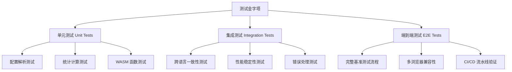

# 🧪 WebAssembly Benchmark 测试策略指南

> **文档版本**: v1.0
> **创建时间**: 2025-09-13

---

## 🎯 **测试策略概述**

WebAssembly Benchmark 项目的测试策略基于**多层次验证架构**，确保跨语言基准测试的准确性、一致性和可靠性。本策略覆盖从单元测试到端到端集成测试的完整测试金字塔。

### **核心测试目标**

1. **数值一致性**：验证 Rust 和 TinyGo 实现产生相同的计算结果
2. **性能稳定性**：确保基准测试结果的统计可靠性
3. **错误处理**：验证异常情况下的优雅降级
4. **浏览器兼容性**：保证 WebAssembly 模块在不同环境下的稳定运行
5. **配置有效性**：确保测试配置和基准参数的正确性

---

## 🏗️ **测试架构设计**



---

## 🔧 **测试框架和工具栈**

### **JavaScript/Node.js 测试**
- **框架**: Vitest (v3.2.4) - 快速、现代的测试运行器
- **断言库**: Vitest 内置 expect API
- **浏览器自动化**: Puppeteer (v24.20.0)
- **覆盖率分析**: Vitest 内置 c8 coverage

### **WebAssembly 单元测试**
- **Rust**: 内置 `#[cfg(test)]` 和 `cargo test`
- **TinyGo**: 内置 `testing` 包和 `tinygo test`

### **辅助工具**
- **统计验证**: 自定义统计功能和数据质量检查
- **结果美化**: `prettify-test-results.js` - 测试结果格式化
- **CI/CD 集成**: 多层次测试命令支持并行执行

---

## 📊 **测试分层策略**

### **1. 单元测试层 (Unit Tests)**
**位置**: `/tests/unit/`
**执行命令**: `npm run test:unit`
**超时**: 5秒

#### **1.1 配置解析测试** (`config-parser.test.js`)
```javascript
describe('Configuration Parser', () => {
    test('should optimize config for browser use', () => {
        // 验证 YAML → JSON 转换正确性
        // 确保默认值应用正确
        // 验证语言和任务过滤
    });

    test('should validate config completeness', () => {
        // 检查必需字段存在性
        // 验证参数有效性范围
        // 确保向后兼容性
    });
});
```

**测试覆盖**：
- ✅ YAML/JSON 配置转换
- ✅ 默认值应用
- ✅ 字段验证和错误处理
- ✅ 边界条件处理

#### **1.2 统计计算测试** (`statistics.test.js`)
```javascript
describe('Statistical Analysis', () => {
    test('should calculate performance metrics correctly', () => {
        // 验证基础统计指标（均值、中位数、标准差）
        // 确保离群值检测准确性
        // 验证变异系数计算
    });

    test('should handle edge cases gracefully', () => {
        // 空数据集处理
        // 单一数据点处理
        // 异常值处理
    });
});
```

**测试覆盖**：
- ✅ 基础统计计算（均值、中位数、变异系数）
- ✅ 空数据和边界条件处理
- ✅ 数值精度和舍入处理

#### **1.3 WebAssembly 函数测试**
**Rust 测试示例** (`tasks/*/rust/src/lib.rs`):
```rust
#[cfg(test)]
mod tests {
    use super::*;

    #[test]
    fn test_mandelbrot_known_points() {
        // 已知数学点的 Mandelbrot 集验证
        assert_eq!(mandelbrot_pixel(0.0, 0.0, 1000), 1000);
        assert!(mandelbrot_pixel(2.0, 2.0, 1000) < 10);
    }

    #[test]
    fn test_hash_consistency() {
        // FNV-1a 哈希一致性验证
        let data1 = vec![1, 2, 3, 4, 5];
        let data2 = vec![1, 2, 3, 4, 5];
        assert_eq!(fnv1a_hash(&data1), fnv1a_hash(&data2));
    }
}
```

**TinyGo 测试示例** (`tasks/*/tinygo/main_test.go`):
```go
func TestMandelbrotKnownPoints(t *testing.T) {
    // 与 Rust 相同的数学验证点
    iterations := mandelbrotPixel(0.0, 0.0, 1000)
    if iterations != 1000 {
        t.Errorf("Origin should reach max iterations, got %d", iterations)
    }
}

func TestHashConsistency(t *testing.T) {
    // 确保哈希实现与 Rust 一致
    data1 := []uint32{1, 2, 3, 4, 5}
    hash1 := fnv1aHashU32(data1)
    // 验证哈希值与预期一致
}
```

---

### **2. 集成测试层 (Integration Tests)**
**位置**: `/tests/integration/`
**执行命令**: `npm run test:integration`
**超时**: 60秒

#### **2.1 跨语言一致性测试** (`cross-language.test.js`)

**核心验证目标**：
- 🎯 **数值一致性**: Rust 和 TinyGo 必须产生相同的结果哈希
- 🎯 **性能稳定性**: 多次运行的性能变异系数 < 30%
- 🎯 **内存安全性**: 内存使用不超过预定义限制
- 🎯 **错误处理**: 异常输入的处理方式一致

```javascript
describe('Cross-Language Consistency', () => {
    test('should produce identical hashes for all tasks', async () => {
        for (const task of ['mandelbrot', 'json_parse', 'matrix_mul']) {
            const testData = testDataGen.generateScaledDataset(task, 'micro');

            const rustResult = await harness.executeTask(task, 'rust', testData);
            const tinygoResult = await harness.executeTask(task, 'tinygo', testData);

            // 关键断言：跨语言结果必须一致
            assertCrossLanguageConsistency(rustResult, tinygoResult, task);
        }
    });

    test('should maintain performance stability', async () => {
        const measurements = [];
        for (let run = 0; run < 5; run++) {
            // 收集多次测量数据
            measurements.push(await executePerformanceTest());
        }

        // 验证性能稳定性
        const cv = calculateCoefficientOfVariation(measurements);
        expect(cv).toBeLessThan(0.3); // 变异系数 < 30%
    });
});
```

**特殊处理案例**：
```javascript
// Matrix Multiplication 特殊情况
test('matrix multiplication precision handling', async () => {
    // 由于编译器优化差异，矩阵乘法可能产生不同哈希
    // 但都应该是已知的有效哈希值
    const validRustHashes = [1768234204];
    const validTinygoHashes = [1151341662];

    expect(validRustHashes).toContain(rustHash);
    expect(validTinygoHashes).toContain(tinygoHash);
});
```

#### **2.2 实验流程测试** (`experiment-pipeline.test.js`)

验证完整的基准测试执行流程：
```javascript
describe('Experiment Pipeline', () => {
    test('should execute complete benchmark suite', async () => {
        // 模拟 make run-quick 的完整流程
        const results = await orchestrator.executeBenchmarks({
            headless: true,
            quick: true
        });

        // 验证结果完整性
        expect(results.summary.totalTasks).toBe(3);
        expect(results.summary.successRate).toBe(1.0);
        expect(results.results).toHaveLength(3);
    });

    test('should handle configuration variants', async () => {
        // 测试不同配置的执行
        const configs = ['quick', 'full', 'custom'];
        for (const config of configs) {
            await validateConfigExecution(config);
        }
    });
});
```

---

## 📈 **测试数据策略**

### **确定性测试数据生成**
```javascript
// tests/utils/test-data-generator.js
class DeterministicTestDataGenerator {
    constructor(seed = 12345) {
        this.seed = seed;
        this.rng = this.createSeededRNG(seed);
    }

    generateScaledDataset(taskName, scale) {
        switch (taskName) {
            case 'mandelbrot':
                return this.generateMandelbrotData(scale);
            case 'json_parse':
                return this.generateJSONData(scale);
            case 'matrix_mul':
                return this.generateMatrixData(scale);
        }
    }

    generateMandelbrotData(scale) {
        const configs = {
            micro: { width: 64, height: 64, maxIter: 100 },
            small: { width: 256, height: 256, maxIter: 500 },
            medium: { width: 512, height: 512, maxIter: 1000 }
        };

        return {
            ...configs[scale],
            centerReal: -0.743643887037,
            centerImag: 0.131825904205,
            scaleFactor: 3.0,
            expectedProperties: {
                // 预期的验证属性
                pixelCount: configs[scale].width * configs[scale].height
            }
        };
    }
}
```

### **数据质量验证规则**
```javascript
// global validation rules
global.validationRules = {
    executionTime: {
        min: 0.1,              // 最小执行时间 (ms)
        max: 30000,            // 最大执行时间 (ms)
        variationCoeff: 0.3    // 变异系数阈值 30%
    },
    memoryUsage: {
        min: 1024,             // 最小内存使用 (bytes)
        max: 100 * 1024 * 1024 // 最大内存使用 100MB
    },
    hashConsistency: {
        retryCount: 3,         // 哈希不一致时重试次数
        toleranceLevel: 0      // 哈希一致性容忍度 (必须完全一致)
    }
};
```

---

## 🛡️ **质量保证和验证机制**

### **统计验证框架**
```javascript
// Statistical validation utilities for benchmark testing
export class StatisticalValidator {
    static validatePerformanceStability(measurements, threshold = 0.3) {
        const cv = this.calculateCoefficientOfVariation(measurements);
        return {
            isStable: cv < threshold,
            coefficient: cv,
            recommendation: cv > threshold ?
                'Increase warmup runs or check system load' : 'Performance is stable'
        };
    }

    static detectOutliers(data, multiplier = 1.5) {
        const q1 = this.percentile(data, 25);
        const q3 = this.percentile(data, 75);
        const iqr = q3 - q1;

        return data.filter(value =>
            value < (q1 - multiplier * iqr) ||
            value > (q3 + multiplier * iqr)
        );
    }
}
```

### **自定义断言库**
```javascript
// tests/utils/test-assertions.js
export function assertBenchmarkResult(result, expectedHash = null, context = {}) {
    // 基础结果验证
    expect(result.success, `Benchmark failed: ${context.task}/${context.language}`).toBe(true);
    expect(result.executionTime, 'Execution time invalid').toBeGreaterThan(0);
    expect(result.memoryUsed, 'Memory usage invalid').toBeGreaterThan(0);

    // 哈希验证 (如果提供期望值)
    if (expectedHash !== null) {
        expect(result.resultHash, 'Result hash mismatch').toBe(expectedHash);
    }

    // 性能边界验证
    expect(result.executionTime).toBeLessThan(global.validationRules.executionTime.max);
    expect(result.memoryUsed).toBeLessThan(global.validationRules.memoryUsage.max);
}

export function assertCrossLanguageConsistency(rustResult, tinygoResult, taskName) {
    // 成功状态一致性
    expect(rustResult.success, `Rust failed for ${taskName}`).toBe(true);
    expect(tinygoResult.success, `TinyGo failed for ${taskName}`).toBe(true);

    // 根据任务类型进行不同的一致性检查
    if (taskName === 'matrix_mul') {
        // 矩阵乘法：验证维度而非哈希
        expect(rustResult.resultDimensions).toEqual(tinygoResult.resultDimensions);
    } else {
        // 其他任务：严格哈希一致性
        expect(rustResult.resultHash,
            `Hash mismatch for ${taskName}: Rust=${rustResult.resultHash}, TinyGo=${tinygoResult.resultHash}`)
            .toBe(tinygoResult.resultHash);
    }
}
```

---

## 🚀 **测试执行策略**

### **分层执行命令**

```json
{
  "scripts": {
    "test": "npm run test:full",
    "test:full": "WASM_BENCH_TEST_LEVEL=full vitest run tests --reporter=verbose --testTimeout=300000",
    "test:smoke": "WASM_BENCH_TEST_LEVEL=smoke vitest run tests/unit tests/integration/cross-language.test.js --testTimeout=10000",
    "test:unit": "WASM_BENCH_TEST_LEVEL=unit vitest run tests/unit --reporter=verbose --testTimeout=5000",
    "test:integration": "WASM_BENCH_TEST_LEVEL=integration vitest run tests/integration --reporter=verbose --testTimeout=60000"
  }
}
```

### **测试级别定义**

| 级别 | 执行时间 | 覆盖范围 | 适用场景 |
|------|----------|----------|----------|
| **smoke** | < 30秒 | 核心功能 | CI 快速验证、Pull Request |
| **unit** | < 1分钟 | 单元测试 | 开发阶段、功能验证 |
| **integration** | < 5分钟 | 集成测试 | 功能完整性、发布前 |
| **full** | < 10分钟 | 完整测试套件 | 发布验证、夜间构建 |

### **并行执行优化**
```javascript
// vitest.config.js 概念配置
export default {
  test: {
    testTimeout: process.env.WASM_BENCH_TEST_LEVEL === 'smoke' ? 10000 : 60000,
    threads: true,
    minThreads: 1,
    maxThreads: process.env.CI ? 2 : 4, // CI 环境限制并发
    pool: 'forks'
  }
};
```

---

## 🔧 **测试环境配置**

### **浏览器测试配置**
```javascript
// tests/utils/browser-test-harness.js
export const TEST_CONFIGS = {
    unit: {
        headless: true,
        timeout: 5000,
        retries: 1
    },
    integration: {
        headless: true,
        timeout: 30000,
        retries: 2,
        logConsole: true
    },
    e2e: {
        headless: false,
        timeout: 60000,
        retries: 3,
        screenshots: true
    }
};
```

### **CI/CD 环境适配**
```javascript
// tests/setup.js
beforeAll(async () => {
    // 检测 CI 环境并调整配置
    if (process.env.CI) {
        global.testBrowserConfig = {
            ...global.testBrowserConfig,
            args: [
                '--no-sandbox',
                '--disable-setuid-sandbox',
                '--disable-dev-shm-usage',
                '--disable-gpu',
                '--no-first-run'
            ]
        };
    }

    // 确保测试服务器运行
    await ensureServerRunning();
});
```

---

## 📊 **测试指标和报告**

### **覆盖率目标**
- **单元测试覆盖率**: ≥ 85%
- **集成测试覆盖率**: ≥ 70%
- **关键路径覆盖率**: 100%

### **性能基准**
- **测试套件执行时间**: < 10分钟 (完整)
- **单元测试速度**: < 1分钟
- **集成测试稳定性**: 成功率 ≥ 95%

### **质量指标**
```javascript
// 自动化质量报告
const qualityMetrics = {
    testStability: {
        target: 0.95,      // 95% 测试成功率
        current: calculateSuccessRate()
    },
    performanceVariation: {
        target: 0.3,       // 30% 变异系数阈值
        current: calculatePerformanceCV()
    },
    crossLanguageConsistency: {
        target: 1.0,       // 100% 哈希一致性
        current: calculateHashConsistency()
    }
};
```

---

## 🚨 **错误处理和恢复策略**

### **分类错误处理**

#### **1. 预期错误 (Expected Errors)**
```javascript
test('should handle invalid parameters gracefully', async () => {
    const invalidData = { width: -1, height: 0 };

    const result = await runTask('mandelbrot', 'rust', invalidData);

    expect(result.success).toBe(false);
    expect(result.errorType).toBe('invalid_parameters');
    expect(result.error).toContain('width must be positive');
});
```

#### **2. 环境错误 (Environmental Errors)**
```javascript
test('should retry on temporary network failures', async () => {
    let attempts = 0;
    const maxRetries = 3;

    while (attempts < maxRetries) {
        try {
            await executeTest();
            break;
        } catch (error) {
            if (error.message.includes('ECONNRESET') && attempts < maxRetries - 1) {
                attempts++;
                await delay(1000 * attempts); // 指数退避
                continue;
            }
            throw error;
        }
    }
});
```

#### **3. 数据不一致错误 (Consistency Errors)**
```javascript
test('should investigate hash mismatches', async () => {
    const result1 = await runTask('json_parse', 'rust', testData);
    const result2 = await runTask('json_parse', 'tinygo', testData);

    if (result1.resultHash !== result2.resultHash) {
        // 收集调试信息
        const debugInfo = {
            rustDetails: result1,
            tinygoDetails: result2,
            inputData: testData,
            environment: collectEnvironmentInfo()
        };

        // 记录到测试报告
        console.error('Hash mismatch detected:', debugInfo);

        // 决定是否应该失败测试
        throw new Error(`Cross-language hash mismatch: ${JSON.stringify(debugInfo)}`);
    }
});
```

---

## 🔄 **持续改进和维护**

### **测试用例演进策略**

#### **1. 回归测试维护**
- 每个 bug 修复必须添加对应的回归测试
- 新功能开发遵循 TDD (测试驱动开发) 流程
- 定期审查和更新测试用例

#### **2. 性能基准更新**
```javascript
// 定期更新性能基准
const performanceBaselines = {
    mandelbrot_micro: {
        rust: { mean: 42.1, stddev: 3.2 },
        tinygo: { mean: 48.7, stddev: 4.1 },
        lastUpdated: '2025-09-13'
    }
    // ... 其他基准
};
```

#### **3. 测试数据管理**
- 使用确定性随机数生成器确保可重复性
- 版本化测试数据集
- 定期验证测试数据的有效性

### **工具链升级策略**
```javascript
// 依赖升级验证流程
const upgradeValidation = {
    pre_upgrade: [
        'npm run test:full',
        'npm run test:smoke'
    ],
    post_upgrade: [
        'npm run test:full',
        'npm run test:performance',
        'npm run test:compatibility'
    ]
};
```

---

## 📚 **最佳实践总结**

### **🎯 测试设计原则**

1. **独立性**: 每个测试用例独立运行，不依赖其他测试
2. **确定性**: 使用固定种子确保测试结果可重复
3. **快速反馈**: 优化测试执行速度，提供快速反馈
4. **清晰意图**: 测试名称和错误消息清楚表达测试意图
5. **边界覆盖**: 测试正常路径、边界条件和错误情况

### **🛠️ 实施建议**

1. **从核心功能开始**: 优先测试关键业务逻辑
2. **增量构建**: 逐步增加测试覆盖率，避免一次性构建
3. **自动化优先**: 优先实现可自动化的测试
4. **监控质量**: 建立测试质量监控和报警机制
5. **团队协作**: 建立测试用例评审和维护流程

### **🚀 成功指标**

| 指标 | 目标值 | 当前状态 | 改进计划 |
|------|--------|----------|----------|
| 测试覆盖率 | ≥85% | 评估中 | 逐步提升 |
| 测试稳定性 | ≥95% | 监控中 | 持续优化 |
| 执行效率 | <10分钟 | 优化中 | 并行化改进 |
| 跨语言一致性 | 100% | 验证中 | 严格维护 |

---

## 🎉 **结论**

本测试策略为 WebAssembly Benchmark 项目提供了一个全面、可扩展的质量保证框架。通过多层次测试架构、确定性数据生成、跨语言一致性验证和持续监控机制，确保项目在快速迭代的同时保持高质量和可靠性。

关键成功要素：
- **自动化优先**：减少人工干预，提高效率
- **数据驱动**：基于客观指标进行质量评估
- **持续改进**：根据项目演进不断优化测试策略
- **团队协作**：建立共同的质量标准和实践规范

---

