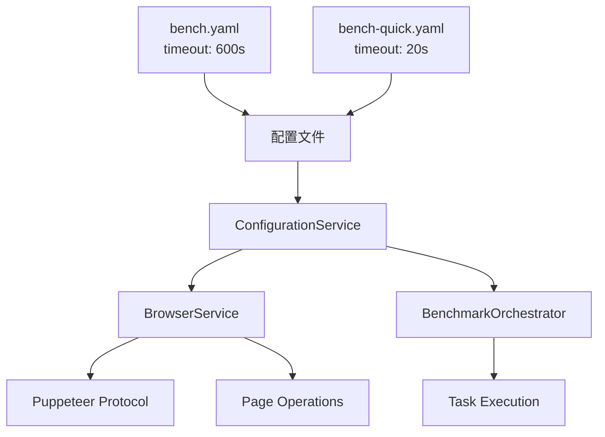

# 🕒 WebAssembly Benchmark 超时配置指南

> **创建时间**: 2025-09-22  
> **适用范围**: 解决 WASM 密集任务超时问题

---

## 🎯 **概述**

本文档详细说明 WebAssembly Benchmark 项目的超时配置策略，专门解决密集型 WASM 任务执行过程中出现的各种超时问题，包括 `Runtime.callFunctionOn timed out` 等浏览器协议超时错误。

### 🚨 **解决的问题**

- ✅ `Runtime.callFunctionOn timed out` - Puppeteer 协议超时
- ✅ `Navigation timeout` - 页面导航超时  
- ✅ `Element not found` - DOM 元素等待超时
- ✅ `Benchmark timeout` - WASM 任务执行超时
- ✅ 长时间运行任务的稳定性问题

---

## 🏗️ **超时架构设计**

### **层级结构**



### **超时类型和倍数**

| 超时类型 | 倍数 | 正常模式 | 快速模式 | 用途 |
|---------|------|---------|---------|------|
| **基础超时** | 1x | 600s (10min) | 20s | 配置基准 |
| **浏览器协议** | 2x | 1200s (20min) | 40s → 4s* | Puppeteer 自动化 |
| **页面导航** | 1x | 600s (10min) | 20s → 2s* | 页面加载 |
| **任务执行** | 2.5x | 1500s (25min) | 50s → 5s* | 基准任务运行 |
| **元素等待** | 0.25x | 150s (2.5min) | 5s → 0.5s* | DOM 操作 |
| **WASM密集** | 3x | 1800s (30min) | 60s → 6s* | CPU密集任务 |

> \* 快速模式额外应用 0.1x 减少因子

---

## ⚙️ **配置实现**

### **1. 基础配置文件**

#### **正常模式**: `configs/bench.yaml`

```yaml
environment:
  warmup_runs: 20
  measure_runs: 100
  repetitions: 3
  
  # 基础超时策略 - 增加到 600s 以处理密集任务
  timeout: 600                # 基础超时 (10分钟)
                              # 基于观察到的最大执行时间: ~180s
                              #
                              # 超时倍数在代码中使用:
                              # - browser_protocol: 2x (1200s) 
                              # - navigation: 1x (600s)
                              # - task_execution: 2.5x (1500s)
                              # - element_wait: 0.25x (150s)
                              # - wasm_intensive: 3x (1800s)
                              # - quick_mode_factor: 0.1x
```

#### **快速模式**: `configs/bench-quick.yaml`

```yaml
environment:
  warmup_runs: 5
  measure_runs: 20  
  repetitions: 1
  
  # 快速反馈超时 - 针对微型任务优化
  timeout: 20                 # 基础超时 (20秒)
```

### **2. 超时服务实现**

#### **ConfigurationService.js** - 超时计算核心

```javascript
/**
 * 获取基础超时配置
 * @returns {number} 基础超时 (毫秒)
 */
getTimeout() {
    const timeoutValue = this.config?.environment?.timeout || 240;
    
    // 智能单位检测
    if (timeoutValue > 1000) {
        return timeoutValue; // 已是毫秒
    }
    
    return timeoutValue * 1000; // 秒转毫秒
}

/**
 * 应用倍数和快速模式因子
 * @param {number} multiplier - 超时倍数
 * @returns {number} 最终超时 (毫秒)
 */
getTimeoutWithMultiplier(multiplier) {
    const baseTimeout = this.getTimeout();
    
    // 快速模式减少 90%
    if (this.isQuickMode) {
        return Math.floor(baseTimeout * multiplier * 0.1);
    }
    
    return Math.floor(baseTimeout * multiplier);
}

// 具体超时方法
getBrowserTimeout()    { return this.getTimeoutWithMultiplier(2);    }
getNavigationTimeout() { return this.getTimeoutWithMultiplier(1);    }
getTaskTimeout()       { return this.getTimeoutWithMultiplier(2.5);  }
getElementTimeout()    { return this.getTimeoutWithMultiplier(0.25); }
getWasmTimeout()       { return this.getTimeoutWithMultiplier(3);    }
```

### **3. 浏览器服务配置**

#### **BrowserService.js** - 协议超时设置

```javascript
async initialize(browserConfig = {}, configService = null) {
    this.configService = configService;
    
    // 获取浏览器协议超时
    const browserTimeout = this.configService ? 
        this.configService.getBrowserTimeout() : 600000;
    
    const config = {
        headless: true,
        args: [...puppeteerArgs],
        protocolTimeout: browserTimeout, // 🔑 关键配置
        ...browserConfig
    };
    
    // 启动浏览器
    this.browser = await this.puppeteer.launch(config);
    this.page = await this.browser.newPage();
    
    // 设置页面级超时
    this.page.setDefaultTimeout(browserTimeout);
    
    // 日志记录
    this.logger.info(`Browser timeout set to ${browserTimeout}ms (${Math.floor(browserTimeout / 60000)}min)`);
    this.logger.info(`Protocol timeout set to ${browserTimeout}ms for intensive WASM tasks`);
}
```

### **4. 页面操作超时**

```javascript
// 导航超时
async navigateTo(url, options = {}) {
    const defaultTimeout = this.configService ? 
        this.configService.getNavigationTimeout() : 300000;
    
    const navigationOptions = {
        waitUntil: 'networkidle0',
        timeout: defaultTimeout,
        ...options
    };
    
    await this.page.goto(url, navigationOptions);
}

// 元素等待超时
async waitForElement(selector, options = {}) {
    const defaultTimeout = this.configService ? 
        this.configService.getElementTimeout() : 60000;
    
    const waitOptions = {
        timeout: defaultTimeout,
        ...options
    };
    
    await this.page.waitForSelector(selector, waitOptions);
}
```

---

## 🔧 **故障排查指南**

### **常见超时错误及解决方案**

#### **1. Runtime.callFunctionOn timed out**

**错误示例:**

```text
[Orchestrator] [ERROR] Failed mandelbrot for rust: Browser timeout during benchmark execution: Runtime.callFunctionOn timed out. Increase the 'protocolTimeout' setting in launch/connect calls for a higher timeout if needed.
```

**根本原因:** Puppeteer 协议层超时，通常发生在执行长时间运行的 JavaScript 函数时

**解决方案:**

- ✅ **已修复**: 在 `BrowserService.js` 中设置 `protocolTimeout`
- ✅ **配置**: 使用 `getBrowserTimeout()` (2x 基础超时)
- ✅ **正常模式**: 1200s (20分钟) 协议超时
- ✅ **快速模式**: 4s 协议超时 (足够微型任务)

**验证方法:**

```bash
# 检查日志是否显示正确的超时设置
[Browser] [INFO] Protocol timeout set to 1200000ms for intensive WASM tasks
```

#### **2. Navigation timeout**

**错误表现:** 页面无法在规定时间内完成加载

**解决方案:**

- 检查开发服务器是否运行: `make dev`
- 检查网络连接
- 增加导航超时: `getNavigationTimeout()`

#### **3. Element not found timeout**

**错误表现:** DOM 元素等待超时

**解决方案:**

- 检查 CSS 选择器是否正确
- 确认页面完全加载
- 使用 `getElementTimeout()` 配置

#### **4. Benchmark task timeout**

**错误表现:** WASM 任务执行时间过长

**解决方案:**

- 开发阶段: 使用 `--quick` 模式
- 生产环境: 检查任务复杂度
- 临时解决: 增加 `timeout` 配置

### **超时调优建议**

#### **开发环境**

```bash
# 使用快速模式进行开发
make run-quick
node scripts/run_bench.js --quick --headed
```

#### **生产环境**

```yaml
# 如果正常超时仍不够，可临时增加
environment:
  timeout: 900  # 15分钟基础超时
```

#### **极限情况**

```yaml
# 对于特别复杂的任务
environment:
  timeout: 1200  # 20分钟基础超时
  # 这将产生:
  # - 浏览器协议: 2400s (40分钟)  
  # - 任务执行: 3000s (50分钟)
  # - WASM密集: 3600s (60分钟)
```

---

## 📊 **性能影响分析**

### **超时设置对性能的影响**

| 超时设置 | CPU 占用 | 内存占用 | 响应性 | 稳定性 |
|---------|---------|---------|-------|-------|
| **偏低** | 低 | 低 | 快 | 差 (容易超时) |
| **适中** | 中 | 中 | 中 | 好 |
| **偏高** | 高 | 高 | 慢 | 好 (但浪费资源) |

### **当前配置评估**

- ✅ **正常模式**: 偏保守，确保复杂任务完成
- ✅ **快速模式**: 激进优化，提供快速反馈
- ✅ **智能切换**: 根据使用场景自动调整

---

## 🚀 **使用指南**

### **开发工作流**

```bash
# 1. 日常开发 - 使用快速模式
make run-quick

# 2. 功能验证 - 使用正常模式
make run

# 3. 调试模式 - 可视化调试
node scripts/run_bench.js --quick --headed

# 4. 自定义超时 - 临时调整
node scripts/run_bench.js --timeout=120000  # 2分钟
```

### **配置修改**

```bash
# 1. 重新生成配置
node scripts/build_config.js
node scripts/build_config.js --quick

# 2. 验证配置
npm run test:unit

# 3. 查看生成的配置
cat configs/bench.json | jq '.environment.timeout'
cat configs/bench-quick.json | jq '.environment.timeout'
```

### **监控和日志**

```bash
# 查看实时超时日志
node scripts/run_bench.js --quick --verbose

# 期望看到的日志输出:
# [Browser] [INFO] Browser timeout set to 4000ms (0min)
# [Browser] [INFO] Protocol timeout set to 4000ms for intensive WASM tasks
# [Orchestrator] [SUCCESS] Completed: mandelbrot_micro_rust (248ms)
```

---

## 📚 **参考资料**

### **相关文件**

- `configs/bench.yaml` - 正常模式超时配置
- `configs/bench-quick.yaml` - 快速模式超时配置  
- `scripts/services/ConfigurationService.js` - 超时计算逻辑
- `scripts/services/BrowserService.js` - 浏览器超时设置
- `scripts/services/BenchmarkOrchestrator.js` - 任务超时处理

### **外部参考**

- [Puppeteer Timeout Configuration](https://pptr.dev/api/puppeteer.puppeteerlaunchoptions)
- [WebAssembly Performance Best Practices](https://developer.mozilla.org/en-US/docs/WebAssembly/Using_the_JavaScript_API)

---
