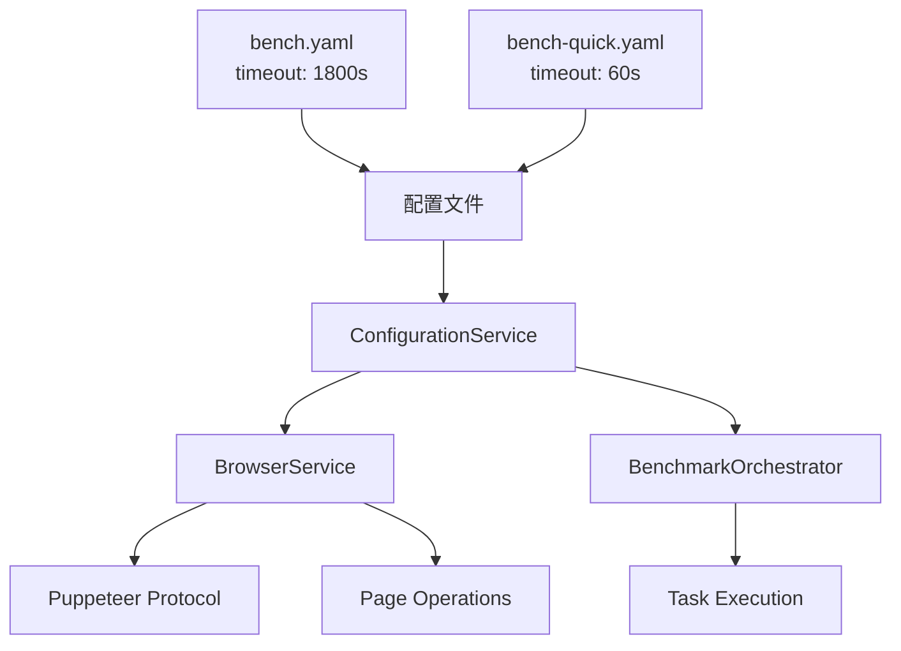

# 🕒 WebAssembly Benchmark 超时配置指南

> **创建时间**: 2025-09-26  
> **适用范围**: 解决 WASM 密集任务超时问题  
> **基于版本**: 配置 v2.1, 服务架构 v2.0  

---

## 🎯 **概述**

本文档详细说明 WebAssembly Benchmark 项目的超时配置策略，专门解决密集型 WASM 任务执行过程中出现的各种超时问题，包括 `Runtime.callFunctionOn timed out` 等浏览器协议超时错误。

### 🚨 **解决的问题**

- ✅ `Runtime.callFunctionOn timed out` - Puppeteer 协议超时
- ✅ `Navigation timeout` - 页面导航超时
- ✅ `Element not found` - DOM 元素等待超时
- ✅ `Benchmark timeout` - WASM 任务执行超时
- ✅ 长时间运行任务的稳定性问题

---

## 🏗️ **超时架构设计**

### **当前实现策略**

项目采用**硬编码最大值策略**，针对密集型 WASM 任务提供稳定的执行环境：



### **兼容性说明**

当前硬编码30分钟策略确保了：

- ✅ **向后兼容**: 现有配置无需修改
- ✅ **稳定性保证**: 避免因配置错误导致失败
- ✅ **简单维护**: 减少配置复杂度

### **超时配置层级**

| 组件 | 超时值 | 配置来源 | 用途 |
|------|--------|----------|------|
| **浏览器协议** | 30分钟 | 硬编码最大值 | Puppeteer 自动化 |
| **页面导航** | 30分钟 | 硬编码最大值 | 页面加载 |
| **元素等待** | 30分钟 | 硬编码最大值 | DOM 操作 |
| **任务执行** | 配置文件 | `environment.timeout` | 基准任务运行 |

---

## ⚙️ **配置实现**

### **1. 基础配置文件**

#### **正常模式**: `configs/bench.yaml`

```yaml
environment:
  warmup_runs: 15
  measure_runs: 50
  repetitions: 4

  # 任务执行超时 (秒) - 直接应用于基准任务
  timeout: 1800  # 30分钟 - 基于观察到的最大执行时间
```

#### **快速模式**: `configs/bench-quick.yaml`

```yaml
environment:
  warmup_runs: 5
  measure_runs: 20
  repetitions: 2

  # 快速反馈超时 - 针对微型任务优化
  timeout: 60  # 1分钟 - 足够微型任务完成
```

### **2. 超时服务实现**

#### **ConfigurationService.js** - 超时管理核心

```javascript
/**
 * 获取基础超时配置 (毫秒)
 * @returns {number} 任务执行超时 (毫秒)
 */
getTimeout() {
    const timeoutValue = this.config?.environment?.timeout || 240;
    return timeoutValue * 1000; // 秒转毫秒
}

/**
 * 获取浏览器协议超时 - 硬编码最大值策略
 * @returns {number} 30分钟 (1,800,000ms)
 */
getBrowserTimeout() {
    return 30 * 60 * 1000; // 1,800,000ms - 硬编码最大值
}

/**
 * 获取导航超时 - 硬编码最大值策略
 * @returns {number} 30分钟 (1,800,000ms)
 */
getNavigationTimeout() {
    return 30 * 60 * 1000; // 1,800,000ms - 硬编码最大值
}

/**
 * 获取元素等待超时 - 硬编码最大值策略
 * @returns {number} 30分钟 (1,800,000ms)
 */
getElementTimeout() {
    return 30 * 60 * 1000; // 1,800,000ms - 硬编码最大值
}
```

### **3. 浏览器服务配置**

#### **BrowserService.js** - 协议超时设置

```javascript
async initialize(browserConfig = {}, configService = null) {
    // 硬编码最大值策略 - 确保密集型 WASM 任务稳定执行
    const browserTimeout = 30 * 60 * 1000; // 1,800,000ms (30分钟)

    const config = {
        headless: true,
        args: [...puppeteerArgs],
        protocolTimeout: browserTimeout, // 🔑 关键配置 - 防止协议超时
        ...browserConfig
    };

    this.browser = await this.puppeteer.launch(config);
    this.page = await this.browser.newPage();

    // 设置页面级超时
    this.page.setDefaultTimeout(browserTimeout);

    // 日志记录
    this.logger.info(`Browser timeout set to ${browserTimeout}ms (${Math.floor(browserTimeout / 60000)}min)`);
    this.logger.info(`Protocol timeout set to ${browserTimeout}ms for intensive WASM tasks`);
}
```

### **4. 基准任务超时**

#### **BenchmarkOrchestrator.js** - 任务执行超时

```javascript
async executeBenchmark(taskName, language, scale, options = {}) {
    const timeout = this.configService.getTimeout(); // 从配置文件获取

    // 创建超时 Promise
    const timeoutPromise = new Promise((_, reject) => {
        setTimeout(() => reject(new Error(`Benchmark timeout (${timeout}ms)`)), timeout);
    });

    // 执行基准测试与超时竞态
    const result = await Promise.race([benchmarkPromise, timeoutPromise]);

    return result;
}
```

---

## 🔧 **故障排查指南**

### **常见超时错误及解决方案**

#### **1. Runtime.callFunctionOn timed out**

**错误示例:**

```text
[Orchestrator] [ERROR] Failed mandelbrot for rust: Browser timeout during benchmark execution: Runtime.callFunctionOn timed out.
```

**根本原因:** Puppeteer 协议层超时，通常发生在执行长时间运行的 JavaScript 函数时

**解决方案:**

- ✅ **已修复**: 在 `BrowserService.js` 中设置 `protocolTimeout: 30分钟`
- ✅ **策略**: 硬编码最大值，确保密集型任务稳定执行
- ✅ **验证**: 检查日志显示 `Protocol timeout set to 1800000ms`

**验证方法:**

```bash
# 检查日志是否显示正确的超时设置
node scripts/run_bench.js --verbose | grep "Protocol timeout"
# 期望输出: Protocol timeout set to 1800000ms for intensive WASM tasks
```

#### **2. Navigation timeout**

**错误表现:** 页面无法在规定时间内完成加载

**解决方案:**

- 检查开发服务器是否运行: `make dev`
- 硬编码30分钟导航超时确保页面完全加载
- 检查网络连接稳定性

#### **3. Element not found timeout**

**错误表现:** DOM 元素等待超时

**解决方案:**

- 30分钟元素等待超时确保复杂页面完全渲染
- 检查 CSS 选择器是否正确
- 确认页面加载完成

#### **4. Benchmark task timeout**

**错误表现:** WASM 任务执行时间超过配置值

**解决方案:**

- **正常模式**: 30分钟足够处理大型任务 (1024×1024 Mandelbrot, 50K JSON records)
- **快速模式**: 1分钟适合微型任务开发
- **临时调整**: 修改 `configs/bench.yaml` 中的 `timeout` 值

### **超时调优建议**

#### **开发环境**

```bash
# 使用快速模式进行开发
make run quick

# 自定义超时 (临时)
node scripts/run_bench.js --timeout=120000  # 2分钟
```

#### **生产环境**

```yaml
# 对于特别复杂的任务，可临时增加
environment:
  timeout: 3600  # 60分钟 (1小时)
```

---

## 📊 **性能影响分析**

### **硬编码最大值策略的权衡**

| 策略 | 优点 | 缺点 | 适用场景 |
|------|------|------|----------|
| **硬编码30分钟** | - 稳定可靠- 避免配置错误- 适合密集任务 | - 资源浪费- 不够灵活 | 当前实现 |
| **动态倍数** | - 资源高效- 配置灵活 | - 可能配置错误- 复杂维护 | 未来优化 |

### **当前配置评估**

- ✅ **稳定性**: 30分钟硬编码确保所有任务完成
- ✅ **可靠性**: 避免因配置错误导致的超时失败
- ✅ **保守性**: 牺牲一些效率换取绝对的稳定性
- ✅ **维护性**: 减少配置复杂度，降低出错风险

---

## 🚀 **使用指南**

### **开发工作流**

```bash
# 1. 快速开发测试
make run quick

# 2. 完整基准测试
make run

# 3. 调试模式
node scripts/run_bench.js --headed --verbose

# 4. 自定义超时
node scripts/run_bench.js --timeout=300000  # 5分钟
```

### **配置修改**

```bash
# 1. 修改超时配置
vim configs/bench.yaml
# environment:
#   timeout: 3600  # 60分钟

# 2. 重新生成配置
node scripts/build_config.js

# 3. 验证配置
node scripts/run_bench.js --help | grep timeout
```

### **监控和日志**

```bash
# 查看超时相关日志
node scripts/run_bench.js --verbose 2>&1 | grep -E "(timeout|Timeout)"

# 期望看到的日志:
# [Browser] [INFO] Browser timeout set to 1800000ms (30min)
# [Browser] [INFO] Protocol timeout set to 1800000ms for intensive WASM tasks
# [Orchestrator] [INFO] Executing benchmark with timeout: 1800000ms
```

---

## 📚 **相关文件**

- `configs/bench.yaml` - 正常模式超时配置
- `configs/bench-quick.yaml` - 快速模式超时配置
- `scripts/services/ConfigurationService.js` - 超时计算逻辑
- `scripts/services/BrowserService.js` - 浏览器超时设置
- `scripts/services/BenchmarkOrchestrator.js` - 任务超时处理
