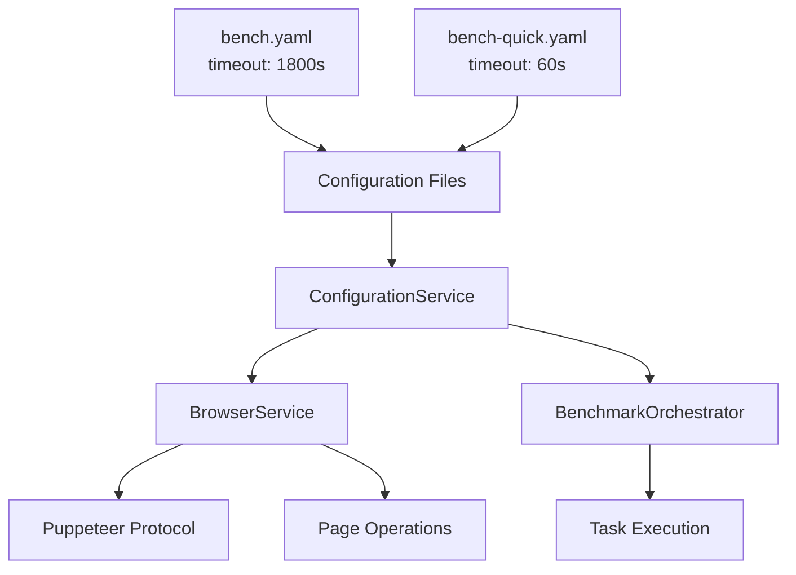

# 🕒 WebAssembly Benchmark Timeout Configuration Guide

> **Created**: 2025-09-26  
> **Scope**: Solving WASM intensive task timeout issues  
> **Based on**: Configuration v2.1, Service Architecture v2.0  

---

## 🎯 **Overview**

This document details the timeout configuration strategy for the WebAssembly Benchmark project, specifically designed to solve various timeout issues encountered during intensive WASM task execution, including browser protocol timeout errors like `Runtime.callFunctionOn timed out`.

### 🚨 **Issues Resolved**

- ✅ `Runtime.callFunctionOn timed out` - Puppeteer protocol timeout
- ✅ `Navigation timeout` - Page navigation timeout
- ✅ `Element not found` - DOM element wait timeout
- ✅ `Benchmark timeout` - WASM task execution timeout
- ✅ Long-running task stability issues

---

## 🏗️ **Timeout Architecture Design**

### **Current Implementation Strategy**

The project adopts a **hardcoded maximum value strategy**, providing a stable execution environment for intensive WASM tasks:



### **Compatibility Notes**

The current hardcoded 30-minute strategy ensures:

- ✅ **Backward Compatibility**: Existing configurations require no modification
- ✅ **Stability Guarantee**: Avoids failures due to configuration errors
- ✅ **Simple Maintenance**: Reduces configuration complexity

### **Timeout Configuration Hierarchy**

| Component | Timeout Value | Configuration Source | Purpose |
|-----------|---------------|---------------------|---------|
| **Browser Protocol** | 30 minutes | Hardcoded Maximum | Puppeteer Automation |
| **Page Navigation** | 30 minutes | Hardcoded Maximum | Page Loading |
| **Element Wait** | 30 minutes | Hardcoded Maximum | DOM Operations |
| **Task Execution** | Configuration File | `environment.timeout` | Benchmark Task Runtime |

---

## ⚙️ **Configuration Implementation**

### **1. Base Configuration Files**

#### **Normal Mode**: `configs/bench.yaml`

```yaml
environment:
  warmup_runs: 15
  measure_runs: 50
  repetitions: 4

  # Task execution timeout (seconds) - Applied directly to benchmark tasks
  timeout: 1800  # 30 minutes - Based on observed maximum execution time
```

#### **Quick Mode**: `configs/bench-quick.yaml`

```yaml
environment:
  warmup_runs: 5
  measure_runs: 20
  repetitions: 2

  # Quick feedback timeout - Optimized for micro tasks
  timeout: 60  # 1 minute - Sufficient for micro task completion
```

### **2. Timeout Service Implementation**

#### **ConfigurationService.js** - Timeout Management Core

```javascript
/**
 * Get base timeout configuration (milliseconds)
 * @returns {number} Task execution timeout (milliseconds)
 */
getTimeout() {
    const timeoutValue = this.config?.environment?.timeout || 240;
    return timeoutValue * 1000; // Convert seconds to milliseconds
}

/**
 * Get browser protocol timeout - Hardcoded maximum value strategy
 * @returns {number} 30 minutes (1,800,000ms)
 */
getBrowserTimeout() {
    return 30 * 60 * 1000; // 1,800,000ms - Hardcoded maximum
}

/**
 * Get navigation timeout - Hardcoded maximum value strategy
 * @returns {number} 30 minutes (1,800,000ms)
 */
getNavigationTimeout() {
    return 30 * 60 * 1000; // 1,800,000ms - Hardcoded maximum
}

/**
 * Get element wait timeout - Hardcoded maximum value strategy
 * @returns {number} 30 minutes (1,800,000ms)
 */
getElementTimeout() {
    return 30 * 60 * 1000; // 1,800,000ms - Hardcoded maximum
}
```

### **3. Browser Service Configuration**

#### **BrowserService.js** - Protocol Timeout Settings

```javascript
async initialize(browserConfig = {}, configService = null) {
    // Hardcoded maximum value strategy - Ensures stable execution of intensive WASM tasks
    const browserTimeout = 30 * 60 * 1000; // 1,800,000ms (30 minutes)

    const config = {
        headless: true,
        args: [...puppeteerArgs],
        protocolTimeout: browserTimeout, // 🔑 Key configuration - Prevents protocol timeout
        ...browserConfig
    };

    this.browser = await this.puppeteer.launch(config);
    this.page = await this.browser.newPage();

    // Set page-level timeout
    this.page.setDefaultTimeout(browserTimeout);

    // Logging
    this.logger.info(`Browser timeout set to ${browserTimeout}ms (${Math.floor(browserTimeout / 60000)}min)`);
    this.logger.info(`Protocol timeout set to ${browserTimeout}ms for intensive WASM tasks`);
}
```

### **4. Benchmark Task Timeout**

#### **BenchmarkOrchestrator.js** - Task Execution Timeout

```javascript
async executeBenchmark(taskName, language, scale, options = {}) {
    const timeout = this.configService.getTimeout(); // Get from configuration file

    // Create timeout Promise
    const timeoutPromise = new Promise((_, reject) => {
        setTimeout(() => reject(new Error(`Benchmark timeout (${timeout}ms)`)), timeout);
    });

    // Race benchmark execution against timeout
    const result = await Promise.race([benchmarkPromise, timeoutPromise]);

    return result;
}
```

---

## 🔧 **Troubleshooting Guide**

### **Common Timeout Errors and Solutions**

#### **1. Runtime.callFunctionOn timed out**

**Error Example:**

```text
[Orchestrator] [ERROR] Failed mandelbrot for rust: Browser timeout during benchmark execution: Runtime.callFunctionOn timed out.
```

**Root Cause:** Puppeteer protocol layer timeout, usually occurs when executing long-running JavaScript functions

**Solutions:**

- ✅ **Fixed**: Set `protocolTimeout: 30 minutes` in `BrowserService.js`
- ✅ **Strategy**: Hardcoded maximum value ensures stable execution of intensive tasks
- ✅ **Verification**: Check logs show `Protocol timeout set to 1800000ms`

**Verification Method:**

```bash
# Check if logs show correct timeout settings
node scripts/run_bench.js --verbose | grep "Protocol timeout"
# Expected output: Protocol timeout set to 1800000ms for intensive WASM tasks
```

#### **2. Navigation timeout**

**Error Manifestation:** Page cannot complete loading within specified time

**Solutions:**

- Check if development server is running: `make dev`
- Hardcoded 30-minute navigation timeout ensures complete page loading
- Check network connection stability

#### **3. Element not found timeout**

**Error Manifestation:** DOM element wait timeout

**Solutions:**

- 30-minute element wait timeout ensures complete rendering of complex pages
- Check if CSS selectors are correct
- Confirm page loading completion

#### **4. Benchmark task timeout**

**Error Manifestation:** WASM task execution time exceeds configured value

**Solutions:**

- **Normal Mode**: 30 minutes sufficient for large tasks (1024×1024 Mandelbrot, 50K JSON records)
- **Quick Mode**: 1 minute suitable for micro task development
- **Temporary Adjustment**: Modify `timeout` value in `configs/bench.yaml`

### **Timeout Tuning Recommendations**

#### **Development Environment**

```bash
# Use quick mode for development
make run quick

# Custom timeout (temporary)
node scripts/run_bench.js --timeout=120000  # 2 minutes
```

#### **Production Environment**

```yaml
# For particularly complex tasks, temporarily increase
environment:
  timeout: 3600  # 60 minutes (1 hour)
```

---

## 📊 **Performance Impact Analysis**

### **Hardcoded Maximum Value Strategy Trade-offs**

| Strategy | Advantages | Disadvantages | Use Case |
|----------|------------|---------------|----------|
| **Hardcoded 30min** | - Stable & reliable<br/>- Avoids configuration errors<br/>- Suitable for intensive tasks | - Resource waste<br/>- Less flexible | Current implementation |
| **Dynamic Multiplier** | - Resource efficient<br/>- Configuration flexible | - Possible configuration errors<br/>- Complex maintenance | Future optimization |

### **Current Configuration Assessment**

- ✅ **Stability**: 30-minute hardcoding ensures all tasks complete
- ✅ **Reliability**: Avoids timeout failures due to configuration errors
- ✅ **Conservative**: Sacrifices some efficiency for absolute stability
- ✅ **Maintainability**: Reduces configuration complexity, lowers error risk

---

## 🚀 **Usage Guide**

### **Development Workflow**

```bash
# 1. Quick development testing
make run quick

# 2. Complete benchmark testing
make run

# 3. Debug mode
node scripts/run_bench.js --headed --verbose

# 4. Custom timeout
node scripts/run_bench.js --timeout=300000  # 5 minutes
```

### **Configuration Modification**

```bash
# 1. Modify timeout configuration
vim configs/bench.yaml
# environment:
#   timeout: 3600  # 60 minutes

# 2. Regenerate configuration
node scripts/build_config.js

# 3. Verify configuration
node scripts/run_bench.js --help | grep timeout
```

### **Monitoring and Logging**

```bash
# View timeout-related logs
node scripts/run_bench.js --verbose 2>&1 | grep -E "(timeout|Timeout)"

# Expected logs:
# [Browser] [INFO] Browser timeout set to 1800000ms (30min)
# [Browser] [INFO] Protocol timeout set to 1800000ms for intensive WASM tasks
# [Orchestrator] [INFO] Executing benchmark with timeout: 1800000ms
```

---

## 📚 **Related Files**

- `configs/bench.yaml` - Normal mode timeout configuration
- `configs/bench-quick.yaml` - Quick mode timeout configuration
- `scripts/services/ConfigurationService.js` - Timeout calculation logic
- `scripts/services/BrowserService.js` - Browser timeout settings
- `scripts/services/BenchmarkOrchestrator.js` - Task timeout handling
